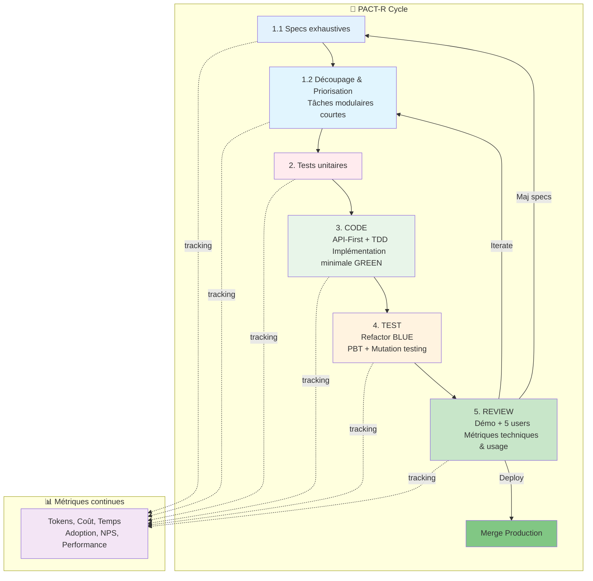
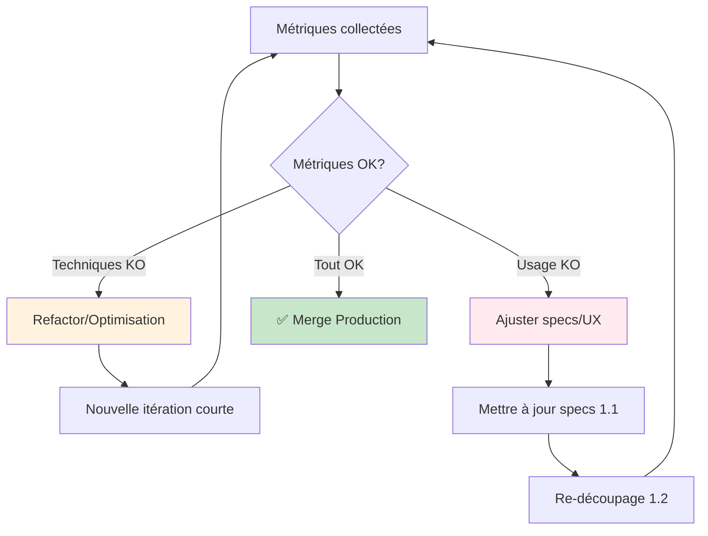
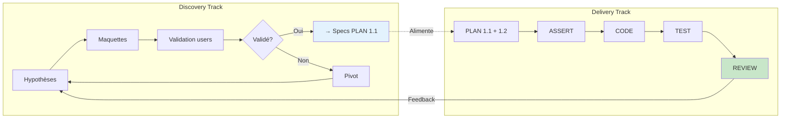

# PACT-R : Méthodologie de développement assisté par IA

> **Plan → Assert (tests) → Code → Test → Review**

---

## 🎓 Formation AI Pair Programming

**Vous cherchez le contenu de la formation de 7h sur le vibe coding ?**

👉 **[PROGRAMME-FORMATION.md](PROGRAMME-FORMATION.md)** - Programme complet  
👉 **[FORMATION-RESUME.md](FORMATION-RESUME.md)** - Résumé exécutif  
👉 **[cours/](cours/)** - Contenus théoriques (4 modules)  
👉 **[exercices/](exercices/)** - Exercices pratiques (API PACT-R + MCP RAG)  
👉 **[charte/](charte/)** - Charte d'utilisation IA

---

## ⚠️ Disclaimer

**PACT-R est un modèle théorique qui doit être adapté à votre contexte.**

Cette méthodologie propose un cadre complet, mais **vous devez l'ajuster selon vos besoins** :

- **Évitez l'over-engineering** : N'appliquez pas toutes les phases si elles ne sont pas nécessaires
- **Évitez le processus paralysant** : Si une étape ralentit ou bloque votre développement, simplifiez-la ou sautez-la
- **Adaptez aux workflows existants** : Intégrez PACT-R progressivement dans vos pratiques actuelles
- **Privilégiez la valeur** : L'objectif est de livrer rapidement avec qualité, pas de suivre un processus rigide

**Start small, measure, adapt.** Commencez par une feature simple, mesurez ce qui fonctionne, ajustez ensuite.

---

## 🎯 Introduction

**PACT-R** est une méthodologie de développement logiciel conçue pour les équipes professionnelles qui souhaitent maximiser la qualité et la vélocité grâce à l'IA, tout en gardant la maîtrise du processus de développement.

Cette approche combine :

- **Spec Driven Development** : Les spécifications exhaustives guident tout le cycle
- **Plan-Act-Review-Repeat** : Itérations rapides et feedback continu
- **Test-Driven Development** : Aucune ligne de code sans test d'abord
- **Dual-Track Agile** : Discovery et Delivery en parallèle
- **API-First Design** : Le contrat d'API comme source de vérité

### Philosophie clé

La méthodologie PACT-R met l'**emphase sur la phase PLAN** : investir du temps en amont pour créer des spécifications complètes et détaillées permet d'accélérer drastiquement les phases suivantes. Une fois les specs établies, le découpage modulaire et la priorisation permettent des itérations rapides avec un feedback constant.

---

## 🔄 Vue d'ensemble du cycle PACT-R



---

## 1️⃣ Phase PLAN : Spécifications exhaustives puis découpage modulaire

### 0. Points d'entrée : Adapter PLAN selon vos inputs

**Selon votre situation de départ, le workflow PLAN diffère.** Voici les scénarios courants :

| Scénario                  | Input disponible           | Workflow PLAN                           | Détails                                                       |
| ------------------------- | -------------------------- | --------------------------------------- | ------------------------------------------------------------- |
| **1. Greenfield**         | Rien (projet from scratch) | Discovery → Specs → Découpage           | [Guide détaillé](input-plan-workflow.md#1-greenfield)         |
| **2. JIRA/Linear**        | Tickets existants          | MCP → Analyse → Specs → Découpage       | [Guide détaillé](input-plan-workflow.md#2-jira-linear)        |
| **3. Figma**              | Maquettes validées         | MCP Figma → Analyse → Specs → Découpage | [Guide détaillé](input-plan-workflow.md#3-figma)              |
| **4. Cahier des charges** | Document PDF/MD            | Analyse CDC → Specs → Découpage         | [Guide détaillé](input-plan-workflow.md#4-cahier-des-charges) |
| **5. API existante**      | OpenAPI/Swagger            | Analyse contrats → Extension specs      | [Guide détaillé](input-plan-workflow.md#5-api-existante)      |
| **6. Codebase legacy**    | Code source                | `/init` ou analyse → Reverse specs      | [Guide détaillé](input-plan-workflow.md#6-codebase-legacy)    |
| **7. Discovery pur**      | User research              | Interviews → Hypothèses → Specs         | [Guide détaillé](input-plan-workflow.md#7-discovery-pur)      |
| **8. Backlog éparpillé**  | Notes, emails, tickets     | Consolidation → Priorisation → Specs    | [Guide détaillé](input-plan-workflow.md#8-backlog-eparpille)  |

💡 **Combinaisons possibles** : Figma + JIRA, CDC + Figma, API + Tickets, etc. → Voir [workflows combinés](input-plan-workflow.md#combinaisons).

📖 **Guide complet des workflows** : [input-plan-workflow.md](input-plan-workflow.md)

---

### 1.1. Spécifications techniques complètes

**Objectif** : Créer des spécifications détaillées et user-centric qui serviront de référence tout au long du projet.

#### Livrables obligatoires

1. **User Flows** : Parcours utilisateurs complets avec tous les cas (nominal, erreurs, limites)
2. **Diagrammes de séquence** : Interactions entre composants du système
3. **Modèle de données** : ERD complet avec types, contraintes, relations
4. **Spécifications API** : Contrats OpenAPI exhaustifs (endpoints, DTOs, validations)

**Approches possibles** :

- Discovery Track (hypothèses, interviews, maquettes) → Specs
- Spec-First strict (analyse métier → specs directement)
- Hybride (specs minimales → discovery → enrichissement)

**Durée recommandée** : Variable selon complexité (2-5 jours pour feature moyenne)

📖 **Voir exemple détaillé** : [examples/plan-phase.md](examples/plan-phase.md)

### 1.2. Découpage et priorisation modulaire

**Objectif** : Transformer les specs exhaustives en tâches courtes, priorisées, permettant itérations rapides.

#### Principes

- **Modularité** : Chaque tâche doit être indépendante et testable
- **Priorisation** : Vertical slices (tracer bullets) plutôt que layers
- **Timeboxing** : Tâches de 2-4h maximum
- **API-First** : Commencer par définir les contrats
- **TDD-Ready** : Chaque tâche doit avoir des critères d'acceptation testables

#### Méthodes de priorisation

Plusieurs approches existent pour prioriser les tâches. Choisissez celle qui correspond à votre contexte :

**1. MoSCoW (Must, Should, Could, Won't)**

- **Must** : Fonctionnalités critiques sans lesquelles le produit ne fonctionne pas
- **Should** : Important mais pas vital pour le lancement
- **Could** : Nice-to-have si le temps le permet
- **Won't** : Hors scope pour cette itération

**2. Value vs Effort (Matrice 2x2)**

- **Quick Wins** : Haute valeur, faible effort → Prioriser en premier
- **Big Bets** : Haute valeur, fort effort → Planifier soigneusement
- **Fill-ins** : Faible valeur, faible effort → Si temps disponible
- **Time Sinks** : Faible valeur, fort effort → Éviter

**3. RICE Score (Reach, Impact, Confidence, Effort)**

- Score = (Reach × Impact × Confidence) / Effort
- Permet une priorisation quantitative des features

**4. Tracer Bullets / Walking Skeleton**

- Vertical slices end-to-end fonctionnelles dès le début
- Permet d'avoir un flux complet même minimal à démontrer rapidement

**5. User Story Mapping**

- Organiser les user stories selon le parcours utilisateur
- Identifier le MVP backbone vs les améliorations

**Livrables** :

- Backlog priorisé de tâches
- Critères d'acceptation par tâche (format ATDD/BDD)
- Plan de tests associé
- Fichier `GUIDELINES.md` (optionnel) : Charte de code et règles de développement

#### Guidelines de développement (optionnel)

Si nécessaire, créez un fichier `GUIDELINES.md` ou `CODING_STANDARDS.md` contenant :

- **Standards de code** : PSR-12, naming conventions, structure des fichiers
- **Règles métier** : Contraintes spécifiques au domaine
- **Patterns imposés** : Architecture, injection de dépendances, gestion d'erreurs
- **Contraintes techniques** : Versions, librairies autorisées/interdites
- **Bonnes pratiques** : Logs, sécurité, performance

Ce fichier servira de référence pour l'IA lors du développement (Vibe Coding).

**Métriques à tracker** :

- Estimation tokens/coût par tâche
- Dépendances entre tâches
- Risques identifiés

📖 **Voir exemple détaillé** : [examples/plan-phase.md](examples/plan-phase.md)

---

## 2️⃣ Phase ASSERT : Tests d'abord (RED)

**Objectif** : Écrire tous les tests avant toute implémentation.

### Règle d'or

> ⛔ **Aucune ligne de code de production sans test RED d'abord**

### Types de tests

1. **Tests d'acceptation** (ATDD/BDD)

   - Basés sur critères d'acceptation métier
   - Format Given-When-Then
   - Validant les user flows end-to-end

2. **Tests unitaires** (TDD classique)

   - Cas nominal
   - Cas d'erreur
   - Cas limites

3. **Validation de contrats** (Contract Testing)
   - Conformité aux specs OpenAPI
   - Vérification des DTOs

**Métriques à tracker** :

- Nombre de tests écrits
- Temps d'écriture des tests
- Tokens/coût utilisés

📖 **Voir exemple détaillé** : [examples/coding-phase.md](examples/coding-phase.md)

---

## 3️⃣ Phase CODE : Implémentation minimale (GREEN)

**Objectif** : Écrire le code le plus simple qui fait passer les tests.

### Approche API-First + TDD

1. **Implémenter les contrats API** définis dans les specs
2. **Code minimal** pour passer les tests (YAGNI)
3. **Respect strict des types** et signatures
4. **Injection de dépendances** systématique

### Contraintes

- Pas de sur-engineering
- Pas de fonctionnalités non testées
- Typage strict
- Respect des standards de code

### 🎯 Vibe Coding avec IA : Bonnes pratiques

Lorsqu'un développeur sélectionne une tâche pour la développer avec assistance IA :

**⚠️ Avant de commencer** :

1. **Fournir le contexte complet à l'IA** :

   - Les spécifications de la tâche (User Stories, critères d'acceptation)
   - Le fichier `GUIDELINES.md` ou `CODING_STANDARDS.md` si existant
   - Les tests RED déjà écrits (phase ASSERT)
   - Les contraintes techniques du projet

2. **Encourager l'IA à poser des questions** :

   - « Avant de commencer, as-tu besoin de clarifications sur les specs ? »
   - « Y a-t-il des ambiguïtés dans les critères d'acceptation ? »
   - « Quelles dépendances ou contraintes techniques dois-je prendre en compte ? »

3. **Itérer avec l'IA** :
   - Commencer par un code minimal (GREEN)
   - Valider l'approche avant d'ajouter de la complexité
   - Demander des explications si le code généré n'est pas clair

**Exemple de prompt** :

```markdown
## Contexte

Tâche : Implémenter l'endpoint POST /api/reviews

**Specs** : [coller les critères d'acceptation]

**Guidelines** : [coller GUIDELINES.md]

**Tests RED** : [coller les tests qui échouent]

## Questions

Avant de commencer l'implémentation, as-tu besoin de clarifications sur :

- Les règles métier ?
- Les contraintes de validation ?
- L'architecture à respecter ?

Pose-moi toutes les questions nécessaires avant de générer le code.
```

**Métriques à tracker** :

- Temps RED → GREEN
- Lignes de code produites
- Tokens/coût par implémentation
- Ratio code/tests
- Nombre d'itérations avec l'IA

📖 **Voir exemple détaillé** : [examples/coding-phase.md](examples/coding-phase.md)

---

## 4️⃣ Phase TEST : Qualité et robustesse (BLUE)

**Objectif** : Améliorer le code et garantir la qualité avec tests avancés.

### Activités

1. **Refactoring**

   - Amélioration lisibilité
   - Extraction de méthodes
   - Respect des principes SOLID

2. **Property-Based Testing (PBT)**

   - Test des invariants
   - Génération de cas aléatoires
   - Validation des propriétés métier

3. **Mutation Testing**

   - Vérification de la robustesse des tests
   - Mutation Score Index (MSI) > 80%

4. **Analyse statique**
   - Typage strict
   - Détection de code smells
   - Couverture de code > 80%

**Métriques à tracker** :

- Temps de refactoring
- MSI (Mutation Score Index)
- Couverture de code
- Complexité cyclomatique
- Dette technique ajoutée/retirée

📖 **Voir exemple détaillé** : [examples/test-phase.md](examples/test-phase.md)

---

## 5️⃣ Phase REVIEW : Validation et métriques

**Objectif** : Valider la valeur métier et collecter des données pour piloter les itérations.

### Activités

1. **Démo courte** (15-30 min)

   - Présentation feature end-to-end
   - Environnement de preview
   - Démonstration des cas nominal + erreur

2. **Tests utilisateurs légers** (5 users)

   - Protocole Nielsen Norman Group
   - Tâches à accomplir
   - Questionnaire SUS (System Usability Scale)

3. **Métriques Build-Measure-Learn**

#### Métriques techniques

| Métrique             | Cible            | Mesure           |
| -------------------- | ---------------- | ---------------- |
| **Tokens utilisés**  | Budget par tâche | Logs IA          |
| **Coût total**       | ROI > 3x         | Facturation      |
| **Temps de dev**     | Vélocité x1.5-2x | Time tracking    |
| **Couverture tests** | > 80%            | Outils d'analyse |
| **MSI**              | > 80%            | Mutation testing |
| **Temps CI/CD**      | < 10 min         | Pipeline         |

#### Métriques usage

| Métrique          | Cible                | Mesure             |
| ----------------- | -------------------- | ------------------ |
| **Adoption**      | > 80% en 1 semaine   | Analytics          |
| **NPS**           | > 8/10               | Survey             |
| **Efficacité**    | Gain temps mesurable | Logs               |
| **Taux d'erreur** | < 1%                 | Monitoring         |
| **SUS Score**     | > 70                 | Tests utilisateurs |

### Décision



📖 **Voir exemple détaillé** : [examples/review-phase.md](examples/review-phase.md)

📊 **Template de métriques** : [examples/metrics-template.md](examples/metrics-template.md)

---

## 🔀 Dual-Track Agile : Discovery & Delivery en parallèle

### Principe

Deux pistes de travail simultanées :

**Track Discovery** (exploration)

- Hypothèses métier à valider
- Maquettes et prototypes
- Interviews utilisateurs
- Alimentation des specs (phase 1.1)

**Track Delivery** (implémentation PACT-R)

- Spécifications → Tests → Code → Review
- Itérations sur tâches courtes
- Feedback continu pour ajuster Discovery



---

## 🛡️ Garde-fous anti-over-engineering

### YAGNI (You Aren't Gonna Need It)

**Règle** : N'implémente que ce qui est dans les specs et testé.

| ❌ Over-engineering          | ✅ YAGNI                                    |
| ---------------------------- | ------------------------------------------- |
| Système de cache "au cas où" | Implémenter quand métriques montrent besoin |
| Message queue pour 100 req/j | Solution simple, migrer si scaling justifié |
| Microservices dès le début   | Monolithe modulaire, extraire si nécessaire |

### Monolith-First / Modular Monolith

**Principe** : Démarrer avec un monolithe bien structuré (bounded contexts clairs), extraire en services seulement si :

- Scaling indépendant nécessaire
- Équipes multiples sur domaines séparés
- Besoin de déploiements indépendants

### Architecture Decision Records (ADRs)

**Principe** : Documenter uniquement les choix architecturaux durables et structurants.

**Quand créer un ADR** :

- Choix de base de données
- Architecture d'authentification
- Modèle de déploiement
- Stratégie de cache/messaging

**Ne pas créer d'ADR pour** :

- Naming de variables
- Choix de librairie mineure
- Style de code (déjà dans standards)

---

## 📊 Suivi des métriques par tâche

### Format de tracking

Pour chaque tâche du découpage (phase 1.2), tracker dans un fichier `.md` :

```markdown
## Tâche #42 : Implémentation endpoint POST /api/reviews

### Métriques techniques

- Tokens utilisés : 25,000
- Coût : $0.15
- Temps total : 3h20
  - PLAN : 0h
  - ASSERT : 45min
  - CODE : 1h30
  - TEST : 55min
  - REVIEW : 10min

### Métriques qualité

- Tests écrits : 12
- Couverture : 92%
- MSI : 85%
- Complexité cyclomatique : 4

### Résultat

- Status : ✅ Merged
- Bugs post-deploy : 0
- Feedback users : Positif
```

📊 **Template complet** : [examples/metrics-template.md](examples/metrics-template.md)

---

## 🎓 Principes directeurs

| Principe                | Description                              |
| ----------------------- | ---------------------------------------- |
| **Specs exhaustives**   | Investir en amont pour accélérer ensuite |
| **Découpage modulaire** | Tâches courtes et indépendantes          |
| **Test-First, Always**  | RED → GREEN → BLUE obligatoire           |
| **API-First**           | Le contrat est la source de vérité       |
| **Mesurer tout**        | Métriques techniques ET usage            |
| **Itérer rapidement**   | Feedback hebdomadaire minimum            |
| **YAGNI by default**    | Pas d'implémentation sans preuve         |

---

## 🚀 Adoption de PACT-R

### Étapes recommandées

1. **Semaine 1** : Formation équipe + Setup outils
2. **Semaine 2** : Premier cycle PACT-R sur feature simple
3. **Semaine 3** : Feature complexe avec Discovery Track
4. **Semaine 4+** : Optimisation continue basée sur métriques

### Prérequis

- Équipe formée au TDD
- Environnement de CI/CD fonctionnel
- Outils de tracking métriques
- Templates de specs et tests

---

## 📚 Ressources

### Fichiers d'exemples détaillés

- [Points d'entrée PLAN : Workflows selon vos inputs](input-plan-workflow.md)
- [Phase PLAN : Spécifications et découpage](examples/plan-phase.md)
- [Phase CODING : API-First + TDD](examples/coding-phase.md)
- [Phase TEST : Refactor + PBT + Mutation](examples/test-phase.md)
- [Phase REVIEW : Démo + Users + Métriques](examples/review-phase.md)
- [Template de métriques](examples/metrics-template.md)

### Concepts fondateurs

- **Spec Driven Development** : Spécifications comme contrat
- **Plan-Act-Review-Repeat** : Méthodologie Andrej Karpathy
- **TDD** : Kent Beck - Test-Driven Development
- **Dual-Track Agile** : Marty Cagan - Discovery/Delivery parallèle
- **YAGNI** : Martin Fowler - Simplicité par défaut
- **Build-Measure-Learn** : Eric Ries - The Lean Startup

---

## ✅ Checklist rapide

### Avant de démarrer une feature

- [ ] Specs complètes (User Flows, Séquences, Data, API)
- [ ] Découpage en tâches < 4h
- [ ] Critères d'acceptation testables définis
- [ ] Estimation tokens/coût par tâche
- [ ] Template métriques prêt

### Pendant le développement

- [ ] Tests RED écrits avant code
- [ ] Code minimal pour GREEN
- [ ] Refactor + PBT pour BLUE
- [ ] Métriques trackées par tâche
- [ ] Preview environment déployé

### Avant de merger

- [ ] Couverture > 80%
- [ ] MSI > 80%
- [ ] Démo réalisée
- [ ] Tests 5 utilisateurs validés
- [ ] Métriques usage positives
- [ ] Specs mises à jour si besoin

---

## 📖 Glossaire des acronymes

| Acronyme   | Signification                                  | Description                                                               |
| ---------- | ---------------------------------------------- | ------------------------------------------------------------------------- |
| **PACT-R** | Plan, Assert, Code, Test, Review               | Méthodologie de développement assisté par IA                              |
| **TDD**    | Test-Driven Development                        | Développement piloté par les tests (RED → GREEN → BLUE)                   |
| **ATDD**   | Acceptance Test-Driven Development             | TDD au niveau des critères d'acceptation métier                           |
| **BDD**    | Behavior-Driven Development                    | Développement piloté par le comportement (format Gherkin Given-When-Then) |
| **PBT**    | Property-Based Testing                         | Tests basés sur des propriétés invariantes plutôt que des cas spécifiques |
| **MSI**    | Mutation Score Index                           | Pourcentage de mutations tuées par les tests                              |
| **API**    | Application Programming Interface              | Interface de programmation d'application                                  |
| **ERD**    | Entity-Relationship Diagram                    | Diagramme entité-association (modèle de données)                          |
| **DTO**    | Data Transfer Object                           | Objet de transfert de données entre couches                               |
| **YAGNI**  | You Aren't Gonna Need It                       | Principe : n'implémentez pas ce dont vous n'avez pas besoin maintenant    |
| **SOLID**  | Single, Open, Liskov, Interface, Dependency    | Principes de conception orientée objet                                    |
| **ADR**    | Architecture Decision Record                   | Document traçant une décision architecturale importante                   |
| **SRP**    | Single Responsibility Principle                | Principe de responsabilité unique (un des principes SOLID)                |
| **CI/CD**  | Continuous Integration / Continuous Deployment | Intégration continue / Déploiement continu                                |
| **SUS**    | System Usability Scale                         | Échelle d'utilisabilité système (questionnaire standardisé)               |
| **NPS**    | Net Promoter Score                             | Score de recommandation client                                            |
| **MVP**    | Minimum Viable Product                         | Produit minimum viable                                                    |
| **MoSCoW** | Must, Should, Could, Won't                     | Méthode de priorisation des exigences                                     |
| **RICE**   | Reach, Impact, Confidence, Effort              | Méthode de scoring pour prioriser les features                            |
| **UX**     | User Experience                                | Expérience utilisateur                                                    |
| **ROI**    | Return On Investment                           | Retour sur investissement                                                 |
| **PSR-12** | PHP Standards Recommendation 12                | Standard de codage PHP                                                    |
| **JWT**    | JSON Web Token                                 | Standard de token d'authentification                                      |
| **UUID**   | Universally Unique Identifier                  | Identifiant unique universel                                              |
| **JSON**   | JavaScript Object Notation                     | Format d'échange de données                                               |
| **YAML**   | YAML Ain't Markup Language                     | Format de sérialisation de données lisible                                |
| **SQL**    | Structured Query Language                      | Langage de requête pour bases de données                                  |
| **FK**     | Foreign Key                                    | Clé étrangère (base de données)                                           |
| **PK**     | Primary Key                                    | Clé primaire (base de données)                                            |
| **UK**     | Unique Key                                     | Clé unique (contrainte de base de données)                                |
| **REST**   | Representational State Transfer                | Style d'architecture pour les APIs web                                    |
| **CRUD**   | Create, Read, Update, Delete                   | Opérations de base sur les données                                        |

---

**La meilleure méthodologie est celle qui s'adapte à votre contexte. Expérimentez, mesurez, ajustez !** 🚀
