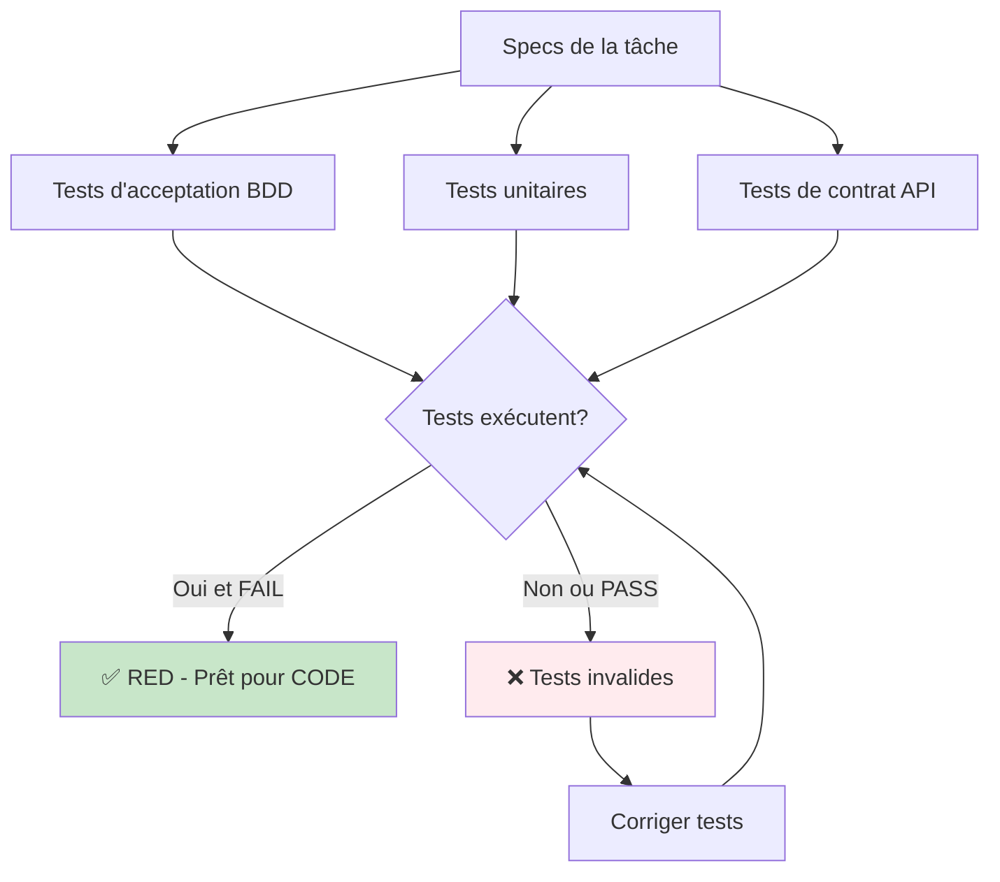

# Phases ASSERT & CODE : Exemples détaillés

## Vue d'ensemble

Les phases ASSERT et CODE constituent le cœur du cycle TDD :

1. **Phase ASSERT** : Écrire tous les tests AVANT le code (RED)
2. **Phase CODE** : Implémenter le code minimal pour passer les tests (GREEN)

---

## Phase ASSERT : Tests d'abord (RED)

### Règle d'or

> ⛔ **Aucune ligne de code de production sans test RED d'abord**

### Types de tests à écrire



---

## 1. Tests d'acceptation (ATDD/BDD)

### Objectif

Valider que le comportement métier correspond aux critères d'acceptation.

### Format : Gherkin (Given-When-Then)

#### Exemple : Approbation de review

**Fichier** : `features/moderation.feature`

```gherkin
Feature: Modération de reviews
  En tant que modérateur
  Je veux approuver ou rejeter des reviews
  Afin de garantir la qualité du contenu publié

  Background:
    Given les utilisateurs suivants existent:
      | id                                   | email                | role      |
      | 550e8400-e29b-41d4-a716-446655440000 | user@example.com     | USER      |
      | 660e8400-e29b-41d4-a716-446655440001 | mod@example.com      | MODERATOR |
    And les produits suivants existent:
      | id                                   | name           |
      | 770e8400-e29b-41d4-a716-446655440002 | iPhone 15 Pro  |

  Scenario: Modérateur approuve une review en attente
    Given une review existe avec les données:
      | id                                   | 880e8400-e29b-41d4-a716-446655440003 |
      | user_id                              | 550e8400-e29b-41d4-a716-446655440000 |
      | product_id                           | 770e8400-e29b-41d4-a716-446655440002 |
      | rating                               | 5                                    |
      | content                              | Excellent produit, très satisfait!   |
      | status                               | PENDING                              |
    And je suis authentifié en tant que "mod@example.com"
    When je fais une requête PATCH vers "/api/reviews/880e8400-e29b-41d4-a716-446655440003/moderate" avec:
      """json
      {
        "action": "approve"
      }
      """
    Then la réponse a le code HTTP 200
    And la réponse JSON contient:
      """json
      {
        "id": "880e8400-e29b-41d4-a716-446655440003",
        "status": "APPROVED",
        "moderated_by": "660e8400-e29b-41d4-a716-446655440001"
      }
      """
    And la review "880e8400-e29b-41d4-a716-446655440003" a le status "APPROVED" dans la base
    And un événement "ReviewApprovedEvent" a été dispatché
    And une notification email a été envoyée à "user@example.com"

  Scenario: Utilisateur non-modérateur tente d'approuver une review
    Given une review existe avec status "PENDING"
    And je suis authentifié en tant que "user@example.com"
    When je fais une requête PATCH vers "/api/reviews/880e8400-e29b-41d4-a716-446655440003/moderate" avec:
      """json
      {
        "action": "approve"
      }
      """
    Then la réponse a le code HTTP 403
    And la réponse JSON contient:
      """json
      {
        "error": "Forbidden",
        "message": "Only moderators can perform this action"
      }
      """

  Scenario: Approbation d'une review déjà approuvée retourne une erreur
    Given une review existe avec status "APPROVED"
    And je suis authentifié en tant que "mod@example.com"
    When je fais une requête PATCH vers "/api/reviews/880e8400-e29b-41d4-a716-446655440003/moderate" avec:
      """json
      {
        "action": "approve"
      }
      """
    Then la réponse a le code HTTP 409
    And la réponse JSON contient:
      """json
      {
        "error": "Conflict",
        "message": "Review is already approved"
      }
      """

  Scenario: Rejet de review avec raison
    Given une review existe avec status "PENDING"
    And je suis authentifié en tant que "mod@example.com"
    When je fais une requête PATCH vers "/api/reviews/880e8400-e29b-41d4-a716-446655440003/moderate" avec:
      """json
      {
        "action": "reject",
        "reason": "SPAM",
        "comment": "Contenu promotionnel détecté"
      }
      """
    Then la réponse a le code HTTP 200
    And la review "880e8400-e29b-41d4-a716-446655440003" a le status "REJECTED" dans la base
    And la review "880e8400-e29b-41d4-a716-446655440003" a "SPAM" comme rejection_reason
    And un événement "ReviewRejectedEvent" a été dispatché

  Scenario: Rejet sans raison retourne une erreur
    Given une review existe avec status "PENDING"
    And je suis authentifié en tant que "mod@example.com"
    When je fais une requête PATCH vers "/api/reviews/880e8400-e29b-41d4-a716-446655440003/moderate" avec:
      """json
      {
        "action": "reject"
      }
      """
    Then la réponse a le code HTTP 400
    And la réponse JSON contient:
      """json
      {
        "error": "Bad Request",
        "message": "Rejection reason is required when rejecting a review"
      }
      """
```

### Exécution

```bash
# Les tests doivent ÉCHOUER car le code n'existe pas encore
vendor/bin/behat features/moderation.feature

# Résultat attendu (RED):
# 5 scenarios (5 failed)
# Reason: Step "je fais une requête PATCH..." failed - Route not found
```

---

## 2. Tests unitaires (TDD classique)

### Objectif

Tester chaque unité de code (méthode, fonction) de manière isolée.

### Structure : Given-When-Then

#### Exemple : ReviewModerationService

**Fichier** : `tests/Unit/Service/ReviewModerationServiceTest.php`

```php
<?php

declare(strict_types=1);

namespace App\Tests\Unit\Service;

use App\Entity\Review;
use App\Entity\User;
use App\Enum\ReviewStatus;
use App\Event\ReviewApprovedEvent;
use App\Event\ReviewRejectedEvent;
use App\Exception\AccessDeniedException;
use App\Exception\InvalidStatusTransitionException;
use App\Exception\ValidationException;
use App\Repository\ReviewRepository;
use App\Service\ReviewModerationService;
use PHPUnit\Framework\MockObject\MockObject;
use PHPUnit\Framework\TestCase;
use Symfony\Component\EventDispatcher\EventDispatcherInterface;

final class ReviewModerationServiceTest extends TestCase
{
    private ReviewRepository|MockObject $repository;
    private EventDispatcherInterface|MockObject $eventDispatcher;
    private ReviewModerationService $service;

    protected function setUp(): void
    {
        $this->repository = $this->createMock(ReviewRepository::class);
        $this->eventDispatcher = $this->createMock(EventDispatcherInterface::class);

        $this->service = new ReviewModerationService(
            $this->repository,
            $this->eventDispatcher
        );
    }

    /**
     * Test nominal : Approbation change le status à APPROVED
     */
    public function testApproveChangesStatusToApproved(): void
    {
        // Given
        $review = $this->createMock(Review::class);
        $review->method('getStatus')->willReturn(ReviewStatus::PENDING);

        $moderator = $this->createMock(User::class);
        $moderator->method('hasRole')->with('MODERATOR')->willReturn(true);

        // Expect
        $review->expects($this->once())
            ->method('setStatus')
            ->with(ReviewStatus::APPROVED);

        $review->expects($this->once())
            ->method('setModeratedBy')
            ->with($moderator);

        $review->expects($this->once())
            ->method('setModeratedAt')
            ->with($this->isInstanceOf(\DateTimeInterface::class));

        $this->repository->expects($this->once())
            ->method('save')
            ->with($review);

        $this->eventDispatcher->expects($this->once())
            ->method('dispatch')
            ->with($this->isInstanceOf(ReviewApprovedEvent::class));

        // When
        $this->service->approve($review, $moderator);
    }

    /**
     * Test erreur : Non-modérateur ne peut pas approuver
     */
    public function testApproveByNonModeratorThrowsException(): void
    {
        // Given
        $review = $this->createMock(Review::class);

        $user = $this->createMock(User::class);
        $user->method('hasRole')->with('MODERATOR')->willReturn(false);

        // Expect
        $this->expectException(AccessDeniedException::class);
        $this->expectExceptionMessage('Only moderators can perform this action');

        // When
        $this->service->approve($review, $user);
    }

    /**
     * Test cas limite : Approuver une review déjà approuvée
     */
    public function testApproveAlreadyApprovedThrowsConflict(): void
    {
        // Given
        $review = $this->createMock(Review::class);
        $review->method('getStatus')->willReturn(ReviewStatus::APPROVED);

        $moderator = $this->createMock(User::class);
        $moderator->method('hasRole')->with('MODERATOR')->willReturn(true);

        // Expect
        $this->expectException(InvalidStatusTransitionException::class);
        $this->expectExceptionMessage('Review is already approved');

        // When
        $this->service->approve($review, $moderator);
    }

    /**
     * Test nominal : Rejet avec raison
     */
    public function testRejectWithReasonSetsStatusAndReason(): void
    {
        // Given
        $review = $this->createMock(Review::class);
        $review->method('getStatus')->willReturn(ReviewStatus::PENDING);

        $moderator = $this->createMock(User::class);
        $moderator->method('hasRole')->with('MODERATOR')->willReturn(true);

        $reason = 'SPAM';
        $comment = 'Contenu promotionnel détecté';

        // Expect
        $review->expects($this->once())
            ->method('setStatus')
            ->with(ReviewStatus::REJECTED);

        $review->expects($this->once())
            ->method('setRejectionReason')
            ->with($reason);

        $review->expects($this->once())
            ->method('setRejectionComment')
            ->with($comment);

        $this->eventDispatcher->expects($this->once())
            ->method('dispatch')
            ->with($this->callback(function (ReviewRejectedEvent $event) use ($review, $reason) {
                return $event->getReview() === $review
                    && $event->getReason() === $reason;
            }));

        // When
        $this->service->reject($review, $moderator, $reason, $comment);
    }

    /**
     * Test erreur : Rejet sans raison
     */
    public function testRejectWithoutReasonThrowsValidationException(): void
    {
        // Given
        $review = $this->createMock(Review::class);
        $moderator = $this->createMock(User::class);
        $moderator->method('hasRole')->with('MODERATOR')->willReturn(true);

        // Expect
        $this->expectException(ValidationException::class);
        $this->expectExceptionMessage('Rejection reason is required');

        // When
        $this->service->reject($review, $moderator, null);
    }

    /**
     * Test cas limite : Rejeter une review déjà rejetée
     */
    public function testRejectAlreadyRejectedThrowsConflict(): void
    {
        // Given
        $review = $this->createMock(Review::class);
        $review->method('getStatus')->willReturn(ReviewStatus::REJECTED);

        $moderator = $this->createMock(User::class);
        $moderator->method('hasRole')->with('MODERATOR')->willReturn(true);

        // Expect
        $this->expectException(InvalidStatusTransitionException::class);

        // When
        $this->service->reject($review, $moderator, 'SPAM');
    }

    /**
     * Test cas limite : Transitions valides uniquement depuis PENDING
     */
    public function testModerateFromFlaggedStatusIsAllowed(): void
    {
        // Given
        $review = $this->createMock(Review::class);
        $review->method('getStatus')->willReturn(ReviewStatus::FLAGGED);

        $moderator = $this->createMock(User::class);
        $moderator->method('hasRole')->with('MODERATOR')->willReturn(true);

        // Expect - should work for FLAGGED status too
        $review->expects($this->once())
            ->method('setStatus')
            ->with(ReviewStatus::APPROVED);

        // When
        $this->service->approve($review, $moderator);
    }
}
```

### Exécution

```bash
# Les tests doivent ÉCHOUER car ReviewModerationService n'existe pas
vendor/bin/phpunit tests/Unit/Service/ReviewModerationServiceTest.php

# Résultat attendu (RED):
# Error: Class 'App\Service\ReviewModerationService' not found
```

---

## 3. Tests de contrat API (Contract Testing)

### Objectif

Garantir que l'implémentation respecte strictement la spécification OpenAPI.

### Exemple avec validation de schéma

**Fichier** : `tests/Contract/ReviewApiContractTest.php`

```php
<?php

declare(strict_types=1);

namespace App\Tests\Contract;

use Symfony\Bundle\FrameworkBundle\Test\WebTestCase;
use Symfony\Component\Yaml\Yaml;

final class ReviewApiContractTest extends WebTestCase
{
    private array $openApiSpec;

    protected function setUp(): void
    {
        $this->openApiSpec = Yaml::parseFile(__DIR__ . '/../../openapi.yaml');
    }

    public function testModerateEndpointResponseMatchesSchema(): void
    {
        $client = static::createClient();

        // Authentification en tant que modérateur
        $token = $this->getModeratorToken();

        // Créer une review PENDING pour le test
        $reviewId = $this->createPendingReview();

        // Appeler l'endpoint
        $client->request(
            'PATCH',
            "/api/reviews/{$reviewId}/moderate",
            [],
            [],
            [
                'HTTP_AUTHORIZATION' => "Bearer {$token}",
                'CONTENT_TYPE' => 'application/json',
            ],
            json_encode(['action' => 'approve'])
        );

        // Assert: Code réponse conforme
        $this->assertSame(200, $client->getResponse()->getStatusCode());

        // Assert: Content-Type conforme
        $this->assertSame(
            'application/json',
            $client->getResponse()->headers->get('Content-Type')
        );

        // Assert: Schema réponse conforme à OpenAPI
        $responseData = json_decode($client->getResponse()->getContent(), true);
        $schema = $this->openApiSpec['components']['schemas']['Review'];

        $this->assertArrayHasKey('id', $responseData);
        $this->assertIsString($responseData['id']);
        $this->assertMatchesRegularExpression(
            '/^[0-9a-f]{8}-[0-9a-f]{4}-[0-9a-f]{4}-[0-9a-f]{4}-[0-9a-f]{12}$/',
            $responseData['id']
        );

        $this->assertArrayHasKey('status', $responseData);
        $this->assertSame('APPROVED', $responseData['status']);

        $this->assertArrayHasKey('moderated_by', $responseData);
        $this->assertIsString($responseData['moderated_by']);

        $this->assertArrayHasKey('moderated_at', $responseData);
        $this->assertMatchesRegularExpression(
            '/^\d{4}-\d{2}-\d{2}T\d{2}:\d{2}:\d{2}[+-]\d{2}:\d{2}$/',
            $responseData['moderated_at'],
            'moderated_at must be ISO-8601 with timezone'
        );
    }

    public function testModerateWithoutPermissionReturns403(): void
    {
        $client = static::createClient();

        // Authentification en tant qu'utilisateur simple
        $token = $this->getUserToken();

        $reviewId = $this->createPendingReview();

        $client->request(
            'PATCH',
            "/api/reviews/{$reviewId}/moderate",
            [],
            [],
            [
                'HTTP_AUTHORIZATION' => "Bearer {$token}",
                'CONTENT_TYPE' => 'application/json',
            ],
            json_encode(['action' => 'approve'])
        );

        // Assert: Code 403 conforme à OpenAPI
        $this->assertSame(403, $client->getResponse()->getStatusCode());

        // Assert: Schema erreur conforme
        $responseData = json_decode($client->getResponse()->getContent(), true);
        $this->assertArrayHasKey('error', $responseData);
        $this->assertArrayHasKey('message', $responseData);
    }

    private function getModeratorToken(): string
    {
        // Logique d'authentification...
        return 'mock-moderator-token';
    }

    private function getUserToken(): string
    {
        return 'mock-user-token';
    }

    private function createPendingReview(): string
    {
        // Logique de création review test...
        return '880e8400-e29b-41d4-a716-446655440003';
    }
}
```

---

## Phase CODE : Implémentation minimale (GREEN)

### Objectif

Écrire le code le plus simple qui fait passer tous les tests.

### Principe YAGNI (You Aren't Gonna Need It)

> N'implémente QUE ce qui est testé, rien de plus.

---

## 1. Implémentation du Service (logique métier)

**Fichier** : `src/Service/ReviewModerationService.php`

```php
<?php

declare(strict_types=1);

namespace App\Service;

use App\Entity\Review;
use App\Entity\User;
use App\Enum\ReviewStatus;
use App\Event\ReviewApprovedEvent;
use App\Event\ReviewRejectedEvent;
use App\Exception\AccessDeniedException;
use App\Exception\InvalidStatusTransitionException;
use App\Exception\ValidationException;
use App\Repository\ReviewRepository;
use Symfony\Component\EventDispatcher\EventDispatcherInterface;

final readonly class ReviewModerationService
{
    public function __construct(
        private ReviewRepository $repository,
        private EventDispatcherInterface $eventDispatcher,
    ) {
    }

    /**
     * Approuve une review en attente de modération
     *
     * @throws AccessDeniedException Si l'utilisateur n'est pas modérateur
     * @throws InvalidStatusTransitionException Si la review n'est pas modérable
     */
    public function approve(Review $review, User $moderator): void
    {
        $this->validateModerator($moderator);
        $this->validateApprovalTransition($review);

        $review->setStatus(ReviewStatus::APPROVED);
        $review->setModeratedBy($moderator);
        $review->setModeratedAt(new \DateTimeImmutable());

        $this->repository->save($review);

        $this->eventDispatcher->dispatch(
            new ReviewApprovedEvent($review, $moderator)
        );
    }

    /**
     * Rejette une review avec une raison
     *
     * @throws AccessDeniedException Si l'utilisateur n'est pas modérateur
     * @throws ValidationException Si la raison n'est pas fournie
     * @throws InvalidStatusTransitionException Si la review n'est pas modérable
     */
    public function reject(
        Review $review,
        User $moderator,
        ?string $reason,
        ?string $comment = null
    ): void {
        $this->validateModerator($moderator);
        $this->validateRejectionReason($reason);
        $this->validateRejectionTransition($review);

        $review->setStatus(ReviewStatus::REJECTED);
        $review->setRejectionReason($reason);
        $review->setRejectionComment($comment);
        $review->setModeratedBy($moderator);
        $review->setModeratedAt(new \DateTimeImmutable());

        $this->repository->save($review);

        $this->eventDispatcher->dispatch(
            new ReviewRejectedEvent($review, $moderator, $reason)
        );
    }

    private function validateModerator(User $user): void
    {
        if (!$user->hasRole('MODERATOR')) {
            throw new AccessDeniedException('Only moderators can perform this action');
        }
    }

    private function validateApprovalTransition(Review $review): void
    {
        if ($review->getStatus() === ReviewStatus::APPROVED) {
            throw new InvalidStatusTransitionException('Review is already approved');
        }

        if (!in_array($review->getStatus(), [ReviewStatus::PENDING, ReviewStatus::FLAGGED], true)) {
            throw new InvalidStatusTransitionException(
                'Review can only be approved from PENDING or FLAGGED status'
            );
        }
    }

    private function validateRejectionTransition(Review $review): void
    {
        if ($review->getStatus() === ReviewStatus::REJECTED) {
            throw new InvalidStatusTransitionException('Review is already rejected');
        }

        if (!in_array($review->getStatus(), [ReviewStatus::PENDING, ReviewStatus::FLAGGED], true)) {
            throw new InvalidStatusTransitionException(
                'Review can only be rejected from PENDING or FLAGGED status'
            );
        }
    }

    private function validateRejectionReason(?string $reason): void
    {
        if ($reason === null || trim($reason) === '') {
            throw new ValidationException('Rejection reason is required');
        }
    }
}
```

### Vérification

```bash
# Tous les tests unitaires doivent maintenant PASSER (GREEN)
vendor/bin/phpunit tests/Unit/Service/ReviewModerationServiceTest.php

# Résultat attendu:
# OK (7 tests, 25 assertions)
```

---

## 2. Implémentation du Controller (API)

**Fichier** : `src/Controller/Api/ReviewModerationController.php`

```php
<?php

declare(strict_types=1);

namespace App\Controller\Api;

use App\Dto\ModerateReviewRequest;
use App\Entity\Review;
use App\Exception\AccessDeniedException;
use App\Exception\InvalidStatusTransitionException;
use App\Exception\ValidationException;
use App\Repository\ReviewRepository;
use App\Service\ReviewModerationService;
use Symfony\Bundle\FrameworkBundle\Controller\AbstractController;
use Symfony\Component\HttpFoundation\JsonResponse;
use Symfony\Component\HttpFoundation\Response;
use Symfony\Component\HttpKernel\Attribute\MapRequestPayload;
use Symfony\Component\Routing\Attribute\Route;
use Symfony\Component\Security\Http\Attribute\IsGranted;

#[Route('/api/reviews', name: 'api_reviews_')]
final class ReviewModerationController extends AbstractController
{
    public function __construct(
        private readonly ReviewModerationService $moderationService,
        private readonly ReviewRepository $reviewRepository,
    ) {
    }

    #[Route('/{id}/moderate', name: 'moderate', methods: ['PATCH'])]
    #[IsGranted('ROLE_MODERATOR')]
    public function moderate(
        string $id,
        #[MapRequestPayload] ModerateReviewRequest $request
    ): JsonResponse {
        $review = $this->reviewRepository->find($id);

        if ($review === null) {
            return $this->json(
                ['error' => 'Not Found', 'message' => 'Review not found'],
                Response::HTTP_NOT_FOUND
            );
        }

        try {
            match ($request->action) {
                'approve' => $this->moderationService->approve($review, $this->getUser()),
                'reject' => $this->moderationService->reject(
                    $review,
                    $this->getUser(),
                    $request->reason,
                    $request->comment
                ),
                default => throw new ValidationException("Invalid action: {$request->action}")
            };

            return $this->json($review, Response::HTTP_OK);

        } catch (AccessDeniedException $e) {
            return $this->json(
                ['error' => 'Forbidden', 'message' => $e->getMessage()],
                Response::HTTP_FORBIDDEN
            );
        } catch (InvalidStatusTransitionException $e) {
            return $this->json(
                ['error' => 'Conflict', 'message' => $e->getMessage()],
                Response::HTTP_CONFLICT
            );
        } catch (ValidationException $e) {
            return $this->json(
                ['error' => 'Bad Request', 'message' => $e->getMessage()],
                Response::HTTP_BAD_REQUEST
            );
        }
    }
}
```

**Fichier DTO** : `src/Dto/ModerateReviewRequest.php`

```php
<?php

declare(strict_types=1);

namespace App\Dto;

use Symfony\Component\Validator\Constraints as Assert;

final readonly class ModerateReviewRequest
{
    public function __construct(
        #[Assert\NotBlank]
        #[Assert\Choice(choices: ['approve', 'reject', 'flag'])]
        public string $action,

        #[Assert\Choice(choices: ['SPAM', 'OFFENSIVE', 'FAKE', 'OTHER'])]
        public ?string $reason = null,

        #[Assert\Length(max: 1000)]
        public ?string $comment = null,
    ) {
    }
}
```

### Vérification

```bash
# Les tests d'acceptation doivent maintenant PASSER (GREEN)
vendor/bin/behat features/moderation.feature

# Résultat attendu:
# 5 scenarios (5 passed)
```

---

## 3. Implémentation des Event Listeners

**Fichier** : `src/EventListener/ReviewApprovedNotificationListener.php`

```php
<?php

declare(strict_types=1);

namespace App\EventListener;

use App\Event\ReviewApprovedEvent;
use App\Service\NotificationService;
use Symfony\Component\EventDispatcher\Attribute\AsEventListener;

#[AsEventListener(event: ReviewApprovedEvent::class)]
final readonly class ReviewApprovedNotificationListener
{
    public function __construct(
        private NotificationService $notificationService,
    ) {
    }

    public function __invoke(ReviewApprovedEvent $event): void
    {
        $review = $event->getReview();
        $author = $review->getUser();

        $this->notificationService->sendEmail(
            to: $author->getEmail(),
            subject: 'Your review has been approved',
            template: 'emails/review_approved.html.twig',
            context: [
                'review' => $review,
                'product' => $review->getProduct(),
            ]
        );
    }
}
```

---

## Checklist Phases ASSERT & CODE

### Phase ASSERT (RED)

- [ ] **Tests d'acceptation BDD**
  - [ ] Scénarios Gherkin écrits (nominal + erreurs + limites)
  - [ ] Steps implémentés
  - [ ] Tests exécutent et ÉCHOUENT
  - [ ] Couverture : tous les critères d'acceptation

- [ ] **Tests unitaires**
  - [ ] Au moins 3 tests par méthode publique (nominal, erreur, limite)
  - [ ] Structure Given-When-Then respectée
  - [ ] Mocks pour dépendances externes
  - [ ] Assertions strictes (assertEquals, pas assertTrue)
  - [ ] Tests exécutent et ÉCHOUENT

- [ ] **Tests de contrat**
  - [ ] Validation schémas OpenAPI
  - [ ] Vérification codes HTTP
  - [ ] Vérification formats (dates ISO-8601, UUIDs, etc.)
  - [ ] Tests exécutent et ÉCHOUENT

### Phase CODE (GREEN)

- [ ] **Implémentation minimale**
  - [ ] Code le plus simple possible (YAGNI)
  - [ ] Tous les tests unitaires PASSENT
  - [ ] Tous les tests acceptation PASSENT
  - [ ] Tous les tests contrat PASSENT

- [ ] **Qualité du code**
  - [ ] Typage strict (declare(strict_types=1))
  - [ ] Injection de dépendances via constructeur
  - [ ] Readonly properties quand applicable
  - [ ] Gestion d'erreurs avec exceptions typées
  - [ ] Pas de code mort ou commenté

- [ ] **API-First respecté**
  - [ ] Endpoints conformes à OpenAPI
  - [ ] DTOs générés/alignés avec schémas
  - [ ] Codes HTTP corrects
  - [ ] Sérialisation JSON conforme

---

## Métriques à tracker

### Phase ASSERT

| Métrique | Cible |
|----------|-------|
| Nombre de tests écrits | ≥ 3 par méthode publique |
| Temps d'écriture tests | 30-50% du temps total tâche |
| Scénarios BDD | 100% critères acceptation |
| Tokens utilisés | Tracking par tâche |

### Phase CODE

| Métrique | Cible |
|----------|-------|
| Temps RED → GREEN | < 2x temps ASSERT |
| Ratio code/tests | 1:2 à 1:3 |
| Couverture après CODE | > 80% |
| Tests passants | 100% |
| Tokens utilisés | Tracking par tâche |
