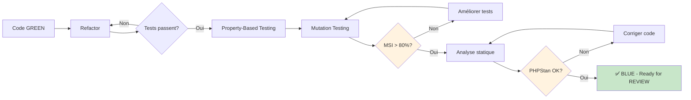

# Phase TEST : Exemples détaillés

## Vue d'ensemble

La phase TEST (BLUE dans le cycle RED-GREEN-BLUE) intervient après que tous les tests passent (GREEN).

**Objectifs** :
1. **Refactoring** : Améliorer la qualité du code sans casser les tests
2. **Property-Based Testing** : Tester les invariants avec données aléatoires
3. **Mutation Testing** : Vérifier la robustesse des tests
4. **Analyse statique** : Garantir typage strict et absence de code smells



---

## 1. Refactoring

### Objectif

Améliorer la lisibilité, maintenabilité et performance du code **sans modifier son comportement**.

### Règle d'or

> ✅ Tous les tests doivent continuer à passer après chaque refactoring

---

### Exemple 1 : Extraction de méthode privée

**Avant refactoring** (code fonctionne mais peu lisible) :

```php
<?php

declare(strict_types=1);

namespace App\Service;

use App\Entity\Review;
use App\Entity\User;
use App\Enum\ReviewStatus;

final readonly class ReviewModerationService
{
    public function approve(Review $review, User $moderator): void
    {
        // Validation inline (peu lisible, répétée)
        if (!$moderator->hasRole('MODERATOR')) {
            throw new AccessDeniedException('Only moderators can perform this action');
        }

        if ($review->getStatus() === ReviewStatus::APPROVED) {
            throw new InvalidStatusTransitionException('Review is already approved');
        }

        if (!in_array($review->getStatus(), [ReviewStatus::PENDING, ReviewStatus::FLAGGED], true)) {
            throw new InvalidStatusTransitionException(
                'Review can only be approved from PENDING or FLAGGED status'
            );
        }

        $review->setStatus(ReviewStatus::APPROVED);
        $review->setModeratedBy($moderator);
        $review->setModeratedAt(new \DateTimeImmutable());

        $this->repository->save($review);
        $this->eventDispatcher->dispatch(new ReviewApprovedEvent($review, $moderator));
    }

    public function reject(Review $review, User $moderator, ?string $reason): void
    {
        // Même validation répétée
        if (!$moderator->hasRole('MODERATOR')) {
            throw new AccessDeniedException('Only moderators can perform this action');
        }

        if ($reason === null || trim($reason) === '') {
            throw new ValidationException('Rejection reason is required');
        }

        if ($review->getStatus() === ReviewStatus::REJECTED) {
            throw new InvalidStatusTransitionException('Review is already rejected');
        }

        // ...
    }
}
```

**Après refactoring** (méthodes privées extraites) :

```php
<?php

declare(strict_types=1);

namespace App\Service;

final readonly class ReviewModerationService
{
    public function approve(Review $review, User $moderator): void
    {
        $this->validateModerator($moderator);
        $this->validateApprovalTransition($review);

        $this->applyModeration($review, $moderator, ReviewStatus::APPROVED);

        $this->eventDispatcher->dispatch(
            new ReviewApprovedEvent($review, $moderator)
        );
    }

    public function reject(Review $review, User $moderator, ?string $reason, ?string $comment = null): void
    {
        $this->validateModerator($moderator);
        $this->validateRejectionReason($reason);
        $this->validateRejectionTransition($review);

        $this->applyModeration($review, $moderator, ReviewStatus::REJECTED);
        $review->setRejectionReason($reason);
        $review->setRejectionComment($comment);

        $this->eventDispatcher->dispatch(
            new ReviewRejectedEvent($review, $moderator, $reason)
        );
    }

    /**
     * Applique les champs communs de modération
     */
    private function applyModeration(Review $review, User $moderator, ReviewStatus $status): void
    {
        $review->setStatus($status);
        $review->setModeratedBy($moderator);
        $review->setModeratedAt(new \DateTimeImmutable());

        $this->repository->save($review);
    }

    private function validateModerator(User $user): void
    {
        if (!$user->hasRole('MODERATOR')) {
            throw new AccessDeniedException('Only moderators can perform this action');
        }
    }

    private function validateApprovalTransition(Review $review): void
    {
        if ($review->getStatus() === ReviewStatus::APPROVED) {
            throw new InvalidStatusTransitionException('Review is already approved');
        }

        $this->ensureModerableStatus($review);
    }

    private function validateRejectionTransition(Review $review): void
    {
        if ($review->getStatus() === ReviewStatus::REJECTED) {
            throw new InvalidStatusTransitionException('Review is already rejected');
        }

        $this->ensureModerableStatus($review);
    }

    private function ensureModerableStatus(Review $review): void
    {
        if (!in_array($review->getStatus(), [ReviewStatus::PENDING, ReviewStatus::FLAGGED], true)) {
            throw new InvalidStatusTransitionException(
                sprintf('Review cannot be moderated from %s status', $review->getStatus()->value)
            );
        }
    }

    private function validateRejectionReason(?string $reason): void
    {
        if ($reason === null || trim($reason) === '') {
            throw new ValidationException('Rejection reason is required');
        }
    }
}
```

**Bénéfices** :
- ✅ DRY (Don't Repeat Yourself)
- ✅ Single Responsibility Principle
- ✅ Noms de méthodes auto-documentants
- ✅ Méthodes < 10 lignes

---

### Exemple 2 : Introduction de Value Object

**Avant** : Logique de transition de statut éparpillée

```php
public function approve(Review $review, User $moderator): void
{
    if (!in_array($review->getStatus(), [ReviewStatus::PENDING, ReviewStatus::FLAGGED], true)) {
        throw new InvalidStatusTransitionException(...);
    }
    // ...
}
```

**Après** : Value Object avec logique encapsulée

```php
<?php

declare(strict_types=1);

namespace App\ValueObject;

use App\Enum\ReviewStatus;
use App\Exception\InvalidStatusTransitionException;

final readonly class ReviewStatusTransition
{
    private const MODERATABLE_STATUSES = [
        ReviewStatus::PENDING,
        ReviewStatus::FLAGGED,
    ];

    public function __construct(
        private ReviewStatus $from,
        private ReviewStatus $to,
    ) {
    }

    /**
     * Vérifie si la transition est valide
     */
    public function isValid(): bool
    {
        return match ($this->to) {
            ReviewStatus::APPROVED, ReviewStatus::REJECTED => $this->isModeratable(),
            ReviewStatus::FLAGGED => $this->from === ReviewStatus::PENDING,
            default => false,
        };
    }

    /**
     * Valide la transition ou lève une exception
     */
    public function validate(): void
    {
        if (!$this->isValid()) {
            throw new InvalidStatusTransitionException(
                sprintf(
                    'Invalid status transition from %s to %s',
                    $this->from->value,
                    $this->to->value
                )
            );
        }
    }

    private function isModeratable(): bool
    {
        return in_array($this->from, self::MODERATABLE_STATUSES, true);
    }
}
```

**Utilisation dans le service** :

```php
public function approve(Review $review, User $moderator): void
{
    $this->validateModerator($moderator);

    $transition = new ReviewStatusTransition($review->getStatus(), ReviewStatus::APPROVED);
    $transition->validate();

    $this->applyModeration($review, $moderator, ReviewStatus::APPROVED);
    // ...
}
```

---

### Exemple 3 : Optimisation performance (N+1 queries)

**Avant** : Problème N+1 lors du chargement de reviews

```php
public function listPendingReviews(): array
{
    $reviews = $this->reviewRepository->findBy(['status' => ReviewStatus::PENDING]);

    // N+1 : 1 requête pour reviews + N requêtes pour users
    foreach ($reviews as $review) {
        $author = $review->getUser(); // Lazy loading
        // ...
    }

    return $reviews;
}
```

**Après** : Eager loading avec jointure

```php
public function listPendingReviews(): array
{
    // 1 seule requête avec JOIN
    return $this->reviewRepository->findPendingWithAuthors();
}
```

**Dans le repository** :

```php
public function findPendingWithAuthors(): array
{
    return $this->createQueryBuilder('r')
        ->innerJoin('r.user', 'u')
        ->addSelect('u')
        ->where('r.status = :status')
        ->setParameter('status', ReviewStatus::PENDING)
        ->getQuery()
        ->getResult();
}
```

---

## 2. Property-Based Testing (PBT)

### Objectif

Tester les **invariants** et **propriétés** du système avec des données générées aléatoirement.

### Principe

Au lieu de tester des cas spécifiques, on teste des propriétés qui doivent **toujours** être vraies.

---

### Exemple 1 : Idempotence de l'approbation

**Propriété à tester** : Approuver une review plusieurs fois produit le même résultat

```php
<?php

declare(strict_types=1);

namespace App\Tests\Property;

use App\Entity\Review;
use App\Entity\User;
use App\Enum\ReviewStatus;
use App\Service\ReviewModerationService;
use Eris\Generator;
use Eris\TestTrait;
use PHPUnit\Framework\TestCase;

final class ReviewModerationPropertyTest extends TestCase
{
    use TestTrait;

    /**
     * Propriété : Approuver une review N fois produit le même état final
     */
    public function testApproveIsIdempotent(): void
    {
        $this->forAll(
            Generator\tuple(
                Generator\string(), // Review ID
                Generator\string(), // Moderator ID
                Generator\choose(1, 5) // Nombre d'approbations (1-5)
            )
        )->then(function (array $data) {
            [$reviewId, $moderatorId, $approvalCount] = $data;

            // Setup
            $review = $this->createReview($reviewId, ReviewStatus::PENDING);
            $moderator = $this->createModerator($moderatorId);
            $service = $this->createService();

            // Première approbation
            $service->approve($review, $moderator);
            $statusAfterFirst = $review->getStatus();
            $moderatedByAfterFirst = $review->getModeratedBy();

            // Approbations supplémentaires (doivent échouer mais état doit rester identique)
            for ($i = 1; $i < $approvalCount; $i++) {
                try {
                    $service->approve($review, $moderator);
                } catch (InvalidStatusTransitionException $e) {
                    // Attendu
                }
            }

            // Propriété : L'état final est identique
            $this->assertEquals($statusAfterFirst, $review->getStatus());
            $this->assertEquals($moderatedByAfterFirst, $review->getModeratedBy());
        });
    }

    /**
     * Propriété : La date de modération est toujours >= date de création
     */
    public function testModeratedAtIsAlwaysAfterCreatedAt(): void
    {
        $this->forAll(
            Generator\associative([
                'review_id' => Generator\string(),
                'created_at' => Generator\date('Y-m-d H:i:s', strtotime('-30 days'), time()),
                'moderator_id' => Generator\string(),
            ])
        )->then(function (array $data) {
            $review = $this->createReview($data['review_id'], ReviewStatus::PENDING);
            $review->setCreatedAt(new \DateTimeImmutable($data['created_at']));

            $moderator = $this->createModerator($data['moderator_id']);
            $service = $this->createService();

            $service->approve($review, $moderator);

            // Propriété : moderated_at >= created_at (toujours vrai)
            $this->assertGreaterThanOrEqual(
                $review->getCreatedAt()->getTimestamp(),
                $review->getModeratedAt()->getTimestamp(),
                'Moderated date must be after or equal to creation date'
            );
        });
    }

    /**
     * Propriété : Le nombre d'événements dispatchés = nombre d'approbations réussies
     */
    public function testEventDispatchedOncePerSuccessfulApproval(): void
    {
        $this->forAll(
            Generator\choose(1, 10) // Nombre de reviews à approuver
        )->then(function (int $reviewCount) {
            $eventDispatcher = $this->createMock(EventDispatcherInterface::class);
            $service = new ReviewModerationService($this->repository, $eventDispatcher);

            $moderator = $this->createModerator('mod-1');

            // Expect : Exactement $reviewCount événements dispatchés
            $eventDispatcher->expects($this->exactly($reviewCount))
                ->method('dispatch');

            // Approuver N reviews
            for ($i = 0; $i < $reviewCount; $i++) {
                $review = $this->createReview("review-{$i}", ReviewStatus::PENDING);
                $service->approve($review, $moderator);
            }
        });
    }

    private function createReview(string $id, ReviewStatus $status): Review
    {
        // Factory pour créer review de test...
    }

    private function createModerator(string $id): User
    {
        // Factory pour créer modérateur...
    }
}
```

### Exécution

```bash
vendor/bin/phpunit tests/Property/ReviewModerationPropertyTest.php

# Résultat : 100 inputs aléatoires générés et testés par propriété
# PHPUnit 10.x
# ...............................................................  100 / 100 (100%)
# Time: 00:02.456, Memory: 18.00 MB
# OK (3 tests, 300 assertions)
```

---

### Exemple 2 : Format ISO-8601 des dates

**Propriété** : Les dates sérialisées doivent toujours être au format ISO-8601 avec timezone

```php
<?php

namespace App\Tests\Property;

use App\Entity\Review;
use Eris\Generator;
use Eris\TestTrait;
use PHPUnit\Framework\TestCase;

final class DateFormattingPropertyTest extends TestCase
{
    use TestTrait;

    /**
     * Propriété : created_at et moderated_at sont toujours ISO-8601
     */
    public function testDatesAreAlwaysISO8601(): void
    {
        $this->forAll(
            Generator\tuple(
                Generator\date('Y-m-d H:i:s'),
                Generator\date('Y-m-d H:i:s')
            )
        )->then(function (array $dates) {
            [$createdAt, $moderatedAt] = $dates;

            $review = new Review();
            $review->setCreatedAt(new \DateTimeImmutable($createdAt));
            $review->setModeratedAt(new \DateTimeImmutable($moderatedAt));

            // Sérialisation
            $json = $this->serializer->serialize($review, 'json');
            $data = json_decode($json, true);

            // Propriété : Format ISO-8601 avec timezone
            $iso8601Pattern = '/^\d{4}-\d{2}-\d{2}T\d{2}:\d{2}:\d{2}[+-]\d{2}:\d{2}$/';

            $this->assertMatchesRegularExpression(
                $iso8601Pattern,
                $data['created_at'],
                'created_at must be ISO-8601 with timezone'
            );

            $this->assertMatchesRegularExpression(
                $iso8601Pattern,
                $data['moderated_at'],
                'moderated_at must be ISO-8601 with timezone'
            );
        });
    }
}
```

---

## 3. Mutation Testing

### Objectif

Vérifier que les tests **tuent** les mutations (modifications intentionnelles du code).

### Principe

Un outil modifie automatiquement le code source (mutation) et vérifie si les tests échouent :
- ✅ **Mutation tuée** : Un test échoue → bonne couverture
- ❌ **Mutation survivante** : Tous les tests passent → test faible

---

### Installation et configuration

```bash
composer require --dev infection/infection
```

**Fichier de configuration** : `infection.json.dist`

```json
{
    "$schema": "vendor/infection/infection/resources/schema.json",
    "source": {
        "directories": [
            "src"
        ],
        "excludes": [
            "src/Kernel.php"
        ]
    },
    "logs": {
        "text": "infection.log",
        "summary": "infection-summary.log",
        "html": "infection-report.html"
    },
    "mutators": {
        "@default": true,
        "@conditional_negotiation": false
    },
    "minMsi": 80,
    "minCoveredMsi": 90
}
```

---

### Exemple de mutation

**Code original** :

```php
public function approve(Review $review, User $moderator): void
{
    if (!$moderator->hasRole('MODERATOR')) {
        throw new AccessDeniedException('Only moderators can perform this action');
    }

    $review->setStatus(ReviewStatus::APPROVED);
    // ...
}
```

**Mutation 1** : Inverser la condition (mutation `!` → ``)

```php
if ($moderator->hasRole('MODERATOR')) { // Condition inversée
    throw new AccessDeniedException('Only moderators can perform this action');
}
```

**Test qui tue cette mutation** :

```php
public function testApproveByNonModeratorThrowsException(): void
{
    $user = $this->createMock(User::class);
    $user->method('hasRole')->with('MODERATOR')->willReturn(false);

    $this->expectException(AccessDeniedException::class);

    $this->service->approve($review, $user);
}
```

✅ **Mutation tuée** : Le test échoue car l'exception n'est plus levée.

---

**Mutation 2** : Changer le status (mutation `APPROVED` → `REJECTED`)

```php
$review->setStatus(ReviewStatus::REJECTED); // Mutation du status
```

**Test faible qui NE tue PAS cette mutation** :

```php
public function testApproveChangesStatus(): void
{
    // ...
    $this->service->approve($review, $moderator);

    // ❌ Assertion trop permissive
    $this->assertNotEquals(ReviewStatus::PENDING, $review->getStatus());
}
```

❌ **Mutation survivante** : Le test passe car `REJECTED != PENDING`

**Test amélioré qui TUE la mutation** :

```php
public function testApproveChangesStatusToApproved(): void
{
    // ...
    $this->service->approve($review, $moderator);

    // ✅ Assertion stricte
    $this->assertEquals(ReviewStatus::APPROVED, $review->getStatus());
}
```

✅ **Mutation tuée** : Le test échoue car `REJECTED != APPROVED`

---

### Exécution

```bash
# Exécuter mutation testing
vendor/bin/infection --threads=4

# Résultat :
# 150 mutations generated
# 135 killed (90%)
# 12 escaped (8%)
# 3 uncovered (2%)
#
# Mutation Score Indicator (MSI): 90%
# Covered Code MSI: 93%
```

**Interprétation** :
- **MSI 90%** : 90% des mutations sont tuées → bonne couverture
- **12 escaped** : Tests à améliorer pour ces mutations
- **3 uncovered** : Code non couvert par les tests

---

### Amélioration basée sur mutations survivantes

**Rapport** : `infection-report.html`

```
Escaped mutants:

1. src/Service/ReviewModerationService.php:42
   Mutation: Changed > to >=

   - if ($approvalCount > 0) {
   + if ($approvalCount >= 0) {
```

**Action** : Ajouter un test pour `approvalCount = 0`

```php
public function testApproveWithZeroApprovalsDoesNothing(): void
{
    $review = $this->createReview(ReviewStatus::PENDING);

    $this->service->bulkApprove([], $moderator);

    // État inchangé
    $this->assertEquals(ReviewStatus::PENDING, $review->getStatus());
}
```

---

## 4. Analyse statique

### Objectif

Détecter les erreurs de typage, code smells et bugs potentiels sans exécuter le code.

---

### 4.1 PHPStan (Analyse statique stricte)

**Installation** :

```bash
composer require --dev phpstan/phpstan
composer require --dev phpstan/extension-installer
composer require --dev phpstan/phpstan-symfony
composer require --dev phpstan/phpstan-phpunit
```

**Configuration** : `phpstan.neon`

```neon
parameters:
    level: 8
    paths:
        - src
        - tests
    excludePaths:
        - tests/bootstrap.php
    symfony:
        container_xml_path: var/cache/dev/App_KernelDevDebugContainer.xml
    ignoreErrors:
        # Ignorer erreurs spécifiques si nécessaire
```

**Exécution** :

```bash
vendor/bin/phpstan analyse --level 8

# Résultat si erreurs :
# ------ --------------------------------------------------------------------
#  Line   src/Service/ReviewModerationService.php
# ------ --------------------------------------------------------------------
#  42     Parameter #1 $review of method approve() expects App\Entity\Review,
#         App\Entity\Review|null given.
#  58     Method reject() should return void but return statement is missing.
# ------ --------------------------------------------------------------------
#
# [ERROR] Found 2 errors
```

**Correction** :

```php
// Avant
public function approve($review, User $moderator): void // Type manquant

// Après
public function approve(Review $review, User $moderator): void
{
    // ...
}
```

---

### 4.2 PHP CS Fixer (Style de code)

**Installation** :

```bash
composer require --dev friendsofphp/php-cs-fixer
```

**Configuration** : `.php-cs-fixer.dist.php`

```php
<?php

use PhpCsFixer\Config;
use PhpCsFixer\Finder;

$finder = Finder::create()
    ->in(__DIR__ . '/src')
    ->in(__DIR__ . '/tests')
    ->name('*.php');

return (new Config())
    ->setRules([
        '@PSR12' => true,
        'declare_strict_types' => true,
        'array_syntax' => ['syntax' => 'short'],
        'ordered_imports' => ['sort_algorithm' => 'alpha'],
        'no_unused_imports' => true,
        'trailing_comma_in_multiline' => ['elements' => ['arrays', 'arguments', 'parameters']],
    ])
    ->setFinder($finder);
```

**Exécution** :

```bash
# Dry-run (vérifier sans modifier)
vendor/bin/php-cs-fixer fix --dry-run --diff

# Appliquer les corrections
vendor/bin/php-cs-fixer fix
```

---

### 4.3 PHPLOC (Métriques de code)

```bash
composer require --dev phploc/phploc

vendor/bin/phploc src/

# Résultat :
# Directories                                         12
# Files                                               45
#
# Lines of Code (LOC)                               3250
# Comment Lines of Code (CLOC)                       812 (25%)
# Non-Comment Lines of Code (NCLOC)                2438 (75%)
#
# Cyclomatic Complexity
#   Average Complexity per Method                    2.8
#   Maximum Complexity                               12
#
# Classes                                            42
#   Methods                                         186
#   Average Methods per Class                        4.4
```

---

## Checklist Phase TEST

### Refactoring

- [ ] **Lisibilité**
  - [ ] Noms explicites (variables, méthodes, classes)
  - [ ] Méthodes < 15 lignes
  - [ ] Commentaires PHPDoc pour méthodes publiques
  - [ ] Pas de code dupliqué (DRY)

- [ ] **Maintenabilité**
  - [ ] Single Responsibility Principle respecté
  - [ ] Dépendances injectées (pas de new dans le code)
  - [ ] Value Objects pour logique métier encapsulée

- [ ] **Performance**
  - [ ] Pas de problèmes N+1
  - [ ] Requêtes optimisées (index, JOIN)
  - [ ] Pas de calculs inutiles dans les boucles

- [ ] **Tests toujours verts**
  - [ ] 100% des tests passent après refactoring

### Property-Based Testing

- [ ] **Invariants testés**
  - [ ] Idempotence des opérations
  - [ ] Formats de données (dates, UUIDs)
  - [ ] Propriétés métier (dates cohérentes, états valides)

- [ ] **Couverture PBT**
  - [ ] Au moins 1 test PBT par invariant critique
  - [ ] 100+ inputs aléatoires générés par test

### Mutation Testing

- [ ] **MSI (Mutation Score Index)**
  - [ ] MSI global > 80%
  - [ ] Covered MSI > 90%

- [ ] **Actions correctives**
  - [ ] Mutations survivantes analysées
  - [ ] Tests ajoutés pour tuer mutations
  - [ ] Assertions strictes (assertEquals vs assertNotEquals)

### Analyse statique

- [ ] **PHPStan**
  - [ ] Level 8 sans erreur
  - [ ] Typage strict partout (declare(strict_types=1))
  - [ ] Pas de mixed types

- [ ] **PHP CS Fixer**
  - [ ] PSR-12 respecté
  - [ ] Style uniforme
  - [ ] Imports triés

- [ ] **Métriques**
  - [ ] Complexité cyclomatique moyenne < 5
  - [ ] Couverture de code > 80%
  - [ ] Ratio commentaires > 20%

---

## Métriques à tracker

| Métrique | Cible | Mesure |
|----------|-------|--------|
| **Temps refactoring** | 20-30% temps total tâche | Time tracking |
| **Couverture code** | > 80% | PHPUnit --coverage |
| **MSI** | > 80% | Infection |
| **Covered MSI** | > 90% | Infection |
| **PHPStan level** | 8 sans erreur | PHPStan |
| **Complexité cyclomatique** | Moyenne < 5 | PHPLOC |
| **Tests PBT** | ≥ 1 par invariant | Comptage manuel |
| **Tokens utilisés** | Tracking | Logs IA |
| **Coût** | Tracking | Facturation |
