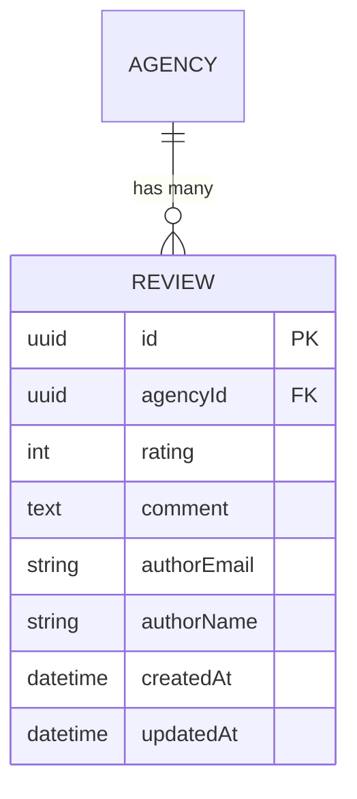

# Exercice 1 : API de gestion d'avis avec PACT-R

**Durée** : 2 heures  
**Format** : Semi-ouvert avec checkpoints  
**Binômes** : Possibles mais non obligatoires

---

## 🎯 Objectifs pédagogiques

À la fin de cet exercice, vous saurez :

- ✅ Appliquer la méthodologie PACT-R complète
- ✅ Créer des spécifications techniques (ERD, OpenAPI)
- ✅ Écrire des tests avant le code (TDD strict)
- ✅ Utiliser Claude Code pour générer du code conforme aux specs
- ✅ Mesurer les métriques (tokens, temps, qualité)
- ✅ Identifier les bonnes pratiques pour votre charte

---

## 📖 Contexte métier

Vous travaillez pour **Immodvisor**, plateforme de mise en relation entre particuliers et agences immobilières.

**Besoin** : Créer une API de gestion d'avis pour permettre aux clients de noter les agences après une prestation (achat, vente, location).

**Stack technique** :

- PHP 8.2+
- Symfony 6.4
- API Platform 3.2
- Doctrine ORM
- PHPUnit pour les tests
- Base de données : SQLite (pour simplicité) ou PostgreSQL

---

## 🏗️ Architecture

```
src/
├── Entity/
│   ├── Review.php
│   └── Agency.php (existante, fournie)
├── Repository/
│   └── ReviewRepository.php
├── Service/
│   └── ReviewService.php
├── Controller/
│   └── ReviewController.php (généré par API Platform)
├── Dto/
│   ├── CreateReviewDto.php
│   └── ReviewDto.php
└── Exception/
    ├── ReviewAlreadyExistsException.php
    └── ValidationException.php

tests/
├── Unit/
│   └── Service/
│       └── ReviewServiceTest.php
└── Functional/
    └── Api/
        └── ReviewApiTest.php
```

---

## 🚀 Déroulé de l'exercice

### Checkpoint 1 : Phase PLAN (30 min)

#### 1.1 Générer le jeu de données (10 min)

**Tâche** : Utiliser Claude Code pour générer 20-30 faux avis réalistes.

**Prompt suggéré** :

```markdown
Génère 30 faux avis d'agences immobilières réalistes en français.

Format JSON :
{
"reviews": [
{
"id": "uuid",
"agencyId": "uuid",
"agencyName": "string",
"rating": 1-5,
"comment": "string (50-300 caractères)",
"authorEmail": "email",
"authorName": "string",
"createdAt": "ISO 8601 date"
}
]
}

Critères :

- Variété de notes (1 à 5 étoiles)
- Commentaires réalistes (positifs, négatifs, neutres)
- Mix de types de prestations (achat, vente, location)
- Ton naturel, pas marketing

Sauvegarde dans `data/fake-reviews.json`
```

**Livrable** : `data/fake-reviews.json`

---

#### 1.2 Créer les spécifications (20 min)

##### a) Modèle de données (ERD)

**Tâche** : Créer un diagramme entité-relation pour l'entité `Review`.

**Entité Review** :

| Champ       | Type     | Contraintes                           |
| ----------- | -------- | ------------------------------------- |
| id          | UUID     | PK                                    |
| agencyId    | UUID     | FK → Agency, NOT NULL                 |
| rating      | Integer  | 1-5, NOT NULL                         |
| comment     | Text     | Min 10 caractères, Max 1000, NOT NULL |
| authorEmail | String   | Email valide, NOT NULL                |
| authorName  | String   | NOT NULL                              |
| createdAt   | DateTime | NOT NULL, auto                        |
| updatedAt   | DateTime | NOT NULL, auto                        |

**Contraintes** :

- Un utilisateur (email) ne peut laisser qu'un seul avis par agence
- Index unique : `(agencyId, authorEmail)`

**Livrable** : Documenter dans `docs/erd.md` ou utiliser Mermaid :



---

##### b) Spécification API (OpenAPI)

**Tâche** : Créer la spec OpenAPI pour les endpoints suivants :

**Endpoints à spécifier** :

1. **POST /api/reviews** : Créer un avis
2. **GET /api/reviews/{id}** : Récupérer un avis par ID
3. **GET /api/reviews** : Lister les avis (avec filtres)
4. **PUT /api/reviews/{id}** : Modifier son avis
5. **DELETE /api/reviews/{id}** : Supprimer son avis

**Exemple de spec (POST)** :

```yaml
openapi: 3.0.0
info:
  title: Immodvisor Reviews API
  version: 1.0.0

paths:
  /api/reviews:
    post:
      summary: Créer un nouvel avis
      operationId: createReview
      tags:
        - Reviews
      requestBody:
        required: true
        content:
          application/json:
            schema:
              type: object
              required:
                - agencyId
                - rating
                - comment
                - authorEmail
                - authorName
              properties:
                agencyId:
                  type: string
                  format: uuid
                  description: ID de l'agence notée
                rating:
                  type: integer
                  minimum: 1
                  maximum: 5
                  description: Note de 1 à 5 étoiles
                comment:
                  type: string
                  minLength: 10
                  maxLength: 1000
                  description: Commentaire de l'avis
                authorEmail:
                  type: string
                  format: email
                  description: Email de l'auteur
                authorName:
                  type: string
                  minLength: 2
                  description: Nom de l'auteur
      responses:
        "201":
          description: Avis créé avec succès
          content:
            application/json:
              schema:
                $ref: "#/components/schemas/Review"
        "400":
          description: Données invalides
          content:
            application/json:
              schema:
                $ref: "#/components/schemas/Error"
        "409":
          description: Un avis existe déjà pour cet utilisateur et cette agence
          content:
            application/json:
              schema:
                $ref: "#/components/schemas/Error"

components:
  schemas:
    Review:
      type: object
      properties:
        id:
          type: string
          format: uuid
        agencyId:
          type: string
          format: uuid
        rating:
          type: integer
          minimum: 1
          maximum: 5
        comment:
          type: string
        authorEmail:
          type: string
          format: email
        authorName:
          type: string
        createdAt:
          type: string
          format: date-time
        updatedAt:
          type: string
          format: date-time

    Error:
      type: object
      properties:
        code:
          type: string
        message:
          type: string
        violations:
          type: array
          items:
            type: object
            properties:
              field:
                type: string
              message:
                type: string
```

**Livrable** : `docs/openapi.yaml` (compléter avec GET, PUT, DELETE)

---

##### c) Découpage en tâches

**Tâche** : Prioriser avec MoSCoW et découper en tâches courtes.

**Exemple de backlog** :

```markdown
## Must Have (MVP - pour cet exercice)

- [ ] POST /api/reviews - Créer un avis (1h30)

  - Critères d'acceptation :
    - Valide les données (rating 1-5, comment min 10 caractères)
    - Vérifie qu'aucun avis n'existe pour cet user + agency
    - Retourne 201 avec l'avis créé
    - Retourne 400 si validation échoue
    - Retourne 409 si duplicata

- [ ] GET /api/reviews/{id} - Lire un avis (30min)
  - Critères :
    - Retourne 200 avec l'avis si trouvé
    - Retourne 404 si non trouvé

## Should Have (si temps disponible)

- [ ] GET /api/reviews?agencyId={id} - Lister les avis d'une agence
- [ ] PUT /api/reviews/{id} - Modifier son avis
- [ ] DELETE /api/reviews/{id} - Supprimer son avis

## Could Have (bonus)

- [ ] GET /api/reviews/stats?agencyId={id} - Statistiques
- [ ] Pagination des résultats
- [ ] Filtres avancés (rating, date, etc.)
```

**Livrable** : `docs/backlog.md`

---

### Checkpoint 2 : Phase ASSERT + CODE (1h)

#### 2.1 ASSERT : Écrire les tests d'abord (30 min)

**Tâche** : Écrire les tests pour POST /api/reviews **AVANT** toute implémentation.

**Tests à écrire** :

```php
// tests/Functional/Api/ReviewApiTest.php
namespace App\Tests\Functional\Api;

use ApiPlatform\Symfony\Bundle\Test\ApiTestCase;
use App\Entity\Agency;
use Hautelook\AliceBundle\PhpUnit\RefreshDatabaseTrait;

class ReviewApiTest extends ApiTestCase
{
    use RefreshDatabaseTrait;

    /** @test */
    public function it_creates_a_review_successfully(): void
    {
        // Given
        $agency = $this->createAgency();

        // When
        $response = static::createClient()->request('POST', '/api/reviews', [
            'json' => [
                'agencyId' => $agency->getId(),
                'rating' => 5,
                'comment' => 'Excellent service, très professionnel et à l\'écoute.',
                'authorEmail' => 'client@example.com',
                'authorName' => 'Jean Dupont',
            ],
        ]);

        // Then
        $this->assertResponseStatusCodeSame(201);
        $this->assertJsonContains([
            'agencyId' => $agency->getId(),
            'rating' => 5,
            'comment' => 'Excellent service, très professionnel et à l\'écoute.',
            'authorEmail' => 'client@example.com',
            'authorName' => 'Jean Dupont',
        ]);
    }

    /** @test */
    public function it_rejects_review_with_invalid_rating(): void
    {
        // TODO: À implémenter
    }

    /** @test */
    public function it_rejects_review_with_too_short_comment(): void
    {
        // TODO: À implémenter
    }

    /** @test */
    public function it_prevents_duplicate_review_for_same_user_and_agency(): void
    {
        // TODO: À implémenter
    }

    /** @test */
    public function it_rejects_review_for_non_existent_agency(): void
    {
        // TODO: À implémenter
    }

    private function createAgency(): Agency
    {
        // Helper method
    }
}
```

**Prompt suggéré pour Claude Code** :

```markdown
## Contexte

Je développe une API de gestion d'avis avec Symfony 6.4 + API Platform 3.2.

Voici la spec OpenAPI de POST /api/reviews :
[coller la spec OpenAPI]

## Tâche

Génère les tests fonctionnels PHPUnit pour cet endpoint.

Tests à couvrir :

1. Cas nominal : création d'avis réussie (201)
2. Validation échouée : rating invalide (< 1 ou > 5) → 400
3. Validation échouée : comment trop court (< 10 caractères) → 400
4. Validation échouée : email invalide → 400
5. Duplicata : avis déjà existant pour user + agency → 409
6. Agence inexistante → 404 ou 400

## Contraintes

- Utilise ApiPlatform\Symfony\Bundle\Test\ApiTestCase
- Format Given-When-Then (commentaires)
- Nomme les tests : it_creates_a_review_successfully, etc.
- Utilise RefreshDatabaseTrait
- Crée une méthode helper createAgency()

## Livrables

- tests/Functional/Api/ReviewApiTest.php
- tests/Unit/Service/ReviewServiceTest.php (optionnel, si service métier)
```

**Livrable** : Tests RED ❌ (qui échouent)

---

#### 2.2 CODE : Implémenter avec l'IA (30 min)

**Tâche** : Demander à Claude Code de générer l'implémentation minimale pour passer les tests au GREEN ✅.

**Prompt suggéré** :

```markdown
## Contexte

API Symfony 6.4 + API Platform 3.2 pour gérer des avis d'agences immobilières.

Architecture :

- Entity/Review.php (entité Doctrine)
- Repository/ReviewRepository.php
- Validation via Symfony Validator (annotations)
- API Platform expose automatiquement les endpoints

## Tests RED

[coller les tests qui échouent]

## Spec OpenAPI

[coller la spec complète]

## Tâche

Génère l'implémentation minimale pour faire passer tous les tests au GREEN.

Fichiers à générer :

1. src/Entity/Review.php (avec annotations Doctrine + Validation + API Platform)
2. src/Repository/ReviewRepository.php (méthode findByAgencyAndAuthor)
3. src/Validator/ (si contraintes custom nécessaires)

## Contraintes

- PHP 8.2 strict typing
- Annotations Doctrine + Symfony Validator
- API Platform Resource sur l'entité
- Constraint unique (agencyId, authorEmail)
- Gestion d'erreur 409 si duplicata via EventSubscriber ou Validator

## Questions

As-tu besoin de voir la structure de l'entité Agency ?
Veux-tu que je te donne des exemples d'entités existantes ?
```

**Workflow** :

1. Copier le prompt dans Claude Code
2. Laisser l'IA générer les fichiers
3. Lancer les tests : `php bin/phpunit`
4. Si RED ❌ → Ajuster le prompt et réitérer
5. Si GREEN ✅ → Passer au checkpoint suivant

**Livrable** : Code qui passe les tests GREEN ✅

---

### Checkpoint 3 : Phase TEST (BLUE) + Métriques (30 min)

#### 3.1 Refactoring (15 min)

**Tâche** : Améliorer le code sans casser les tests.

**Prompt suggéré** :

```markdown
## Contexte

Voici le code qui fait passer les tests :
[coller Entity/Review.php et autres fichiers générés]

## Tâche

Refactore ce code en suivant ces règles :

1. Séparer les responsabilités : si logique métier dans l'entité, extraire dans un Service
2. Améliorer les noms de méthodes/variables si flous
3. Ajouter des type hints manquants
4. Supprimer les duplications
5. Respecter PSR-12

## Contraintes

- NE PAS casser les tests existants
- NE PAS ajouter de fonctionnalités
- Garder l'architecture simple (pas de sur-engineering)

Relance les tests après refactoring pour vérifier.
```

---

#### 3.2 Analyse statique (10 min)

**Tâche** : Lancer PHPStan et corriger les erreurs.

```bash
# Installer PHPStan si pas déjà fait
composer require --dev phpstan/phpstan

# Créer phpstan.neon
parameters:
    level: 9
    paths:
        - src
        - tests

# Lancer l'analyse
vendor/bin/phpstan analyse
```

**Si erreurs** → Demander à Claude Code de les corriger :

```markdown
PHPStan a détecté les erreurs suivantes :
[coller les erreurs]

Corrige ces erreurs en respectant le niveau 9 (strict typing).
```

---

#### 3.3 Mesurer les métriques (5 min)

**Tâche** : Collecter les métriques de développement.

**Template** :

```markdown
## Métriques Exercice 1 : POST /api/reviews

### Métriques techniques

- **Tokens utilisés** : [vérifier dans Claude Code]
- **Coût estimé** : [tokens × $0.003 pour Claude Sonnet]
- **Temps total** : [votre temps réel]
  - PLAN : Xmin
  - ASSERT : Xmin
  - CODE : Xmin
  - TEST : Xmin

### Métriques qualité

- **Tests écrits** : X tests
- **Couverture** : X% (lancer `php bin/phpunit --coverage-text`)
- **PHPStan** : Niveau 9 ✅ ou ❌
- **Complexité cyclomatique** : [si métrique dispo]

### Difficultés rencontrées

- [Liste des blocages]

### Apprentissages

- [Ce qui a bien marché]
- [Ce qui a mal marché]
- [Idées pour la charte]
```

**Livrable** : `metrics.md`

---

### Checkpoint 4 : Phase REVIEW + Retours d'expérience (10 min)

#### 4.1 Démo rapide (5 min)

**Tâche** : Montrer votre endpoint fonctionnel.

**Commandes** :

```bash
# Lancer le serveur Symfony
symfony server:start

# Tester avec curl
curl -X POST http://localhost:8000/api/reviews \
  -H "Content-Type: application/json" \
  -d '{
    "agencyId": "uuid-agence",
    "rating": 5,
    "comment": "Excellent service, très professionnel.",
    "authorEmail": "client@example.com",
    "authorName": "Jean Dupont"
  }'

# Vérifier la réponse 201
```

---

#### 4.2 Retours collectifs (5 min)

**Questions de débriefing** :

1. **Qu'est-ce qui a bien fonctionné ?**

   - Prompts efficaces ?
   - Génération de tests rapide ?
   - Refactoring pertinent ?

2. **Qu'est-ce qui a bloqué ?**

   - Prompts flous ?
   - IA qui ne comprend pas les contraintes ?
   - Erreurs difficiles à corriger ?

3. **Premiers apprentissages pour la charte** :
   - Quels prompts types réutiliser ?
   - Quels garde-fous nécessaires ?
   - Quels outils (PHPStan, tests) obligatoires ?

---

## 📊 Grille d'évaluation (auto-évaluation)

| Critère                                    | Oui ✅ | Non ❌ | Remarque |
| ------------------------------------------ | ------ | ------ | -------- |
| **PLAN** : Specs complètes (ERD + OpenAPI) |        |        |          |
| **ASSERT** : Tests écrits avant code       |        |        |          |
| **CODE** : Code généré conforme aux specs  |        |        |          |
| **TEST** : Tests GREEN ✅                  |        |        |          |
| **TEST** : PHPStan niveau 9 passé          |        |        |          |
| **REVIEW** : Démo fonctionnelle            |        |        |          |
| **Métriques** : Collectées et documentées  |        |        |          |

---

## 🎁 Bonus (si temps disponible)

### Bonus 1 : Implémenter GET /api/reviews/{id}

Répéter le cycle PACT-R pour l'endpoint de lecture.

---

### Bonus 2 : Mutation Testing

Installer et lancer Infection (mutation testing PHP) :

```bash
composer require --dev infection/infection
vendor/bin/infection
```

**Objectif** : MSI > 80%

---

### Bonus 3 : Générer la documentation API

Utiliser API Platform pour générer la doc Swagger :

```bash
# Accéder à http://localhost:8000/api/docs
# Vérifier conformité avec openapi.yaml
```

---

## 💡 Conseils pratiques

### Pour gagner du temps

- ✅ Commencer simple (juste POST pour le MVP)
- ✅ Utiliser SQLite en local (pas besoin de Docker)
- ✅ Copier-coller les specs complètes dans les prompts
- ✅ Ne pas hésiter à réitérer si l'IA ne comprend pas

### Pour éviter les pièges

- ❌ Ne pas sauter la phase PLAN (c'est la clé !)
- ❌ Ne pas écrire le code avant les tests
- ❌ Ne pas accepter du code sans type hints
- ❌ Ne pas ignorer les erreurs PHPStan

### Prompts qui marchent bien

- Toujours donner le **contexte complet** (stack, architecture)
- Préciser les **contraintes** (PSR-12, SOLID, etc.)
- Demander à l'IA de **poser des questions** avant de générer
- Fournir des **exemples** de code existant

---

## 📚 Ressources utiles

- [API Platform Documentation](https://api-platform.com/docs/)
- [Symfony Validation Constraints](https://symfony.com/doc/current/reference/constraints.html)
- [PHPStan Documentation](https://phpstan.org/user-guide/getting-started)
- [PHPUnit Documentation](https://phpunit.de/documentation.html)

---

**Prochain exercice** : [Exercice 2 - Serveur MCP + RAG](exercice-2-serveur-mcp-rag.md)
