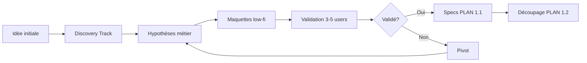
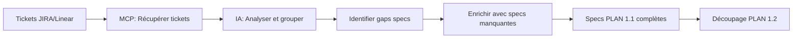
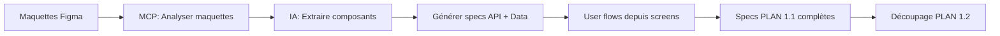
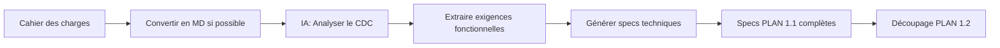
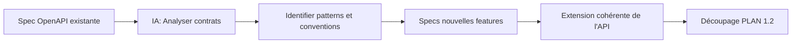
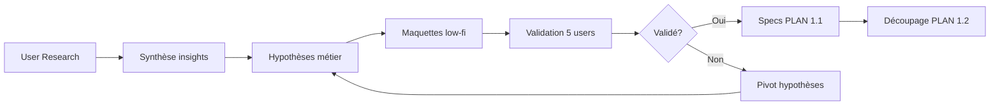
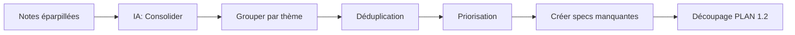

# Points d'entrée PLAN : Workflows selon vos inputs

> **Guide des différents scénarios de démarrage de la phase PLAN selon vos inputs disponibles**

---

## Vue d'ensemble

La phase PLAN de PACT-R s'adapte à votre situation de départ. Ce guide détaille 8 scénarios principaux et leurs combinaisons.

### Tableau de décision rapide

| Vous avez               | Workflow recommandé                 | Durée estimée | Difficulté |
| ----------------------- | ----------------------------------- | ------------- | ---------- |
| Rien (greenfield)       | Discovery → Specs complètes         | 3-5 jours     | ⭐⭐⭐     |
| Tickets JIRA/Linear     | MCP → Analyse → Enrichissement      | 1-2 jours     | ⭐⭐       |
| Maquettes Figma         | MCP Figma → Spécification           | 1-2 jours     | ⭐⭐       |
| Cahier des charges      | Analyse document → Specs techniques | 2-3 jours     | ⭐⭐       |
| API existante (OpenAPI) | Analyse contrats → Extension        | 0.5-1 jour    | ⭐         |
| Codebase legacy         | Reverse engineering → Specs         | 3-4 jours     | ⭐⭐⭐⭐   |
| User research           | Synthèse → Hypothèses → Specs       | 2-4 jours     | ⭐⭐⭐     |
| Backlog éparpillé       | Consolidation → Structure           | 1-2 jours     | ⭐⭐       |

---

## 1. Greenfield (Projet from scratch)

### Contexte

Vous démarrez un nouveau projet sans spécifications, ni maquettes, ni documentation existante.

### Workflow



### Étapes

**Jour 1-2 : Discovery**

1. Définir le problème utilisateur et la proposition de valeur
2. Identifier les user personas principaux
3. Créer des user stories initiales (format : En tant que [persona], je veux [action] afin de [bénéfice])

**Jour 2-3 : Prototypage**

1. Maquettes low-fidelity (wireframes)
2. User flows principaux (3-5 parcours critiques)
3. Validation avec 3-5 utilisateurs cibles

**Jour 3-5 : Spécifications**

1. Créer les specs complètes (voir PLAN 1.1 du README)
   - User Flows détaillés
   - Diagrammes de séquence
   - Modèle de données (ERD)
   - Contrats API (OpenAPI)
2. Découpage et priorisation (voir PLAN 1.2)

### Livrables

- [ ] User personas
- [ ] User stories principales
- [ ] Wireframes validés
- [ ] Specs techniques complètes
- [ ] Backlog priorisé

---

## 2. JIRA/Linear (Tickets existants)

### Contexte

Vous avez déjà des tickets dans un gestionnaire de tâches (JIRA, Linear, Asana, etc.).

### Outils MCP

- **Linear MCP** : Pour récupérer et analyser les issues Linear
  - `mcp_linear_list_issues` : Lister les issues
  - `mcp_linear_get_issue` : Détails d'une issue
  - `mcp_linear_list_projects` : Lister les projets

### Workflow



### Étapes

**Phase 1 : Récupération (30 min)**

1. Connecter le MCP Linear/JIRA à Claude
2. Lister les issues du projet/sprint
3. Récupérer les détails (description, critères d'acceptation, labels)

**Phase 2 : Analyse (2-4h)**

1. Demander à l'IA de :
   - Grouper les tickets par epic/feature
   - Identifier les dépendances entre tickets
   - Détecter les specs manquantes (API contracts, data model, etc.)
   - Extraire les user flows implicites

**Prompt d'analyse** :

```markdown
## Contexte

Voici les tickets du projet [nom] récupérés via Linear MCP :
[coller les issues]

## Tâche

1. Analyse les tickets et groupe-les par feature/epic
2. Identifie les dépendances entre tickets
3. Liste les spécifications techniques manquantes :
   - Contrats API non définis
   - Modèle de données incomplet
   - User flows ambigus
4. Propose un plan pour compléter les specs

## Questions

Y a-t-il des incohérences ou ambiguïtés dans les tickets ?
```

**Phase 3 : Enrichissement (1 jour)**

1. Créer les specs manquantes :
   - OpenAPI pour les endpoints non spécifiés
   - ERD complet
   - User flows détaillés si absents des tickets
2. Créer `GUIDELINES.md` si standards de code manquants

**Phase 4 : Découpage (2-4h)**

1. Prioriser les tickets selon méthode choisie (MoSCoW, RICE, etc.)
2. Découper les gros tickets en tâches < 4h
3. Définir les critères d'acceptation testables (ATDD/BDD)

### Livrables

- [ ] Analyse et groupement des tickets
- [ ] Specs techniques complètes
- [ ] Gaps identifiés et comblés
- [ ] Backlog priorisé et découpé

---

## 3. Figma (Maquettes validées)

### Contexte

Vous avez des maquettes Figma validées par le métier/design.

### Outils MCP

- **Figma MCP (TalkToFigma)** : Pour analyser les maquettes
  - `mcp_TalkToFigma_get_document_info` : Info sur le document
  - `mcp_TalkToFigma_read_my_design` : Lecture détaillée de la sélection
  - `mcp_TalkToFigma_scan_text_nodes` : Scanner les textes
  - `mcp_TalkToFigma_get_styles` : Récupérer les styles

### Workflow



### Étapes

**Phase 1 : Connexion Figma (15 min)**

1. Connecter le MCP TalkToFigma
2. Sélectionner le frame/page à analyser
3. Récupérer la structure de la maquette

**Phase 2 : Analyse des écrans (2-4h)**

1. Demander à l'IA de :
   - Lister tous les écrans/frames
   - Identifier les composants réutilisables
   - Extraire les user flows depuis la navigation
   - Détecter les champs de formulaires → Spécifier les DTOs

**Prompt d'analyse** :

```markdown
## Contexte

Maquettes Figma du projet [nom] analysées via MCP TalkToFigma.

[coller les infos du design]

## Tâche

1. Liste tous les écrans et leur rôle
2. Identifie les user flows depuis la navigation Figma
3. Pour chaque écran :
   - Extrais les champs de formulaire → Spécifie les DTOs
   - Identifie les actions (boutons) → Spécifie les endpoints API
   - Détecte les états (loading, error, empty, success)
4. Propose un modèle de données (ERD) basé sur les écrans
5. Génère les contrats OpenAPI pour les interactions identifiées

## Questions

Y a-t-il des interactions ou états non évidents dans le design ?
```

**Phase 3 : Génération des specs (1 jour)**

1. **User flows** : Créer les diagrammes de parcours depuis la navigation Figma
2. **ERD** : Modéliser les entités détectées dans les écrans
3. **OpenAPI** : Spécifier les endpoints pour chaque action utilisateur
4. **Design System** : Extraire les styles Figma → Créer les guidelines frontend

**Phase 4 : Découpage (2-4h)**

1. Prioriser les écrans (MoSCoW, User Story Mapping)
2. Découper par composants ou par flows
3. Critères d'acceptation basés sur les maquettes

### Livrables

- [ ] Inventaire des écrans et composants
- [ ] User flows extraits de Figma
- [ ] ERD + OpenAPI specs
- [ ] Design System / Guidelines frontend
- [ ] Backlog priorisé par écran/flow

---

## 4. Cahier des charges (Document PDF/MD)

### Contexte

Vous avez un cahier des charges fonctionnel (PDF, Word, Markdown, Notion, etc.).

### Workflow



### Étapes

**Phase 1 : Préparation du document (30 min)**

1. Si PDF : Convertir en Markdown (ou copier le texte brut)
2. Si possible, uploader le document directement à l'IA
3. Structurer le document par sections si non structuré

**Phase 2 : Analyse du CDC (2-4h)**

1. Demander à l'IA de :
   - Extraire toutes les exigences fonctionnelles
   - Identifier les exigences non fonctionnelles (performance, sécurité, etc.)
   - Lister les user personas et leurs besoins
   - Détecter les user flows implicites ou explicites
   - Identifier les contraintes techniques

**Prompt d'analyse** :

```markdown
## Contexte

Voici le cahier des charges du projet [nom] :

[coller le contenu du CDC]

## Tâche

1. Extrais toutes les exigences fonctionnelles et classe-les par module/feature
2. Liste les exigences non fonctionnelles (performance, sécurité, scalabilité)
3. Identifie les user personas et leurs objectifs
4. Détecte les user flows décrits ou implicites
5. Pour chaque exigence fonctionnelle, identifie :
   - Les entités de données nécessaires
   - Les endpoints API requis
   - Les règles métier à implémenter
6. Signale les ambiguïtés ou incohérences dans le CDC

## Questions

Quelles clarifications sont nécessaires avant de créer les specs techniques ?
```

**Phase 3 : Transformation en specs techniques (1-2 jours)**

1. **User Flows** : Créer les diagrammes de parcours depuis le CDC
2. **ERD** : Modéliser les entités mentionnées dans le CDC
3. **OpenAPI** : Spécifier les endpoints pour chaque exigence fonctionnelle
4. **Règles métier** : Documenter les contraintes et validations

**Phase 4 : Validation avec le métier (0.5 jour)**

1. Créer un document de synthèse des specs
2. Partager avec les stakeholders pour validation
3. Itérer sur les retours

**Phase 5 : Découpage (2-4h)**

1. Prioriser selon le CDC (certains cahiers ont déjà des priorités)
2. Découper en tâches techniques < 4h
3. Critères d'acceptation alignés sur le CDC

### Livrables

- [ ] Exigences fonctionnelles extraites et classées
- [ ] User flows depuis le CDC
- [ ] ERD + OpenAPI specs
- [ ] Document de validation partagé avec métier
- [ ] Backlog priorisé

---

## 5. API existante (OpenAPI/Swagger)

### Contexte

Vous avez déjà une API documentée (OpenAPI, Swagger, Postman) et souhaitez l'étendre.

### Workflow



### Étapes

**Phase 1 : Analyse de l'existant (1-2h)**

1. Récupérer le fichier `openapi.yaml` ou l'URL de documentation
2. Demander à l'IA d'analyser :
   - Conventions de naming (routes, paramètres, réponses)
   - Patterns de DTOs et validation
   - Gestion des erreurs (codes HTTP, format des erreurs)
   - Authentification et sécurité (JWT, OAuth, etc.)
   - Versioning API (v1, v2, etc.)

**Prompt d'analyse** :

```markdown
## Contexte

Voici la spec OpenAPI actuelle de notre API :

[coller openapi.yaml]

## Tâche

1. Analyse les conventions et patterns utilisés :
   - Naming des routes et paramètres
   - Structure des DTOs
   - Codes HTTP et gestion d'erreurs
   - Schémas de sécurité
2. Identifie les endpoints existants par domaine métier
3. Détecte les incohérences ou dérives dans la spec actuelle

## Nouvelle feature

Je veux ajouter [décrire la feature]

## Question

Comment étendre l'API de manière cohérente avec l'existant ?
Propose les nouveaux endpoints nécessaires en respectant les conventions.
```

**Phase 2 : Extension de la spec (0.5-1 jour)**

1. Créer les nouveaux endpoints en respectant les conventions détectées
2. Définir les nouveaux DTOs cohérents avec l'existant
3. Spécifier les validations et contraintes
4. Mettre à jour le modèle de données (ERD) si nécessaire

**Phase 3 : Découpage (1-2h)**

1. Prioriser les nouveaux endpoints
2. Découper en tâches d'implémentation
3. Tests d'acceptation basés sur les contrats

### Livrables

- [ ] Analyse des conventions API existantes
- [ ] Nouveaux endpoints OpenAPI
- [ ] Nouveaux DTOs
- [ ] ERD mis à jour
- [ ] Backlog priorisé

---

## 6. Codebase legacy (Code existant sans doc)

### Contexte

Vous devez travailler sur une codebase existante mal documentée (refactoring, nouvelles features).

### Outils

- **Claude Code `/init`** : Analyse initiale de la codebase
- **Codebase Search** : Recherche sémantique dans le code

### Workflow

```mermaid
graph LR
    A[Codebase legacy] --> B[/init ou analyse profonde]
    B --> C[IA: Reverse engineering]
    C --> D[Documenter architecture actuelle]
    D --> E[Créer specs pour refactoring/feature]
    E --> F[Découpage PLAN 1.2]
```

### Étapes

**Phase 1 : Analyse initiale (0.5-1 jour)**

**Option A : Utiliser `/init` de Claude Code**

1. Lancer `/init` sur le projet
2. Laisser Claude analyser la structure et les patterns
3. Demander un résumé de l'architecture actuelle

**Option B : Analyse profonde manuelle**

1. Identifier les points d'entrée (controllers, routes, main)
2. Mapper les domaines métier (modules, bounded contexts)
3. Analyser les dépendances entre composants

**Prompt d'analyse** :

```markdown
## Contexte

Je travaille sur une codebase legacy [langage/framework].

## Tâche

1. Analyse la structure du projet et identifie :
   - L'architecture utilisée (MVC, DDD, etc.)
   - Les domaines métier principaux
   - Les patterns de code (Repository, Service, etc.)
   - Les dépendances entre modules
2. Détecte la dette technique principale :
   - Code dupliqué
   - Couplage fort
   - Absence de tests
   - Violations de SOLID
3. Pour [feature/refactoring à faire], propose :
   - Les fichiers à modifier
   - Les risques identifiés
   - Les tests à créer d'abord (TDD)

## Questions

Quelles clarifications sont nécessaires sur le code existant ?
```

**Phase 2 : Reverse engineering des specs (1-2 jours)**

1. Créer un ERD depuis le code (entités, migrations)
2. Générer une spec OpenAPI depuis les routes/controllers existants
3. Documenter les user flows actuels
4. Créer `GUIDELINES.md` basé sur les patterns détectés

**Phase 3 : Spécifier les changements (0.5-1 jour)**

1. Définir les specs de la nouvelle feature ou du refactoring
2. Identifier les impacts sur l'existant
3. Créer un plan de migration si nécessaire (Strangler Fig)

**Phase 4 : Découpage (2-4h)**

1. Prioriser : Quick wins vs refactoring profond
2. Découper en tâches minimales avec tests
3. Critères d'acceptation : pas de régression + nouvelle fonctionnalité

### Livrables

- [ ] Documentation de l'architecture actuelle
- [ ] ERD reverse-engineered
- [ ] OpenAPI généré depuis le code
- [ ] Analyse de dette technique
- [ ] Specs des changements
- [ ] Plan de migration si besoin
- [ ] Backlog priorisé

---

## 7. Discovery pur (User Research)

### Contexte

Vous démarrez par une phase de recherche utilisateur (interviews, observations, hypothèses métier).

### Workflow



### Étapes

**Phase 1 : Research (3-5 jours selon méthode)**

1. **Interviews utilisateurs** (5-10 utilisateurs cibles)
   - Questions ouvertes sur les problèmes rencontrés
   - Observation des workflows actuels
   - Besoins et frustrations
2. **Analyse concurrentielle**
   - Produits similaires existants
   - Forces et faiblesses
3. **Définition des personas**
   - 2-4 personas principaux
   - Jobs-to-be-done pour chaque persona

**Phase 2 : Synthèse et hypothèses (1 jour)**

1. Regrouper les insights par thème
2. Formuler des hypothèses métier testables :
   - "Les utilisateurs ont besoin de X pour accomplir Y"
   - "La fonctionnalité Z réduira le temps de 50%"
3. Prioriser les hypothèses à tester (impact vs effort)

**Prompt de synthèse** :

```markdown
## Contexte

Voici les notes de mes interviews utilisateurs :

[coller les notes d'interviews]

## Tâche

1. Synthétise les insights principaux par thème
2. Identifie les problèmes récurrents et leur fréquence
3. Pour chaque problème, propose des hypothèses de solution
4. Priorise les hypothèses selon :
   - Impact potentiel sur l'utilisateur
   - Fréquence du problème
   - Effort de développement estimé
5. Propose 3-5 user stories principales

## Questions

Quels autres insights devrais-je explorer avec les utilisateurs ?
```

**Phase 3 : Prototypage (1-2 jours)**

1. Créer des wireframes low-fidelity (Figma, Balsamiq, papier)
2. Définir les user flows principaux
3. Tester avec 5 utilisateurs (méthode Nielsen)

**Phase 4 : Validation (0.5 jour)**

1. Recueillir le feedback sur les prototypes
2. Itérer si nécessaire
3. Valider les hypothèses ou pivoter

**Phase 5 : Spécifications (1-2 jours)**

1. Créer les specs techniques complètes (PLAN 1.1)
2. Découpage et priorisation (PLAN 1.2)

### Livrables

- [ ] Synthèse des interviews (insights, problèmes, besoins)
- [ ] Personas validés
- [ ] Hypothèses métier priorisées
- [ ] Wireframes testés
- [ ] Specs techniques complètes
- [ ] Backlog priorisé

---

## 8. Backlog éparpillé (Notes, emails, tickets)

### Contexte

Vous avez des demandes/idées éparpillées (emails, notes, tickets non structurés, messages Slack, etc.).

### Workflow



### Étapes

**Phase 1 : Collecte (0.5 jour)**

1. Rassembler toutes les sources :
   - Emails de demandes
   - Notes de réunions
   - Messages Slack/Teams
   - Tickets non structurés
   - Idées dans Notion/Confluence
2. Copier tout dans un document unique

**Phase 2 : Consolidation (1 jour)**

1. Demander à l'IA de :
   - Extraire toutes les demandes/idées
   - Grouper par thème ou feature
   - Détecter les doublons
   - Identifier les demandes contradictoires

**Prompt de consolidation** :

```markdown
## Contexte

Voici toutes les demandes et idées collectées depuis différentes sources :

[coller notes, emails, tickets, etc.]

## Tâche

1. Extrais chaque demande/idée distincte
2. Groupe par thème ou feature cohérente
3. Détecte les doublons et fusionne-les
4. Identifie les demandes contradictoires
5. Pour chaque groupe :
   - Propose un titre de feature
   - Résume l'objectif métier
   - Liste les exigences extraites
6. Transforme en user stories (format : En tant que [persona], je veux [action] afin de [bénéfice])

## Questions

Quelles demandes nécessitent des clarifications avec les stakeholders ?
```

**Phase 3 : Priorisation (0.5 jour)**

1. Appliquer une méthode de priorisation (MoSCoW, RICE, Value vs Effort)
2. Valider les priorités avec les stakeholders
3. Créer un backlog structuré

**Phase 4 : Création des specs (1-2 jours)**

1. Pour les features prioritaires, créer les specs complètes (PLAN 1.1)
2. Découpage et critères d'acceptation (PLAN 1.2)

### Livrables

- [ ] Document consolidé de toutes les demandes
- [ ] Demandes groupées par feature
- [ ] Doublons fusionnés
- [ ] Contradictions identifiées et résolues
- [ ] Backlog priorisé
- [ ] Specs techniques des features prioritaires

---

## Combinaisons de scénarios

### Figma + JIRA/Linear

**Cas d'usage** : Design validé + tickets de développement existants

**Workflow** :

1. Analyser Figma (MCP) → Extraire composants et user flows
2. Récupérer tickets (MCP Linear) → Mapper tickets aux écrans Figma
3. Identifier les gaps :
   - Écrans Figma sans ticket correspondant
   - Tickets sans maquette
4. Créer les specs manquantes
5. Découpage et priorisation

**Bénéfice** : Alignement design-dev, détection précoce des incohérences

---

### Cahier des charges + Figma

**Cas d'usage** : Specs fonctionnelles écrites + maquettes validées

**Workflow** :

1. Analyser le CDC → Extraire exigences fonctionnelles
2. Analyser Figma (MCP) → Vérifier conformité maquettes/CDC
3. Identifier les divergences :
   - Fonctionnalités dans CDC absentes de Figma
   - Écrans Figma non mentionnés dans CDC
4. Créer les specs techniques complètes
5. Découpage

**Bénéfice** : Validation croisée CDC-Design, cohérence assurée

---

### API existante + Figma

**Cas d'usage** : Extension d'un produit existant avec nouveaux écrans

**Workflow** :

1. Analyser OpenAPI existant → Identifier conventions
2. Analyser Figma (MCP) → Extraire nouveaux écrans et interactions
3. Spécifier les nouveaux endpoints cohérents avec l'existant
4. Étendre le modèle de données (ERD)
5. Découpage

**Bénéfice** : Cohérence API, réutilisation des patterns existants

---

### Code legacy + Cahier des charges (refactoring)

**Cas d'usage** : Refactoring documenté d'une codebase existante

**Workflow** :

1. Analyser le code (`/init` ou analyse profonde) → Architecture actuelle
2. Analyser le CDC de refactoring → Objectifs et contraintes
3. Comparer état actuel vs état cible
4. Créer un plan de migration (Strangler Fig)
5. Découpage incrémental

**Bénéfice** : Migration sécurisée, risques identifiés

---

### JIRA + API existante

**Cas d'usage** : Évolution d'API avec tickets de nouvelles features

**Workflow** :

1. Récupérer tickets (MCP Linear) → Nouvelles features demandées
2. Analyser OpenAPI existant → Conventions et patterns
3. Spécifier les nouveaux endpoints cohérents
4. Créer les tests de contrat (Pact)
5. Découpage

**Bénéfice** : Évolution cohérente de l'API, tests de non-régression

---

### Discovery + Figma

**Cas d'usage** : Research utilisateur → Design validé → Dev

**Workflow** :

1. User research → Synthèse insights et hypothèses
2. Créer maquettes Figma basées sur les hypothèses
3. Tester maquettes avec 5 users → Valider/Pivoter
4. Analyser Figma validé (MCP) → Specs techniques
5. Découpage

**Bénéfice** : Product-market fit assuré, design validé utilisateurs

---

## Outils et références MCP

### Linear MCP

- **Documentation** : [Linear MCP](https://www.npmjs.com/package/@linear/sdk)
- **Fonctions principales** :
  - `mcp_linear_list_issues` : Lister les issues
  - `mcp_linear_get_issue` : Détails d'une issue
  - `mcp_linear_list_projects` : Lister les projets
  - `mcp_linear_create_issue` : Créer une issue
  - `mcp_linear_update_issue` : Mettre à jour une issue

### Figma MCP (TalkToFigma)

- **Documentation** : [TalkToFigma](https://github.com/hunkim/talk-to-figma)
- **Fonctions principales** :
  - `mcp_TalkToFigma_get_document_info` : Info document
  - `mcp_TalkToFigma_read_my_design` : Lecture sélection
  - `mcp_TalkToFigma_scan_text_nodes` : Scanner textes
  - `mcp_TalkToFigma_get_styles` : Récupérer styles
  - `mcp_TalkToFigma_get_local_components` : Composants

---

## Checklist de sélection du workflow

Utilisez cette checklist pour identifier votre scénario :

- [ ] Avez-vous des maquettes validées ? → **Scénario 3 (Figma)**
- [ ] Avez-vous des tickets de développement ? → **Scénario 2 (JIRA/Linear)**
- [ ] Avez-vous un cahier des charges ? → **Scénario 4 (CDC)**
- [ ] Avez-vous une API documentée existante ? → **Scénario 5 (API existante)**
- [ ] Avez-vous du code legacy à maintenir ? → **Scénario 6 (Codebase legacy)**
- [ ] Démarrez-vous par de la recherche utilisateur ? → **Scénario 7 (Discovery)**
- [ ] Avez-vous des demandes éparpillées à consolider ? → **Scénario 8 (Backlog éparpillé)**
- [ ] Avez-vous plusieurs de ces inputs ? → **Voir combinaisons**
- [ ] Vous n'avez rien de tout ça ? → **Scénario 1 (Greenfield)**

---

## Templates de prompts par scénario

### Template général d'analyse

```markdown
## Contexte

[Décrire le projet et l'objectif]

## Input disponible

[Coller : tickets, maquettes analysées, CDC, spec API, etc.]

## Tâche

1. Analyse l'input et identifie :
   - Les fonctionnalités principales
   - Les exigences fonctionnelles et non fonctionnelles
   - Les user flows implicites ou explicites
   - Les entités de données nécessaires
2. Détecte les manques :
   - Spécifications techniques manquantes
   - Ambiguïtés ou contradictions
   - Contraintes non exprimées
3. Propose un plan pour créer les specs PACT-R complètes :
   - User Flows à documenter
   - ERD à créer
   - Contrats API (OpenAPI) à spécifier
   - Guidelines à définir

## Questions

Quelles clarifications sont nécessaires avant de continuer ?
Quels risques identifies-tu dans l'input fourni ?
```

---

**Retour au guide principal** : [README.md](README.md)
