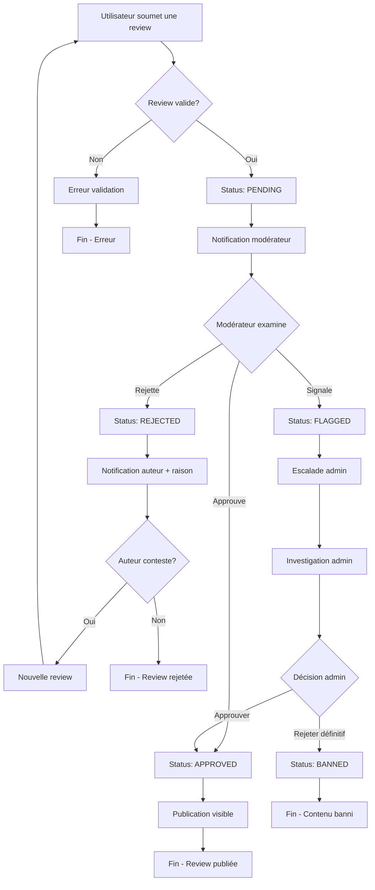
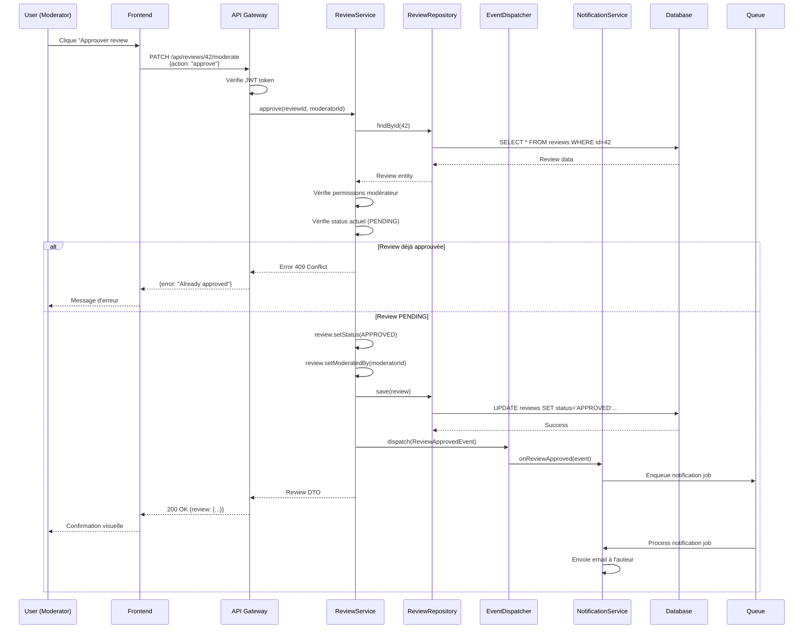
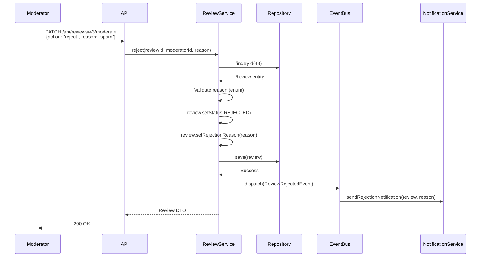
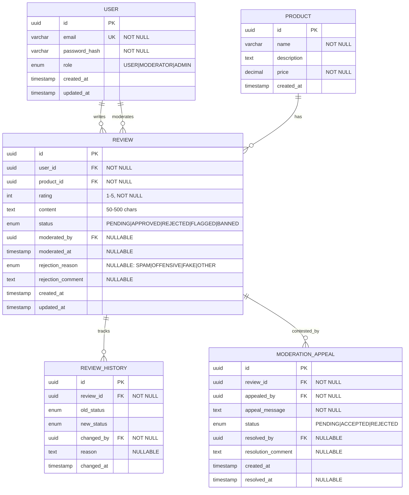
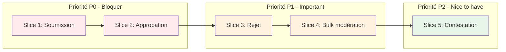
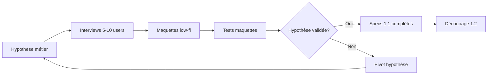
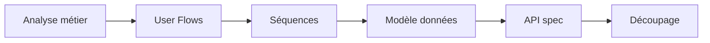
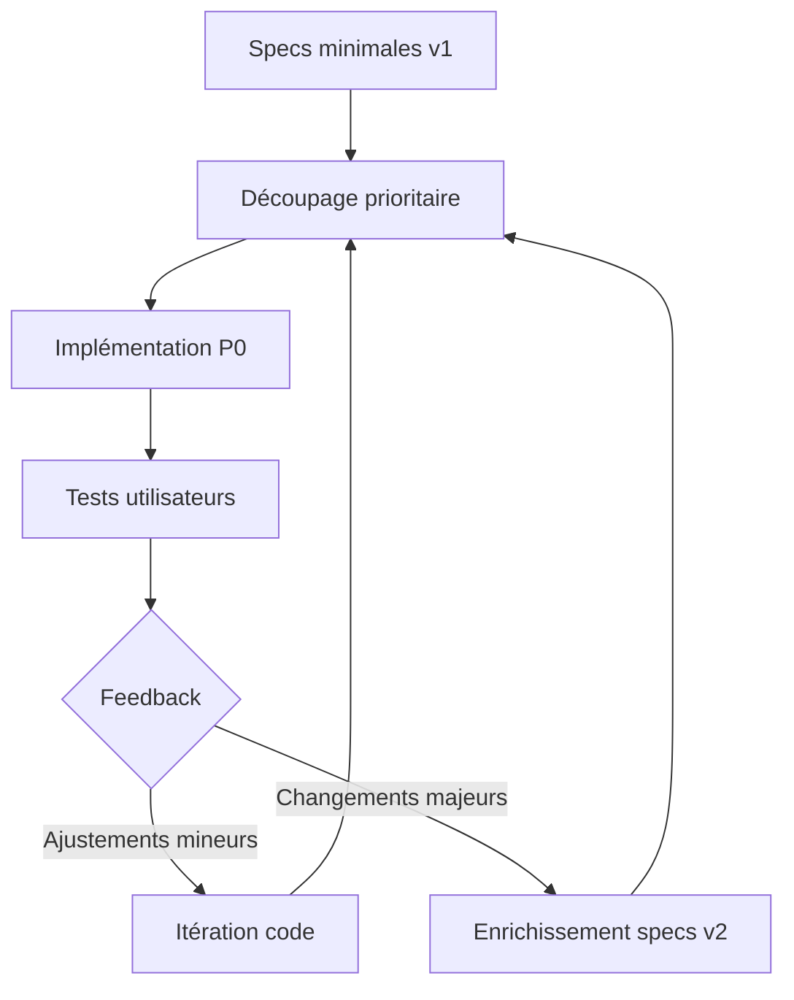

# Phase PLAN : Exemples détaillés

## Vue d'ensemble

La phase PLAN se divise en deux sous-phases complémentaires :

1. **1.1 Spécifications exhaustives** : Créer les spécifications techniques complètes
2. **1.2 Découpage et priorisation** : Transformer les specs en tâches modulaires

---

## 1.1 Spécifications exhaustives

### Objectif

Créer un référentiel complet et user-centric qui servira de source de vérité pour tout le développement.

### Livrables

#### 1. User Flows

**Description** : Parcours utilisateurs complets avec tous les scénarios possibles.

##### Exemple : Système de modération de reviews



**Format texte** :

```markdown
## User Flow 1 : Soumission et modération de review (Happy Path)

1. Utilisateur authentifié accède à la page produit
2. Clique sur "Écrire une review"
3. Remplit le formulaire (note 1-5, commentaire 50-500 chars)
4. Soumet la review
5. Review créée avec status PENDING
6. Notification envoyée au modérateur
7. Modérateur se connecte au dashboard
8. Consulte la liste des reviews PENDING
9. Examine le contenu de la review #42
10. Clique sur "Approuver"
11. Review passe en status APPROVED
12. Review s'affiche publiquement sur la page produit
13. Notification envoyée à l'auteur

## User Flow 2 : Rejet de review avec contestation

1. Modérateur examine review #43
2. Détecte contenu inapproprié
3. Clique sur "Rejeter"
4. Sélectionne raison : "Langage offensant"
5. Ajoute commentaire optionnel
6. Confirme le rejet
7. Review passe en status REJECTED
8. Notification envoyée à l'auteur avec raison
9. Auteur consulte notification
10. Clique sur "Contester la décision"
11. Remplit formulaire de contestation
12. Ticket créé pour équipe admin
13. Admin examine le cas
14. Décide de maintenir le rejet
15. Notification finale envoyée à l'auteur

## User Flow 3 : Modération en masse

1. Modérateur accède au dashboard
2. Filtre reviews par status PENDING
3. Affichage de 25 reviews en attente
4. Coche 10 reviews similaires (même produit)
5. Clique sur "Actions groupées" → "Approuver sélection"
6. Popup de confirmation affiche le nombre (10)
7. Confirme l'action
8. Les 10 reviews passent en APPROVED
9. 10 notifications envoyées aux auteurs
10. Dashboard rafraîchi, 15 reviews PENDING restantes
```

#### 2. Diagrammes de séquence

**Description** : Interactions entre composants pour chaque user flow.

##### Exemple : Approbation de review



##### Exemple : Rejet avec raison



#### 3. Modèle de données (ERD)

**Description** : Structure complète de la base de données avec types, contraintes, relations.



**Contraintes et index** :

```sql
-- Index pour recherche rapide
CREATE INDEX idx_reviews_status ON reviews(status);
CREATE INDEX idx_reviews_product ON reviews(product_id);
CREATE INDEX idx_reviews_user ON reviews(user_id);
CREATE INDEX idx_reviews_moderated_at ON reviews(moderated_at DESC);

-- Index composites pour filtrage modération
CREATE INDEX idx_reviews_status_created ON reviews(status, created_at DESC);

-- Contraintes métier
ALTER TABLE reviews ADD CONSTRAINT check_rating_range
    CHECK (rating >= 1 AND rating <= 5);

ALTER TABLE reviews ADD CONSTRAINT check_content_length
    CHECK (char_length(content) >= 50 AND char_length(content) <= 500);

ALTER TABLE reviews ADD CONSTRAINT check_moderation_fields
    CHECK (
        (status IN ('APPROVED', 'REJECTED') AND moderated_by IS NOT NULL)
        OR
        (status IN ('PENDING', 'FLAGGED') AND moderated_by IS NULL)
    );

-- Triggers pour historique
CREATE TRIGGER review_status_change_trigger
    AFTER UPDATE ON reviews
    FOR EACH ROW
    WHEN (OLD.status IS DISTINCT FROM NEW.status)
    EXECUTE FUNCTION log_review_status_change();
```

#### 4. Spécifications API (OpenAPI)

**Description** : Contrats d'API exhaustifs avec tous les endpoints, DTOs, validations.

```yaml
openapi: 3.0.3
info:
  title: Review Moderation API
  version: 1.0.0
  description: API pour la gestion et modération de reviews produits

servers:
  - url: https://api.example.com/v1
    description: Production
  - url: https://api-staging.example.com/v1
    description: Staging

security:
  - BearerAuth: []

paths:
  /reviews:
    get:
      summary: Liste les reviews avec filtres
      operationId: listReviews
      tags:
        - Reviews
      parameters:
        - name: status
          in: query
          schema:
            $ref: '#/components/schemas/ReviewStatus'
        - name: product_id
          in: query
          schema:
            type: string
            format: uuid
        - name: limit
          in: query
          schema:
            type: integer
            minimum: 1
            maximum: 100
            default: 20
        - name: offset
          in: query
          schema:
            type: integer
            minimum: 0
            default: 0
      responses:
        '200':
          description: Liste de reviews
          content:
            application/json:
              schema:
                type: object
                properties:
                  data:
                    type: array
                    items:
                      $ref: '#/components/schemas/Review'
                  meta:
                    $ref: '#/components/schemas/PaginationMeta'

    post:
      summary: Créer une nouvelle review
      operationId: createReview
      tags:
        - Reviews
      requestBody:
        required: true
        content:
          application/json:
            schema:
              $ref: '#/components/schemas/CreateReviewRequest'
      responses:
        '201':
          description: Review créée
          content:
            application/json:
              schema:
                $ref: '#/components/schemas/Review'
        '400':
          $ref: '#/components/responses/BadRequest'
        '401':
          $ref: '#/components/responses/Unauthorized'

  /reviews/{id}/moderate:
    patch:
      summary: Modérer une review (approve/reject)
      operationId: moderateReview
      tags:
        - Moderation
      security:
        - BearerAuth: []
      parameters:
        - name: id
          in: path
          required: true
          schema:
            type: string
            format: uuid
      requestBody:
        required: true
        content:
          application/json:
            schema:
              $ref: '#/components/schemas/ModerateReviewRequest'
      responses:
        '200':
          description: Review modérée avec succès
          content:
            application/json:
              schema:
                $ref: '#/components/schemas/Review'
        '400':
          $ref: '#/components/responses/BadRequest'
        '403':
          $ref: '#/components/responses/Forbidden'
        '404':
          $ref: '#/components/responses/NotFound'
        '409':
          description: Conflit - review déjà modérée
          content:
            application/json:
              schema:
                $ref: '#/components/schemas/Error'

  /reviews/bulk-moderate:
    post:
      summary: Modérer plusieurs reviews en masse
      operationId: bulkModerateReviews
      tags:
        - Moderation
      requestBody:
        required: true
        content:
          application/json:
            schema:
              $ref: '#/components/schemas/BulkModerateRequest'
      responses:
        '200':
          description: Résultat de la modération en masse
          content:
            application/json:
              schema:
                $ref: '#/components/schemas/BulkModerateResponse'

components:
  securitySchemes:
    BearerAuth:
      type: http
      scheme: bearer
      bearerFormat: JWT

  schemas:
    ReviewStatus:
      type: string
      enum:
        - PENDING
        - APPROVED
        - REJECTED
        - FLAGGED
        - BANNED

    RejectionReason:
      type: string
      enum:
        - SPAM
        - OFFENSIVE
        - FAKE
        - OTHER

    Review:
      type: object
      required:
        - id
        - user_id
        - product_id
        - rating
        - content
        - status
        - created_at
      properties:
        id:
          type: string
          format: uuid
        user_id:
          type: string
          format: uuid
        product_id:
          type: string
          format: uuid
        rating:
          type: integer
          minimum: 1
          maximum: 5
        content:
          type: string
          minLength: 50
          maxLength: 500
        status:
          $ref: '#/components/schemas/ReviewStatus'
        moderated_by:
          type: string
          format: uuid
          nullable: true
        moderated_at:
          type: string
          format: date-time
          nullable: true
        rejection_reason:
          $ref: '#/components/schemas/RejectionReason'
          nullable: true
        rejection_comment:
          type: string
          maxLength: 1000
          nullable: true
        created_at:
          type: string
          format: date-time
        updated_at:
          type: string
          format: date-time

    CreateReviewRequest:
      type: object
      required:
        - product_id
        - rating
        - content
      properties:
        product_id:
          type: string
          format: uuid
        rating:
          type: integer
          minimum: 1
          maximum: 5
        content:
          type: string
          minLength: 50
          maxLength: 500

    ModerateReviewRequest:
      type: object
      required:
        - action
      properties:
        action:
          type: string
          enum:
            - approve
            - reject
            - flag
        reason:
          $ref: '#/components/schemas/RejectionReason'
          description: Obligatoire si action=reject
        comment:
          type: string
          maxLength: 1000

    BulkModerateRequest:
      type: object
      required:
        - review_ids
        - action
      properties:
        review_ids:
          type: array
          items:
            type: string
            format: uuid
          minItems: 1
          maxItems: 100
        action:
          type: string
          enum:
            - approve
            - reject
        reason:
          $ref: '#/components/schemas/RejectionReason'
        comment:
          type: string
          maxLength: 1000

    BulkModerateResponse:
      type: object
      properties:
        success_count:
          type: integer
        failed_count:
          type: integer
        results:
          type: array
          items:
            type: object
            properties:
              review_id:
                type: string
                format: uuid
              success:
                type: boolean
              error:
                type: string
                nullable: true

    PaginationMeta:
      type: object
      properties:
        total:
          type: integer
        limit:
          type: integer
        offset:
          type: integer

    Error:
      type: object
      required:
        - error
        - message
      properties:
        error:
          type: string
        message:
          type: string
        details:
          type: object
          additionalProperties: true

  responses:
    BadRequest:
      description: Requête invalide
      content:
        application/json:
          schema:
            $ref: '#/components/schemas/Error'

    Unauthorized:
      description: Non authentifié
      content:
        application/json:
          schema:
            $ref: '#/components/schemas/Error'

    Forbidden:
      description: Permissions insuffisantes
      content:
        application/json:
          schema:
            $ref: '#/components/schemas/Error'

    NotFound:
      description: Ressource non trouvée
      content:
        application/json:
          schema:
            $ref: '#/components/schemas/Error'
```

---

## 1.2 Découpage et priorisation modulaire

### Objectif

Transformer les spécifications exhaustives en tâches courtes, indépendantes et testables.

### Méthodologie

#### 1. Identification des vertical slices (Tracer Bullets)

**Principe** : Créer des tranches verticales fonctionnelles end-to-end.

##### Exemple de découpage

```markdown
## Feature : Système de modération de reviews

### Slice 1 : Soumission simple de review (Tracer Bullet)
**Durée estimée** : 1 jour
**Valeur** : Permet de valider le flow complet end-to-end

- Frontend : Formulaire création review
- API : POST /reviews
- Backend : ReviewService.create()
- Database : Table reviews + migrations
- Tests : E2E soumission review

### Slice 2 : Modération individuelle (approbation)
**Durée estimée** : 0.5 jour
**Valeur** : Permet aux modérateurs de commencer à approuver

- Frontend : Dashboard modérateur + bouton approuver
- API : PATCH /reviews/{id}/moderate
- Backend : ReviewService.approve()
- Events : ReviewApprovedEvent
- Tests : Unit + E2E approbation

### Slice 3 : Modération individuelle (rejet avec raison)
**Durée estimée** : 0.5 jour
**Valeur** : Gestion des reviews inappropriées

- Frontend : Modal de rejet avec sélection raison
- API : Extension endpoint moderate (action=reject)
- Backend : ReviewService.reject()
- Notifications : Email auteur avec raison
- Tests : Unit + E2E rejet

### Slice 4 : Modération en masse
**Durée estimée** : 1 jour
**Valeur** : Gain de productivité modérateurs

- Frontend : Sélection multiple + actions groupées
- API : POST /reviews/bulk-moderate
- Backend : ReviewService.bulkModerate()
- Optimisation : Transactions + jobs asynchrones
- Tests : PBT sur idempotence

### Slice 5 : Système de contestation
**Durée estimée** : 1.5 jour
**Valeur** : Permet recours utilisateurs

- Frontend : Formulaire contestation
- API : POST /reviews/{id}/appeal
- Backend : ModerationAppealsService
- Workflow : Notification admin + résolution
- Tests : Unit + E2E workflow complet
```

#### 2. Priorisation par valeur métier



#### 3. Découpage en tâches courtes (< 4h)

##### Exemple : Slice 2 décomposée

```markdown
## Slice 2 : Modération individuelle (approbation)

### Tâche 2.1 : Spécification API endpoint moderate
**Durée** : 30min
**Tokens estimés** : 5,000
**Coût estimé** : $0.03

- Valider spec OpenAPI pour PATCH /reviews/{id}/moderate
- Définir DTO ModerateReviewRequest
- Définir codes réponse (200, 400, 403, 404, 409)

**Critères d'acceptation** :
- [ ] Spec OpenAPI validée par linter
- [ ] DTOs générés automatiquement
- [ ] Documentation API à jour

---

### Tâche 2.2 : Tests d'acceptation RED (BDD)
**Durée** : 45min
**Tokens estimés** : 8,000
**Coût estimé** : $0.05

**Scénarios Gherkin** :
```gherkin
Feature: Approbation de review

  Scenario: Modérateur approuve une review PENDING
    Given une review avec id "550e8400-e29b-41d4-a716-446655440000" et status "PENDING"
    And un utilisateur avec role "MODERATOR"
    When le modérateur approuve la review
    Then le status de la review est "APPROVED"
    And le champ moderated_by contient l'id du modérateur
    And un événement ReviewApprovedEvent est dispatché
    And une notification est envoyée à l'auteur

  Scenario: Non-modérateur tente d'approuver
    Given une review avec status "PENDING"
    And un utilisateur avec role "USER"
    When l'utilisateur tente d'approuver la review
    Then une erreur 403 Forbidden est retournée

  Scenario: Approbation de review déjà approuvée
    Given une review avec status "APPROVED"
    And un utilisateur avec role "MODERATOR"
    When le modérateur tente d'approuver la review
    Then une erreur 409 Conflict est retournée
```

**Critères d'acceptation** :
- [ ] 3 scénarios BDD écrits
- [ ] Tests exécutent et ÉCHOUENT (RED)
- [ ] Couverture : cas nominal + erreurs + limites

---

### Tâche 2.3 : Tests unitaires ReviewService.approve() RED
**Durée** : 45min
**Tokens estimés** : 10,000
**Coût estimé** : $0.06

**Tests à écrire** :
1. `testApproveChangesStatusToApproved()`
2. `testApproveSetsModerationFields()`
3. `testApproveDispatchesEvent()`
4. `testApproveByNonModeratorThrowsException()`
5. `testApproveAlreadyApprovedThrowsConflict()`

**Critères d'acceptation** :
- [ ] 5 tests unitaires minimum
- [ ] Mocks pour Repository et EventDispatcher
- [ ] Assertions strictes (assertEquals, pas assertTrue)
- [ ] Tous les tests ÉCHOUENT (classe pas encore créée)

---

### Tâche 2.4 : Implémentation ReviewService.approve() GREEN
**Durée** : 1h30
**Tokens estimés** : 15,000
**Coût estimé** : $0.09

**Code à produire** :
- Classe ReviewService
- Méthode approve(reviewId, moderatorId)
- Validation permissions
- Validation status
- Dispatch événement
- Persistence

**Critères d'acceptation** :
- [ ] Tous les tests unitaires PASSENT (GREEN)
- [ ] Code minimal (YAGNI)
- [ ] Typage strict
- [ ] Injection dépendances

---

### Tâche 2.5 : Implémentation Controller + Route
**Durée** : 45min
**Tokens estimés** : 8,000
**Coût estimé** : $0.05

**Code à produire** :
- ReviewModerationController
- Route PATCH /api/reviews/{id}/moderate
- Validation JWT middleware
- Sérialisation réponse

**Critères d'acceptation** :
- [ ] Tests E2E BDD PASSENT
- [ ] Route accessible via API
- [ ] Validation JWT active
- [ ] Réponses conformes à OpenAPI

---

### Tâche 2.6 : Notification auteur (event handler)
**Durée** : 30min
**Tokens estimés** : 6,000
**Coût estimé** : $0.04

**Code à produire** :
- ReviewApprovedEventListener
- Création job notification email
- Template email approbation

**Critères d'acceptation** :
- [ ] Listener enregistré sur événement
- [ ] Job enqueue dans queue
- [ ] Email contient bon contenu
- [ ] Test unitaire listener

---

### Tâche 2.7 : Frontend - Dashboard modérateur
**Durée** : 1h30
**Tokens estimés** : 12,000
**Coût estimé** : $0.07

**UI à créer** :
- Page /moderator/dashboard
- Liste reviews PENDING
- Bouton "Approuver" par review
- Confirmation visuelle après action

**Critères d'acceptation** :
- [ ] Composant fonctionnel
- [ ] Appel API PATCH correct
- [ ] Gestion erreurs (403, 409)
- [ ] Mise à jour UI après succès

---

## Récapitulatif Slice 2

| Tâche | Durée | Tokens | Coût |
|-------|-------|--------|------|
| 2.1 Spec API | 30min | 5K | $0.03 |
| 2.2 Tests acceptation | 45min | 8K | $0.05 |
| 2.3 Tests unitaires | 45min | 10K | $0.06 |
| 2.4 Impl Service | 1h30 | 15K | $0.09 |
| 2.5 Impl Controller | 45min | 8K | $0.05 |
| 2.6 Event handler | 30min | 6K | $0.04 |
| 2.7 Frontend | 1h30 | 12K | $0.07 |
| **TOTAL** | **6h15** | **64K** | **$0.39** |
```

---

## Approches alternatives pour la phase PLAN

### Approche 1 : Discovery Track (Hypothèses → Validation → Specs)

**Quand l'utiliser** : Feature innovante, besoin utilisateur incertain



**Durée** : 3-5 jours avant specs
**Avantage** : Réduit risque de construire la mauvaise chose
**Inconvénient** : Plus lent au démarrage

---

### Approche 2 : Spec-First strict (Analyse → Specs directement)

**Quand l'utiliser** : Besoin clair, feature technique, remplacement système existant



**Durée** : 1-2 jours
**Avantage** : Rapide, focus développement
**Inconvénient** : Risque si besoin mal compris

---

### Approche 3 : Hybride (Specs minimales → Discovery → Enrichissement)

**Quand l'utiliser** : Besoin partiellement connu, itération attendue



**Durée** : 1 jour specs + itérations
**Avantage** : Équilibre rapidité/validation
**Inconvénient** : Peut générer refactoring

---

## Checklist Phase PLAN complète

### Spécifications 1.1

- [ ] **User Flows**
  - [ ] Parcours nominal documenté
  - [ ] Cas d'erreur identifiés
  - [ ] Cas limites spécifiés
  - [ ] Diagrammes Mermaid créés

- [ ] **Diagrammes de séquence**
  - [ ] Interactions entre composants claires
  - [ ] Appels API documentés
  - [ ] Gestion erreurs incluse
  - [ ] Événements asynchrones spécifiés

- [ ] **Modèle de données**
  - [ ] ERD complet avec types
  - [ ] Contraintes définies (PK, FK, UK, NOT NULL)
  - [ ] Index identifiés
  - [ ] Migrations SQL prêtes

- [ ] **Spécifications API**
  - [ ] OpenAPI 3.0+ validé par linter
  - [ ] Tous les endpoints documentés
  - [ ] DTOs avec validation stricte
  - [ ] Codes réponse exhaustifs (2xx, 4xx, 5xx)
  - [ ] Exemples de payloads
  - [ ] Schémas de sécurité (JWT, etc.)

### Découpage 1.2

- [ ] **Vertical slices identifiés**
  - [ ] Au moins 1 Tracer Bullet défini
  - [ ] Slices indépendantes
  - [ ] Valeur métier par slice claire

- [ ] **Priorisation**
  - [ ] P0 (bloquant) identifié
  - [ ] P1 (important) listé
  - [ ] P2 (nice-to-have) différé si besoin

- [ ] **Tâches courtes**
  - [ ] Chaque tâche < 4h
  - [ ] Critères d'acceptation testables
  - [ ] Estimation tokens/coût
  - [ ] Dépendances entre tâches identifiées

- [ ] **Ready for coding**
  - [ ] Première tâche peut démarrer immédiatement
  - [ ] Tests d'acceptation peuvent être écrits
  - [ ] Environnement dev prêt
