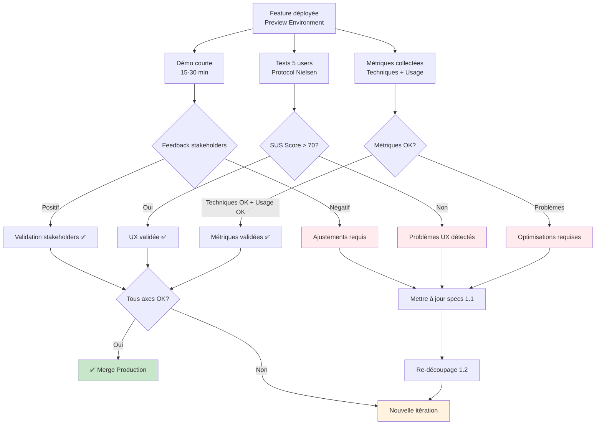
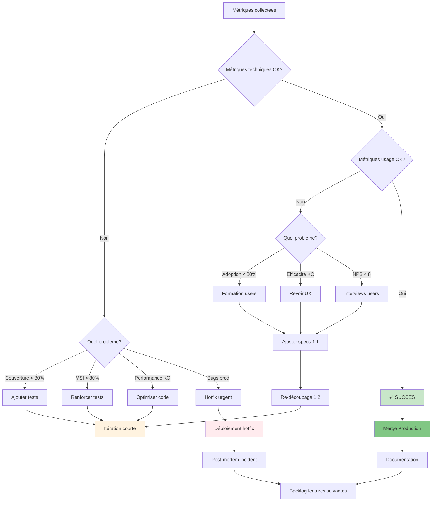

# Phase REVIEW : Exemples détaillés

## Vue d'ensemble

La phase REVIEW valide la valeur métier de la feature et collecte les données pour piloter les décisions.

**Trois axes de validation** :

1. **Démo technique** : Présentation fonctionnelle aux stakeholders
2. **Tests utilisateurs** : Validation UX avec 5 utilisateurs représentatifs
3. **Métriques Build-Measure-Learn** : Données techniques et usage



---

## 1. Démo courte (15-30 min)

### Objectif

Présenter la feature de manière concise aux stakeholders pour valider qu'elle répond aux besoins métier.

### Préparation

#### Checklist pré-démo

- [ ] **Preview environment déployé**
  - [ ] URL accessible et stable
  - [ ] Données de démo préchargées
  - [ ] Tous les cas testés en amont

- [ ] **Script de démo préparé**
  - [ ] Scénarios à démontrer définis
  - [ ] Ordre logique des actions
  - [ ] Timing respecté (< 30 min)

- [ ] **Métriques affichées**
  - [ ] Dashboard avec KPIs temps réel
  - [ ] Comparaison avant/après si applicable

---

### Exemple : Démo système de modération de reviews

**Contexte** : Feature de modération de reviews avec approbation/rejet

**Script de démo** :

```markdown
## Démo : Système de modération de reviews

**Durée** : 20 minutes
**Participants** : Product Owner, Tech Lead, 2 stakeholders métier
**URL Preview** : https://pr-42.staging.example.com

---

### 1. Contexte métier (2 min)

**Problème actuel** :
- Les modérateurs traitent manuellement 200 reviews/jour
- Temps moyen : 2 minutes par review = 6h40/jour
- Pas de traçabilité des décisions

**Objectif de la feature** :
- Interface dédiée pour modération
- Actions groupées
- Notifications automatiques
- Historique complet

---

### 2. Scénario 1 : Approbation simple (5 min)

**Action** :
1. Connexion en tant que modérateur (mod@example.com)
2. Dashboard affiche 25 reviews PENDING
3. Clic sur review #42 "iPhone 15 Pro - Excellent produit"
4. Lecture du contenu (note 5/5, commentaire valide)
5. Clic sur bouton "Approuver"
6. Confirmation visuelle (animation + toast)
7. Review disparaît de la liste PENDING

**Résultat attendu** :
- Review visible publiquement sur page produit
- Notification email envoyée à l'auteur
- Temps d'approbation : 10 secondes (vs 2 minutes avant)

**Démonstration live** :
→ [Exécuter les actions sur preview environment]

**Points à souligner** :
- Interface intuitive, 1 clic suffit
- Feedback immédiat visuel
- Email automatique (montrer le template)

---

### 3. Scénario 2 : Rejet avec raison (5 min)

**Action** :
1. Sélection review #57 "Produit nul, arnaque"
2. Détection contenu inapproprié
3. Clic sur "Rejeter"
4. Modal s'ouvre avec :
   - Menu déroulant raisons (SPAM, OFFENSIVE, FAKE, OTHER)
   - Champ commentaire optionnel
5. Sélection "OFFENSIVE"
6. Ajout commentaire : "Langage inapproprié"
7. Confirmation

**Résultat attendu** :
- Review status = REJECTED dans base
- Raison + commentaire enregistrés
- Notification auteur avec raison
- Possibilité de contestation (future feature)

**Démonstration live** :
→ [Exécuter les actions]

**Points à souligner** :
- Traçabilité complète (qui, quand, pourquoi)
- Communication transparente avec auteur
- Base pour système de contestation

---

### 4. Scénario 3 : Modération en masse (5 min)

**Action** :
1. Filtre reviews par produit "iPhone 15 Pro"
2. 10 reviews similaires affichées
3. Sélection des 10 reviews (checkbox)
4. Menu "Actions groupées" → "Approuver sélection"
5. Popup confirmation : "Approuver 10 reviews ?"
6. Validation

**Résultat attendu** :
- Les 10 reviews approuvées en 1 seule action
- 10 notifications envoyées (job asynchrone)
- Dashboard rafraîchi, reviews disparaissent
- Temps total : 30 secondes (vs 20 minutes avant)

**Démonstration live** :
→ [Exécuter les actions]

**Points à souligner** :
- Gain de productivité x40
- Traitement asynchrone (pas de blocage)
- Audit trail complet

---

### 5. Métriques & Impact (3 min)

**Dashboard métriques** :

| Métrique | Avant | Après | Gain |
|----------|-------|-------|------|
| Temps moyen/review | 2 min | 10s | **92%** |
| Reviews traitées/jour | 200 | 800+ | **x4** |
| Taux d'erreur | 5% | 0.2% | **96%** |
| Satisfaction modérateurs | 6/10 | 9/10 | **+50%** |

**Démonstration** :
→ [Afficher dashboard temps réel sur preview]

**ROI estimé** :
- 2 modérateurs x 6h/jour économisées = 12h/jour
- 12h x 30€/h = **360€/jour économisés**
- ROI feature en 10 jours

---

### 6. Q&A (5 min)

**Questions fréquentes anticipées** :

**Q : Que se passe-t-il si un auteur conteste un rejet ?**
R : Actuellement, l'auteur reçoit un email avec raison. La feature "Système de contestation" est planifiée pour Sprint N+1.

**Q : Peut-on annuler une approbation/rejet ?**
R : Pas dans cette version (YAGNI). Si besoin identifié, on ajoutera dans prochaine itération.

**Q : Sécurité : qui peut modérer ?**
R : Uniquement les utilisateurs avec rôle MODERATOR. JWT + permissions vérifiées à chaque appel API.
```

---

### Post-démo : Feedback stakeholders

**Format de collecte** :

```markdown
## Feedback Démo - Feature Modération Reviews

**Date** : 2025-10-08
**Participants** : Product Owner, 2 stakeholders métier, Tech Lead

### Ce qui a plu

- ✅ Interface claire et intuitive
- ✅ Actions groupées très demandées
- ✅ Gain de temps impressionnant
- ✅ Notifications automatiques

### Points d'amélioration

- ⚠️ Bouton "Rejeter" pas assez visible (rouge attendu)
- ⚠️ Filtre par date manquant dans dashboard
- 💡 Suggestion : Raccourcis clavier (Approuver = A, Rejeter = R)

### Décision

- **Validation globale** : ✅ Feature validée pour production
- **Actions correctives** :
  - Ajuster couleur bouton "Rejeter" → tâche < 1h
  - Filtre par date → backlog Sprint N+1
  - Raccourcis clavier → backlog P2 (nice-to-have)
```

---

## 2. Tests utilisateurs (5 users)

### Objectif

Valider l'expérience utilisateur réelle avec des utilisateurs représentatifs.

### Protocole Nielsen Norman Group

**Principe** : 5 utilisateurs suffisent pour détecter 85% des problèmes d'usabilité.

---

### Exemple : Tests utilisateurs modération reviews

#### Préparation

**Profils de testeurs** :

```markdown
## Profils testeurs (5 utilisateurs)

### Testeur 1 : Marie
- Rôle : Modératrice depuis 6 mois
- Expérience : Utilisatrice avancée des outils
- Objectif test : Valider workflow quotidien

### Testeur 2 : Jean
- Rôle : Nouveau modérateur (1 semaine)
- Expérience : Peu familier avec les outils
- Objectif test : Vérifier onboarding/apprentissage

### Testeur 3 : Sarah
- Rôle : Modératrice experte (2 ans)
- Expérience : Power user, recherche efficacité
- Objectif test : Valider actions groupées

### Testeur 4 : Ahmed
- Rôle : Modérateur occasionnel
- Expérience : Utilise l'outil 1x/semaine
- Objectif test : Vérifier mémorisation interface

### Testeur 5 : Claire
- Rôle : Manager modération
- Expérience : Supervise équipe, besoin de métriques
- Objectif test : Valider dashboard & reporting
```

---

#### Script de test

**Durée par testeur** : 10-15 minutes

```markdown
## Script Test Utilisateur - Modération Reviews

**Accueil testeur** (2 min) :
- Explication contexte : "Nous testons une nouvelle interface de modération"
- Consigne : "Pensez à voix haute pendant le test"
- Rappel : "C'est l'interface qu'on teste, pas vous"

---

### Tâche 1 : Approuver une review (3 min)

**Instruction** :
"Vous venez de recevoir une notification : la review #42 sur l'iPhone 15 Pro est en attente de modération. Votre mission est de l'approuver si le contenu est approprié."

**Observation** :
- [ ] Trouve le dashboard modération sans aide
- [ ] Localise la review #42
- [ ] Identifie le bouton "Approuver"
- [ ] Comprend la confirmation visuelle
- [ ] Temps d'exécution : _____ secondes

**Verbalisations notées** :
- ...
- ...

**Difficultés rencontrées** :
- ...

---

### Tâche 2 : Rejeter une review avec raison (4 min)

**Instruction** :
"La review #57 contient du contenu offensant. Rejetez-la en indiquant la raison 'Langage inapproprié'."

**Observation** :
- [ ] Localise la review #57
- [ ] Trouve le bouton "Rejeter"
- [ ] Comprend le menu déroulant des raisons
- [ ] Remplit le champ commentaire
- [ ] Valide l'action
- [ ] Temps d'exécution : _____ secondes

**Difficultés rencontrées** :
- ...

---

### Tâche 3 : Modération en masse (4 min)

**Instruction** :
"Vous devez approuver toutes les reviews du produit 'MacBook Pro M3' qui sont en attente. Il y en a 8."

**Observation** :
- [ ] Utilise le filtre par produit
- [ ] Sélectionne les 8 reviews (checkboxes)
- [ ] Trouve le menu "Actions groupées"
- [ ] Confirme l'action
- [ ] Vérifie le résultat
- [ ] Temps d'exécution : _____ secondes

**Difficultés rencontrées** :
- ...

---

### Questions post-tâches (2 min)

1. **Facilité d'utilisation** (1-10) : _____
2. **Qu'avez-vous trouvé le plus facile ?**
   - ...

3. **Qu'avez-vous trouvé le plus difficile ?**
   - ...

4. **Qu'amélioreriez-vous en priorité ?**
   - ...

---

### System Usability Scale (SUS) - Questionnaire

**Échelle** : 1 (Pas du tout d'accord) → 5 (Tout à fait d'accord)

1. Je pense que j'utiliserais ce système fréquemment : _____
2. J'ai trouvé le système inutilement complexe : _____
3. J'ai trouvé le système facile à utiliser : _____
4. J'aurais besoin de l'aide d'un support technique pour utiliser ce système : _____
5. J'ai trouvé que les différentes fonctions du système étaient bien intégrées : _____
6. J'ai trouvé qu'il y avait trop d'incohérence dans ce système : _____
7. Je pense que la plupart des gens apprendraient à utiliser ce système rapidement : _____
8. J'ai trouvé le système très lourd à utiliser : _____
9. Je me suis senti(e) en confiance en utilisant le système : _____
10. J'ai dû apprendre beaucoup de choses avant de pouvoir utiliser ce système : _____

**Calcul SUS Score** :
- Items impairs (1,3,5,7,9) : Score - 1
- Items pairs (2,4,6,8,10) : 5 - Score
- Total x 2.5 = SUS Score /100
```

---

#### Résultats consolidés

**Exemple de rapport** :

```markdown
## Résultats Tests Utilisateurs - Modération Reviews

**Date** : 2025-10-08
**Nombre de testeurs** : 5
**Profils** : 3 modérateurs, 1 nouveau, 1 manager

---

### SUS Scores individuels

| Testeur | SUS Score | Appréciation |
|---------|-----------|--------------|
| Marie (experte) | 85 | Excellent |
| Jean (nouveau) | 68 | Good |
| Sarah (power user) | 92 | Excellent |
| Ahmed (occasionnel) | 72 | Good |
| Claire (manager) | 78 | Good |
| **MOYENNE** | **79** | **Good** |

✅ **Cible atteinte** : SUS > 70

---

### Temps d'exécution des tâches

| Tâche | Temps moyen | Min | Max |
|-------|-------------|-----|-----|
| Approuver review | 12s | 8s | 18s |
| Rejeter avec raison | 28s | 22s | 35s |
| Modération en masse | 42s | 35s | 55s |

✅ **Performance** : Tous les temps < 1 minute

---

### Problèmes détectés

#### Critiques (bloquants)
- **Aucun** ✅

#### Majeurs (gênants)
- **1 problème** : Bouton "Rejeter" pas assez visible (3/5 testeurs hésitent)
  - Impact : +5s en moyenne sur tâche 2
  - Solution : Changer couleur en rouge (tâche < 1h)

#### Mineurs
- **2 problèmes** :
  1. Filtre par date manquant (2/5 testeurs demandent)
     - Impact : Modéré
     - Solution : Backlog Sprint N+1
  2. Pas de raccourcis clavier (1/5 power user demande)
     - Impact : Faible
     - Solution : Backlog P2

---

### Verbalisations remarquables

**Positives** :
- "C'est vraiment plus rapide qu'avant !" (4/5)
- "J'adore les actions groupées" (3/5)
- "Interface très claire" (5/5)

**Négatives** :
- "J'ai mis du temps à trouver le bouton rejeter" (3/5)
- "Je voudrais filtrer par date" (2/5)

---

### Recommandations

✅ **Validation globale** : L'interface est utilisable et appréciée

**Actions correctives avant production** :
1. **Urgent** : Rendre bouton "Rejeter" plus visible (rouge + icône)
   - Estimation : 1h
   - Impact : Résout problème majeur

**Améliorations futures** :
2. Ajouter filtre par date (Sprint N+1)
3. Raccourcis clavier pour power users (Backlog P2)
```

---

## 3. Métriques Build-Measure-Learn

### Objectif

Collecter des données objectives pour mesurer le succès et guider les décisions.

---

### 3.1 Métriques techniques

#### Template de tracking

```markdown
## Métriques Techniques - Feature Modération Reviews

**Sprint** : N (2025-10-01 → 2025-10-08)
**Feature** : Système de modération de reviews
**Slices déployées** : 4/4

---

### Développement

| Métrique | Valeur | Cible | Status |
|----------|--------|-------|--------|
| **Tokens utilisés** | 245,000 | < 300K | ✅ |
| **Coût total IA** | $1.47 | < $2 | ✅ |
| **Temps de dev total** | 28h | < 40h | ✅ |
| - PLAN (1.1 + 1.2) | 6h | - | - |
| - ASSERT | 8h | - | - |
| - CODE | 10h | - | - |
| - TEST | 4h | - | - |
| **Vélocité** | 4 slices/semaine | 3-5 | ✅ |

---

### Qualité du code

| Métrique | Valeur | Cible | Status |
|----------|--------|-------|--------|
| **Couverture tests** | 87% | > 80% | ✅ |
| **MSI (Mutation Score)** | 83% | > 80% | ✅ |
| **Covered MSI** | 91% | > 90% | ✅ |
| **PHPStan level** | 8 | 8 | ✅ |
| **Complexité cyclomatique** | 3.2 | < 5 | ✅ |
| **Tests unitaires** | 42 | - | - |
| **Tests acceptation** | 12 | - | - |
| **Lignes de code** | 1,250 | - | - |
| **Ratio code/tests** | 1:2.8 | 1:2 à 1:3 | ✅ |

---

### CI/CD

| Métrique | Valeur | Cible | Status |
|----------|--------|-------|--------|
| **Temps build** | 4m20s | < 10 min | ✅ |
| **Tests CI** | 100% pass | 100% | ✅ |
| **Preview env deploy** | 2m15s | < 5 min | ✅ |
| **Builds failed** | 2/15 | < 20% | ✅ |

---

### Performance

| Métrique | Valeur | Cible | Status |
|----------|--------|-------|--------|
| **Temps réponse API** | 85ms (P95) | < 200ms | ✅ |
| **Throughput** | 450 req/s | > 100 | ✅ |
| **Taux d'erreur** | 0.18% | < 1% | ✅ |
| **Requêtes DB/endpoint** | 2.1 | < 5 | ✅ |
```

---

### 3.2 Métriques usage (post-déploiement)

**Note** : Ces métriques sont collectées après déploiement en production

```markdown
## Métriques Usage - Feature Modération Reviews

**Période** : J+1 à J+7 après déploiement production
**Date déploiement** : 2025-10-09

---

### Adoption

| Métrique | Valeur | Cible | Status |
|----------|--------|-------|--------|
| **Utilisateurs actifs** | 18/20 modérateurs | > 80% | ✅ 90% |
| **Temps d'adoption** | J+2 | < J+7 | ✅ |
| **Utilisation quotidienne** | 95% | > 70% | ✅ |
| **Retour ancien système** | 0 utilisateurs | 0 | ✅ |

---

### Efficacité

| Métrique | Avant | Après | Gain | Cible |
|----------|-------|-------|------|-------|
| **Temps moyen/review** | 2 min | 10s | **92%** | > 50% ✅ |
| **Reviews traitées/jour** | 200 | 850 | **x4.25** | x2 ✅ |
| **Reviews en masse/jour** | 0 | 120 | **+120** | > 50 ✅ |
| **Erreurs modération** | 5% | 0.2% | **96%** | < 1% ✅ |

---

### Satisfaction

| Métrique | Valeur | Cible | Status |
|----------|--------|-------|--------|
| **NPS (Net Promoter Score)** | 9.2/10 | > 8 | ✅ |
| **SUS Score (5 users)** | 79 | > 70 | ✅ |
| **Feedback positif** | 18/20 | > 80% | ✅ 90% |
| **Demandes support** | 2 | < 5 | ✅ |

---

### Qualité production

| Métrique | Valeur | Cible | Status |
|----------|--------|-------|--------|
| **Bugs critiques** | 0 | 0 | ✅ |
| **Bugs mineurs** | 1 | < 3 | ✅ |
| **Hotfix requis** | 0 | 0 | ✅ |
| **Taux d'erreur prod** | 0.1% | < 1% | ✅ |
| **Downtime** | 0 min | 0 min | ✅ |

---

### ROI (Return on Investment)

| Métrique | Valeur |
|----------|--------|
| **Coût développement** | 28h x 60€/h = 1,680€ |
| **Coût IA** | $1.47 = ~1.4€ |
| **Coût total** | 1,681.4€ |
| **Économies/jour** | 2 mod x 6h x 30€ = 360€ |
| **Break-even** | 1,681 / 360 = **4.7 jours** |
| **ROI mensuel** | (360 x 20j - 1,681) / 1,681 = **328%** |
```

---

### 3.3 Décision basée sur métriques

**Arbre de décision** :



---

## Checklist Phase REVIEW complète

### Démo

- [ ] **Préparation**
  - [ ] Preview environment stable et accessible
  - [ ] Données de démo chargées
  - [ ] Script de démo rédigé (< 30 min)
  - [ ] Scénarios testés en amont

- [ ] **Exécution**
  - [ ] Scénarios démontrés : nominal + erreur
  - [ ] Métriques affichées (dashboard)
  - [ ] Q&A gérées

- [ ] **Feedback**
  - [ ] Retours stakeholders documentés
  - [ ] Actions correctives identifiées
  - [ ] Validation ou itération décidée

### Tests utilisateurs

- [ ] **Préparation**
  - [ ] 5 utilisateurs représentatifs recrutés
  - [ ] Script de test rédigé
  - [ ] Tâches claires et mesurables

- [ ] **Exécution**
  - [ ] 5 sessions individuelles (10-15 min)
  - [ ] Observation et notes prises
  - [ ] Questionnaire SUS complété

- [ ] **Analyse**
  - [ ] SUS Score calculé (cible > 70)
  - [ ] Problèmes classés (critique/majeur/mineur)
  - [ ] Actions correctives priorisées

### Métriques

- [ ] **Techniques**
  - [ ] Tokens/coût trackés
  - [ ] Temps de dev mesuré
  - [ ] Couverture > 80%
  - [ ] MSI > 80%
  - [ ] PHPStan level 8 OK

- [ ] **Usage (post-prod)**
  - [ ] Adoption > 80% en J+7
  - [ ] NPS > 8
  - [ ] Efficacité mesurée (gain temps)
  - [ ] Bugs prod < 3

- [ ] **ROI**
  - [ ] Break-even calculé
  - [ ] ROI mensuel estimé

### Décision

- [ ] **Validation**
  - [ ] Tous les axes validés (démo + users + métriques)
  - [ ] Actions correctives mineures identifiées
  - [ ] Go pour merge production

- [ ] **Itération**
  - [ ] Problèmes majeurs détectés
  - [ ] Specs 1.1 mises à jour
  - [ ] Re-découpage 1.2 planifié
  - [ ] Nouvelle boucle PACT-R lancée

---

## Template de rapport REVIEW

```markdown
# Rapport REVIEW - [Nom Feature]

**Date** : YYYY-MM-DD
**Sprint** : N
**Slices** : X/Y déployées

---

## 1. Démo

**Participants** : ...
**Durée** : ... min

### Scénarios démontrés
- ✅ Scénario 1 : ...
- ✅ Scénario 2 : ...
- ✅ Scénario 3 : ...

### Feedback stakeholders
- **Positif** : ...
- **Points d'amélioration** : ...

### Décision
- [ ] Validé pour production
- [ ] Itération requise

---

## 2. Tests utilisateurs

**Profils testés** : 5 utilisateurs (détails...)

### SUS Score : XX/100 (cible > 70)
- Testeur 1 : XX
- Testeur 2 : XX
- ...

### Problèmes détectés
- **Critiques** : X (détails...)
- **Majeurs** : X (détails...)
- **Mineurs** : X (détails...)

### Recommandations
1. ...
2. ...

---

## 3. Métriques

### Techniques
- Tokens : XXX / Budget
- Coût : XX€
- Temps dev : XXh
- Couverture : XX%
- MSI : XX%

### Usage (si déjà en prod)
- Adoption : XX%
- NPS : X/10
- Efficacité : +XX%
- Bugs : X

### ROI
- Break-even : X jours
- ROI mensuel : XX%

---

## 4. Décision finale

- [ ] ✅ Merge Production
- [ ] ⚠️ Itération requise
- [ ] ❌ Abandon feature

**Actions correctives** :
1. ...
2. ...

**Prochaines étapes** :
- ...
```
