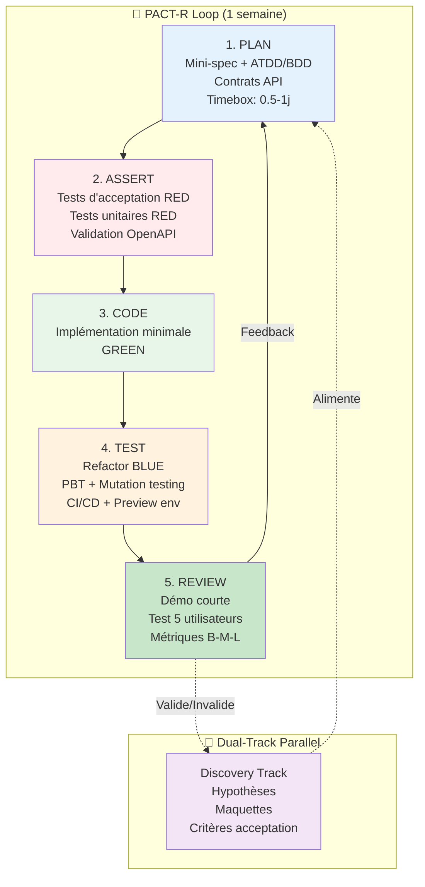
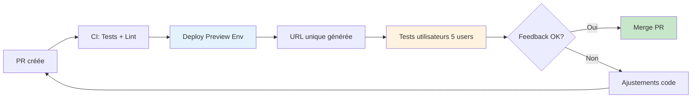
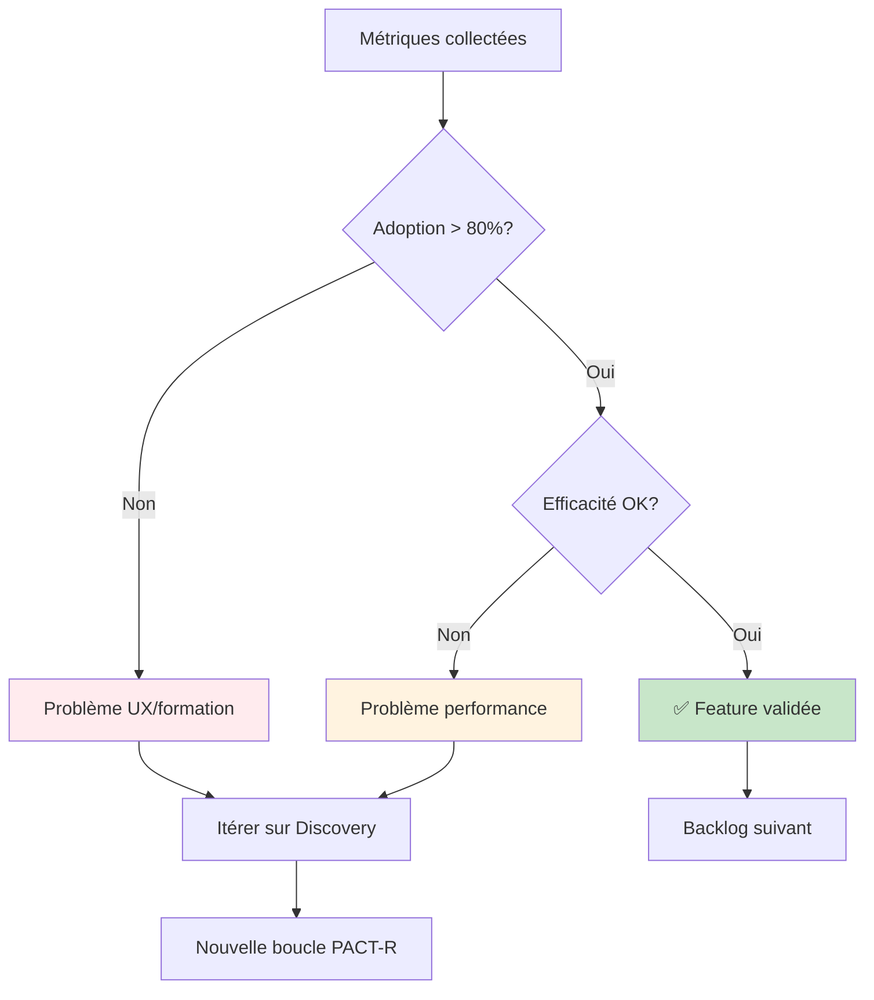
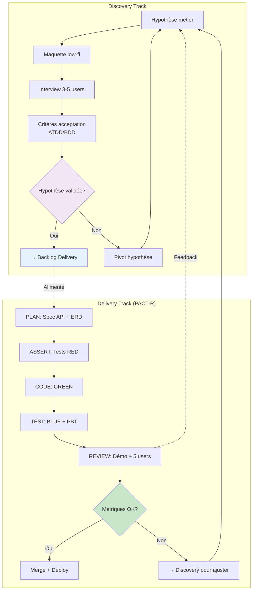
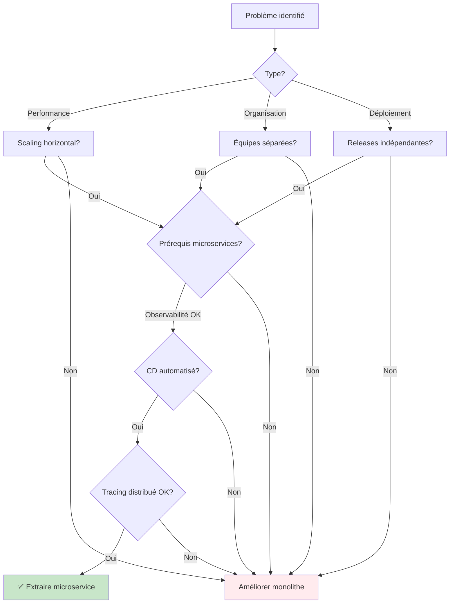
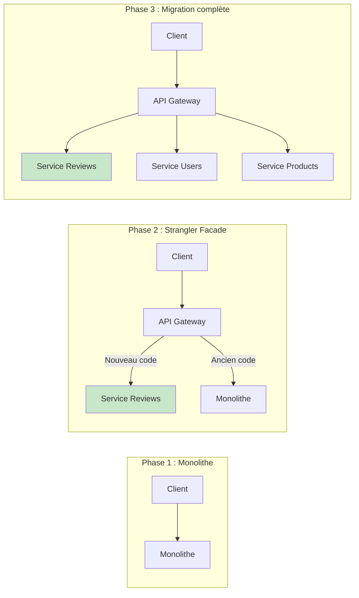

# PACT-R : Méthodologie TDD-first assistée par IA

> **Plan → Assert (tests) → Code → Test → Review**

## 📋 Introduction

**PACT-R** est une méthodologie de développement assisté par IA qui combine :

- **Plan-Act-Review-Repeat** : Méthode de Vie Coding popularisé par Andrej Karpathy, cofondateur d’OpenAI
- **API-First Design** : Le contrat d'API est la source de vérité
- **TDD** : Aucune ligne de code sans test RED d'abord
- **Dual-Track Agile** : Discovery et Delivery en parallèle
- **Feedback ultra-rapide** : Démos hebdo + tests utilisateurs léger
- **Garde-fous anti-over-engineering** : YAGNI, Monolith-First, ADRs

### Philosophie

| Principe                | Description                                               |
| ----------------------- | --------------------------------------------------------- |
| **Test-First, Always**  | RED → GREEN → BLUE obligatoire                            |
| **Spec juste assez**    | API + ERD complet, user flows principaux uniquement       |
| **Dual-Track**          | Discovery (hypothèses, maquettes) alimente Delivery (TDD) |
| **Tracer Bullets**      | Slice verticale démo-able dès J+2                         |
| **Build-Measure-Learn** | Métriques d'usage systématiques, pas de vanity metrics    |
| **YAGNI by default**    | Pas d'implémentation sans preuve (test/usage)             |

---

## 🔁 La boucle PACT-R



---

## 1️⃣ Phase PLAN : Spec juste assez

**Objectif** : Définir le minimum viable pour démarrer le TDD
**Durée** : 0,5–1 jour max par slice

### Ce qu'on fait

#### ✅ API-First Design (obligatoire)

```markdown
## Tâche

Génère la spécification OpenAPI 3.0 pour [feature]

### Endpoints nécessaires

- GET /api/reviews
- POST /api/reviews
- PATCH /api/reviews/{id}/status

### Pour chaque endpoint

- Description claire
- Schémas de requête/réponse (DTOs)
- Codes de réponse (200, 400, 401, 403, 404)
- Exemples de payloads
- Security schemes (JWT)

### Contraintes

- Utiliser components/schemas pour réutilisation
- Validation JSON Schema stricte
- Versioning API (/v1/)
```

**Livrables** :

- `openapi.yaml` validé (CI lint)
- DTOs générés automatiquement (codegen)

#### ✅ ERD complet (obligatoire)

```markdown
## Tâche

Crée le diagramme ERD pour [feature]

### Entités nécessaires

- Review (id, content, rating, status, created_at)
- User (id, email, role)
- Product (id, name)

### Pour chaque entité

- Types précis (UUID, VARCHAR(255), ENUM)
- Contraintes (PK, FK, UK, NOT NULL)
- Index recommandés
- Relations et cardinalités

Format : Mermaid ERD + migration SQL PostgreSQL
```

**Livrables** :

- `migrations/Version{timestamp}.php`
- `DATABASE_SCHEMA.md`

#### ⚠️ User flows principaux SEULEMENT (allégé)

```markdown
## Tâche

Génère les user flows pour les 3 parcours critiques de [feature]

### Parcours

1. Happy path principal (80% des cas)
2. Cas d'erreur le plus fréquent
3. Cas limite critique

### Format

- Diagramme Mermaid simple
- Description en 5-10 étapes max
- Critères d'acceptation ATDD/BDD (Given-When-Then)

⚠️ NE PAS détailler tous les cas, on itérera ensuite.
```

**Livrables** :

- `USER_FLOWS.md` (3-5 flows max)
- Critères d'acceptation en Gherkin/BDD

#### 🚫 Ce qu'on ne fait PAS (timeboxing strict)

- ❌ Tous les diagrammes de séquence (seulement si complexité justifiée)
- ❌ Architecture détaillée (on part Monolith-First par défaut)
- ❌ Documentation exhaustive (ADRs uniquement pour choix durables)
- ❌ Découpage micro-tâches (on fait ça en Sprint Planning)

### Validation Phase PLAN

- [ ] OpenAPI spec validée (lint CI)
- [ ] ERD complet et migrations prêtes
- [ ] 3-5 user flows principaux documentés
- [ ] Critères d'acceptation ATDD/BDD co-écrits avec métier
- [ ] Durée < 1 jour

---

## 2️⃣ Phase ASSERT : Tests d'abord (RED)

**Objectif** : Écrire les tests qui échouent avant tout code de production
**Règle d'or** : Aucune ligne de code sans test RED

### 2.1. Tests d'acceptation (ATDD/BDD)

````markdown
## Contexte

Feature : Modération de reviews
User story : En tant que modérateur, je veux approuver/rejeter des reviews pour garantir la qualité du contenu

## Tâche

Génère les tests d'acceptation en Gherkin/BDD

### Scénarios

```gherkin
Feature: Modération de reviews

  Scenario: Approuver une review en attente
    Given une review avec status "PENDING"
    And un utilisateur avec rôle "MODERATOR"
    When le modérateur approuve la review
    Then le status de la review est "APPROVED"
    And un événement "ReviewApproved" est dispatché
    And une notification est envoyée à l'auteur

  Scenario: Rejeter une review avec raison
    Given une review avec status "PENDING"
    And un utilisateur avec rôle "MODERATOR"
    When le modérateur rejette la review avec raison "Contenu inapproprié"
    Then le status de la review est "REJECTED"
    And la raison est enregistrée
    And un événement "ReviewRejected" est dispatché

  Scenario: Tentative d'approbation sans permissions
    Given une review avec status "PENDING"
    And un utilisateur avec rôle "USER"
    When l'utilisateur tente d'approuver la review
    Then une exception "AccessDeniedException" est levée
```
````

**Exécution** : `vendor/bin/behat` → **DOIT échouer** (feature non implémentée)

### 2.2. Tests unitaires (TDD classique)

```markdown
## Contexte

Service : ReviewModerationService
Méthode : approve(Review $review, User $moderator): void

## Tâche

Génère le test unitaire PHPUnit

### Cas à tester

1. **Cas nominal** : approve change le status à APPROVED
2. **Cas d'erreur** : approve sur review déjà approuvée lève exception
3. **Cas limite** : approve par non-modérateur lève AccessDeniedException

### Contraintes

- Structure Given-When-Then
- Mocks pour dépendances (Repository, EventDispatcher)
- Assertions précises (assertEquals, assertSame)
- Naming : test{Method}{Scenario}

### Important

Le test DOIT échouer (classe ReviewModerationService non créée encore)
```

**Exemple généré** :

```php
// tests/Unit/Service/ReviewModerationServiceTest.php

final class ReviewModerationServiceTest extends TestCase
{
    private ReviewRepository|MockObject $repository;
    private EventDispatcherInterface|MockObject $eventDispatcher;
    private ReviewModerationService $service;

    protected function setUp(): void
    {
        $this->repository = $this->createMock(ReviewRepository::class);
        $this->eventDispatcher = $this->createMock(EventDispatcherInterface::class);
        $this->service = new ReviewModerationService(
            $this->repository,
            $this->eventDispatcher
        );
    }

    public function testApproveChangesStatusToApproved(): void
    {
        // Given
        $review = $this->createMock(Review::class);
        $review->method('getStatus')->willReturn(ReviewStatus::PENDING);
        $moderator = $this->createMock(User::class);
        $moderator->method('hasRole')->with('MODERATOR')->willReturn(true);

        // Expect
        $review->expects($this->once())
            ->method('setStatus')
            ->with(ReviewStatus::APPROVED);

        $this->eventDispatcher->expects($this->once())
            ->method('dispatch')
            ->with($this->isInstanceOf(ReviewApprovedEvent::class));

        // When
        $this->service->approve($review, $moderator);
    }

    public function testApproveAlreadyApprovedThrowsException(): void
    {
        // Given
        $review = $this->createMock(Review::class);
        $review->method('getStatus')->willReturn(ReviewStatus::APPROVED);
        $moderator = $this->createMock(User::class);

        // Expect
        $this->expectException(InvalidStatusTransitionException::class);

        // When
        $this->service->approve($review, $moderator);
    }

    public function testApproveByNonModeratorThrowsException(): void
    {
        // Given
        $review = $this->createMock(Review::class);
        $user = $this->createMock(User::class);
        $user->method('hasRole')->with('MODERATOR')->willReturn(false);

        // Expect
        $this->expectException(AccessDeniedException::class);

        // When
        $this->service->approve($review, $user);
    }
}
```

**Exécution** : `vendor/bin/phpunit` → **DOIT échouer** (classe non trouvée)

### 2.3. Validation OpenAPI (Contract Testing)

```bash
# Valider la spec OpenAPI
npx @stoplight/spectral-cli lint openapi.yaml

# Générer les DTOs PHP depuis OpenAPI
php bin/console api:openapi:export --yaml > var/openapi-generated.yaml
composer require jane-php/open-api-3

# Configurer les tests de contrat (Pact/Specmatic)
# → Les tests échouent si l'implémentation dévie du contrat
```

---

## 3️⃣ Phase CODE : Implémentation minimale (GREEN)

**Objectif** : Écrire le code le plus simple qui fait passer les tests
**Contrainte** : UNIQUEMENT ce qui est testé, pas plus (YAGNI)

### Prompt de génération

````markdown
## Contexte

J'ai ce test qui échoue :

```php
[Coller le test RED]
```

## Tâche

Génère le code de production MINIMAL pour faire passer ce test

### Contraintes

- Code le plus simple possible (pas de sur-engineering)
- Respecter les signatures de méthodes du test
- PHP 8.2, Symfony 7.3
- Injection de dépendances via constructeur
- Typage strict (declare(strict_types=1))

### ⚠️ Important

NE PAS ajouter de fonctionnalités non testées.
Si le test vérifie seulement le changement de statut, n'implémente QUE ça.
````

**Exemple généré** :

```php
// src/Service/ReviewModerationService.php

declare(strict_types=1);

namespace App\Service;

use App\Entity\Review;
use App\Entity\User;
use App\Enum\ReviewStatus;
use App\Event\ReviewApprovedEvent;
use App\Exception\AccessDeniedException;
use App\Exception\InvalidStatusTransitionException;
use App\Repository\ReviewRepository;
use Symfony\Component\EventDispatcher\EventDispatcherInterface;

final readonly class ReviewModerationService
{
    public function __construct(
        private ReviewRepository $repository,
        private EventDispatcherInterface $eventDispatcher,
    ) {
    }

    public function approve(Review $review, User $moderator): void
    {
        if (!$moderator->hasRole('MODERATOR')) {
            throw new AccessDeniedException('User must be a moderator');
        }

        if ($review->getStatus() === ReviewStatus::APPROVED) {
            throw new InvalidStatusTransitionException('Review is already approved');
        }

        $review->setStatus(ReviewStatus::APPROVED);
        $this->repository->save($review);

        $this->eventDispatcher->dispatch(
            new ReviewApprovedEvent($review, $moderator)
        );
    }
}
```

**Exécution** : `vendor/bin/phpunit` → **DOIT passer** (GREEN)

---

## 4️⃣ Phase TEST : Refactor + Qualité (BLUE)

**Objectif** : Améliorer le code sans casser les tests + garanties supplémentaires

### 4.1. Refactoring

````markdown
## Contexte

Voici mon code qui fait passer les tests :

```php
[Coller le code GREEN]
```

## Tâche

Refactorise pour améliorer :

1. **Lisibilité**

   - Noms explicites
   - Méthodes < 20 lignes
   - Commentaires PHPDoc

2. **Maintenabilité**

   - Extraction de méthodes privées si complexité
   - SRP (Single Responsibility Principle)

3. **Performance**
   - Pas d'appels DB inutiles

### ⚠️ Contraintes

- Les tests DOIVENT continuer à passer
- Ne pas changer les interfaces publiques
````

### 4.2. Property-Based Testing (PBT)

Pour les invariants critiques (formats, ranges, idempotence) :

```php
// tests/Property/ReviewModerationPropertyTest.php

use Eris\Generator;
use Eris\TestTrait;

final class ReviewModerationPropertyTest extends TestCase
{
    use TestTrait;

    public function testApproveIsIdempotent(): void
    {
        $this->forAll(
            Generator\associative([
                'review_id' => Generator\string(),
                'moderator_id' => Generator\string(),
            ])
        )->then(function ($data) {
            $review = $this->createReview($data['review_id']);
            $moderator = $this->createModerator($data['moderator_id']);

            // Appeler approve 2 fois
            $this->service->approve($review, $moderator);
            $status1 = $review->getStatus();

            $this->service->approve($review, $moderator);
            $status2 = $review->getStatus();

            // L'état doit être identique (idempotence)
            $this->assertEquals($status1, $status2);
        });
    }
}
```

### 4.3. Mutation Testing

Pour s'assurer que les tests "tuent" les mutations :

```bash
# Installer Infection (mutation testing)
composer require --dev infection/infection

# Configurer infection.json.dist
{
    "source": {
        "directories": ["src"]
    },
    "mutators": {
        "@default": true
    }
}

# Exécuter mutation testing
vendor/bin/infection --min-msi=80 --min-covered-msi=90

# Si MSI < 80%, les tests ne tuent pas assez de mutations
# → Ajouter des assertions ou cas limites
```

### 4.4. Analyse statique

```bash
# PHPStan niveau 8 (strict)
vendor/bin/phpstan analyse src tests --level 8

# PHP CS Fixer (PSR-12)
vendor/bin/php-cs-fixer fix --dry-run --diff

# Coverage > 80%
vendor/bin/phpunit --coverage-text --coverage-filter src/
```

### 4.5. CI/CD + Preview Environments

**Configuration GitHub Actions** :

```yaml
# .github/workflows/ci.yml
name: CI

on:
  pull_request:
  push:
    branches: [main]

jobs:
  tests:
    runs-on: ubuntu-latest
    services:
      postgres:
        image: postgres:16
        env:
          POSTGRES_DB: test_db
          POSTGRES_PASSWORD: test
        options: >-
          --health-cmd pg_isready
          --health-interval 10s
          --health-timeout 5s
          --health-retries 5

    steps:
      - uses: actions/checkout@v3

      - name: Setup PHP
        uses: shivammathur/setup-php@v2
        with:
          php-version: 8.2
          extensions: pdo_pgsql

      - name: Install dependencies
        run: composer install --no-interaction

      - name: Lint OpenAPI spec
        run: npx @stoplight/spectral-cli lint openapi.yaml

      - name: Run migrations
        run: php bin/console doctrine:migrations:migrate --no-interaction --env=test

      - name: Run tests
        run: vendor/bin/phpunit --coverage-text

      - name: PHPStan
        run: vendor/bin/phpstan analyse --level 8

      - name: Mutation testing
        run: vendor/bin/infection --min-msi=80

  preview:
    runs-on: ubuntu-latest
    needs: tests
    if: github.event_name == 'pull_request'
    steps:
      - uses: actions/checkout@v3

      - name: Deploy to preview
        run: |
          # Déployer sur Heroku Review App / Netlify Deploy Preview / Vercel Preview
          # Chaque PR crée un environnement isolé avec URL unique
          echo "Preview URL: https://pr-${{ github.event.pull_request.number }}.preview.example.com"

      - name: Comment PR with preview URL
        uses: actions/github-script@v6
        with:
          script: |
            github.rest.issues.createComment({
              issue_number: context.issue.number,
              owner: context.repo.owner,
              repo: context.repo.repo,
              body: '🚀 Preview deployed: https://pr-${{ github.event.pull_request.number }}.preview.example.com'
            })
```

**Workflow Discovery avec Preview Environments** :



---

## 5️⃣ Phase REVIEW : Démo + Tests utilisateurs

**Objectif** : Valider la valeur ajoutée et collecter les métriques
**Fréquence** : Chaque fin de sprint (1 semaine)

### 5.1. Démo courte (15-30 min)

**Checklist** :

- [ ] Preview environment fonctionnel (URL partagée)
- [ ] User story démontrée end-to-end
- [ ] Cas nominal + 1 cas d'erreur montré
- [ ] Métriques clés affichées (temps de réponse, taux d'erreur)

**Script de démo** :

```markdown
## Feature : Modération de reviews

### Objectif

Permettre aux modérateurs d'approuver/rejeter les reviews en attente

### Scénario démontré

1. **Setup** : 5 reviews en statut PENDING
2. **Action** : Modérateur se connecte, filtre par PENDING
3. **Approve** : Approuve 3 reviews → notifications envoyées
4. **Reject** : Rejette 2 reviews avec raisons
5. **Résultat** : Dashboard modérateur affiche statistiques

### Métriques

- Temps de traitement : 10s pour 5 reviews (vs 2 min manuellement)
- Taux d'erreur : 0% sur 50 tests
```

### 5.2. Tests utilisateurs légers (5 users)

**Protocole Nielsen Norman Group** :

1. **Recruter 5 utilisateurs** représentatifs (suffit pour détecter 85% des problèmes)
2. **Tâches à accomplir** (5-10 min par utilisateur) :
   - « Approuvez la review #42 »
   - « Rejetez la review #57 avec une raison »
   - « Consultez les statistiques de modération »
3. **Observer et noter** :
   - Hésitations
   - Erreurs
   - Verbalisations (« je ne comprends pas ce bouton »)
4. **Questionnaire rapide** (SUS - System Usability Scale) :
   - Note /10 sur la facilité
   - 1-2 questions ouvertes (« qu'améliorer ? »)

**Seuils d'acceptation** :

- SUS Score > 70 (good usability)
- 0 blocage critique
- < 2 problèmes mineurs par utilisateur

### 5.3. Métriques Build-Measure-Learn

**Métriques d'usage (pas de vanity metrics)** :

| Métrique         | Cible                                             | Mesure           |
| ---------------- | ------------------------------------------------- | ---------------- |
| **Adoption**     | 80% modérateurs utilisent la feature en 1 semaine | Logs API         |
| **Efficacité**   | Temps de modération divisé par 5                  | Analytics        |
| **Qualité**      | Taux d'erreur < 1%                                | Sentry/Logs      |
| **Satisfaction** | NPS > 8/10                                        | Survey post-démo |

**Décisions selon métriques** :



---

## 🔀 Dual-Track Agile : Discovery ↔ Delivery

### Principe

**Track Discovery** (exploration continue) :

- Hypothèses métier (« Les modérateurs ont besoin d'un filtre par date »)
- Maquettes low-fi (Figma, wireframes)
- Interviews utilisateurs
- Critères d'acceptation ATDD/BDD

**Track Delivery** (TDD strict) :

- Implémentation guidée par les tests
- Code review + CI/CD
- Déploiement preview environments
- Métriques d'usage

### Workflow parallèle



### Exemple concret

**Sprint N** :

| Jour     | Discovery                                    | Delivery                                      |
| -------- | -------------------------------------------- | --------------------------------------------- |
| Lundi    | Interview 5 modérateurs sur « bulk actions » | Sprint planning : découpage tâches modération |
| Mardi    | Maquette Figma bulk approve/reject           | TDD : ReviewModerationService (RED → GREEN)   |
| Mercredi | Validation maquette avec 3 users             | TDD : BulkModerationService (RED → GREEN)     |
| Jeudi    | Critères acceptation Gherkin pour bulk       | Refactor + PBT + Mutation testing             |
| Vendredi | Prépare hypothèses sprint N+1                | Démo + Tests 5 users + Métriques              |

---

## 🛡️ Garde-fous anti-over-engineering

### 1. YAGNI (You Aren't Gonna Need It)

**Règle** : N'implémente pas aujourd'hui ce dont tu n'as pas la preuve (test/usage)

**Exemples** :

| ❌ Over-engineering                              | ✅ YAGNI                                                              |
| ------------------------------------------------ | --------------------------------------------------------------------- |
| Créer un système de cache Redis « au cas où »    | Implémenter le cache quand les métriques montrent un problème de perf |
| Ajouter un message queue Kafka pour 100 req/jour | Utiliser Symfony Messenger avec transport Doctrine                    |
| Découper en microservices dès le début           | Monolith modulaire, extraire seulement si scaling justifié            |

### 2. Monolith-First / Modular Monolith

**Principe** : Démarrer avec un monolithe bien structuré, extraire en services seulement si :

1. **Scaling indépendant** : Une partie de l'app a des besoins de ressources différents
2. **Cadence d'équipe** : Plusieurs équipes travaillent sur des domaines différents
3. **Contraintes de déploiement** : Besoin de déployer indépendamment

**Architecture recommandée** :

```
src/
├── Module/
│   ├── Review/           # Bounded Context "Review"
│   │   ├── Domain/       # Entités, Value Objects, Events
│   │   ├── Application/  # Use Cases, Services
│   │   ├── Infrastructure/ # Repositories, External APIs
│   │   └── Presentation/ # Controllers, DTOs
│   ├── User/             # Bounded Context "User"
│   └── Product/          # Bounded Context "Product"
```

**Quand extraire en microservice ?** :



**Prérequis microservices** (checklist Martin Fowler) :

- [ ] Provisioning automatisé (Terraform, CloudFormation)
- [ ] Monitoring & alerting (Prometheus, Grafana)
- [ ] Déploiement continu (CI/CD pipeline < 10 min)
- [ ] Tracing distribué (OpenTelemetry, Jaeger)
- [ ] Service discovery (Consul, Eureka)
- [ ] Gestion de configuration centralisée

### 3. ADRs (Architecture Decision Records)

**Principe** : Documenter les choix architecturaux durables uniquement

**Template ADR** :

```markdown
# ADR-001 : Choix du transport Messenger (Doctrine vs RabbitMQ)

## Statut

Accepté

## Contexte

L'application doit traiter des notifications email/SMS de manière asynchrone.
Volume actuel : 500 messages/jour.
Volume prévu à 6 mois : 5000 messages/jour.

## Décision

Utiliser Doctrine transport (base de données) pour Symfony Messenger.

## Conséquences

### Positives

- Pas d'infrastructure supplémentaire (RabbitMQ, Redis)
- Transactions ACID garanties
- Debugging facile (SQL queries)

### Négatives

- Performance < message broker dédié
- Pas de pub/sub natif

### Plan de migration

Si volume > 10k messages/jour → migrer vers RabbitMQ avec Strangler Fig pattern

## Alternatives considérées

1. RabbitMQ : overhead opérationnel trop élevé pour volume actuel
2. Redis : pas de garantie de persistence

## Références

- [Symfony Messenger Doctrine Transport](https://symfony.com/doc/current/messenger.html#doctrine-transport)
- ADR-002 si migration RabbitMQ
```

**Quand créer un ADR ?**

| ✅ Créer ADR                                     | ❌ Pas d'ADR                |
| ------------------------------------------------ | --------------------------- |
| Choix de base de données (PostgreSQL vs MySQL)   | Naming de variables         |
| Architecture auth (JWT vs sessions)              | Choix de librairie mineure  |
| Modèle de déploiement (containers vs serverless) | Ordre des paramètres        |
| Stratégie de cache (Redis vs Memcached)          | Style de code (déjà PSR-12) |

### 4. Strangler Fig Pattern

**Principe** : Migrer progressivement en entourant l'ancien système



**Exemple concret** :

```yaml
# config/routes.yaml

# Phase 1 : Tout le trafic vers monolithe
api_reviews:
  path: /api/reviews
  controller: App\Controller\ReviewController::list

# Phase 2 : Nouveau code via feature flag
api_reviews_new:
  path: /api/reviews
  controller: App\Controller\ReviewControllerV2::list
  condition: "context.hasFeature('new_review_api')"
# Phase 3 : Suppression ancien code
# → Garder seulement ReviewControllerV2
```

---

## 🤖 Garde-fous spécifiques IA

### Risques identifiés

1. **API Drift** : Implémentation dévie de la spec OpenAPI
2. **Hallucinations** : Packages/méthodes inventés
3. **Types mal définis** : Timestamp devient string libre
4. **Tests faibles** : Assertions trop permissives

### Parades

#### 1. Design-First + Validation OpenAPI

```bash
# Valider la spec avant codegen
npx @stoplight/spectral-cli lint openapi.yaml

# Générer les DTOs depuis la spec (source de vérité)
# Option 1 : API Platform
php bin/console api:openapi:export > var/openapi.yaml

# Option 2 : Jane (codegen PHP depuis OpenAPI)
vendor/bin/jane-openapi generate

# CI : Fail si drift détecté
npx openapi-diff openapi.yaml var/openapi-generated.yaml --fail-on-incompatible
```

#### 2. Contract Testing (Pact/Specmatic)

**Exemple avec Pact** :

```php
// tests/Contract/ReviewApiContractTest.php

use PhpPact\Consumer\InteractionBuilder;
use PhpPact\Consumer\Model\ConsumerRequest;
use PhpPact\Consumer\Model\ProviderResponse;
use PhpPact\Standalone\MockService\MockServerEnvConfig;

class ReviewApiContractTest extends TestCase
{
    private InteractionBuilder $builder;

    protected function setUp(): void
    {
        $config = new MockServerEnvConfig();
        $this->builder = new InteractionBuilder($config);
    }

    public function testGetReviews(): void
    {
        $this->builder
            ->given('reviews exist')
            ->uponReceiving('a request for reviews')
            ->with(new ConsumerRequest('GET', '/api/reviews'))
            ->willRespondWith(new ProviderResponse(
                200,
                ['Content-Type' => 'application/json'],
                [
                    [
                        'id' => 'string',          // Type attendu du contrat
                        'content' => 'string',
                        'rating' => 'integer',     // PAS 'number' ou 'float'
                        'status' => 'string',
                        'created_at' => 'datetime' // Format ISO-8601
                    ]
                ]
            ));

        // Exécuter le test contre le mock
        // Si l'implémentation renvoie rating: "5" (string), le test échoue
        $response = $this->httpClient->get('/api/reviews');

        $this->builder->verify();
    }
}
```

**Intégration CI** :

```yaml
# .github/workflows/contract-tests.yml
- name: Run Pact contract tests
  run: vendor/bin/phpunit tests/Contract/

- name: Publish Pact contracts
  run: |
    pact-broker publish pacts/ \
      --consumer-app-version ${{ github.sha }} \
      --broker-base-url ${{ secrets.PACT_BROKER_URL }}

- name: Can-i-deploy check
  run: |
    pact-broker can-i-deploy \
      --pacticipant ReviewAPI \
      --version ${{ github.sha }} \
      --to production
```

#### 3. Property-Based Testing (Invariants)

**Exemple : Formats de dates** :

```php
// tests/Property/DateFormattingPropertyTest.php

use Eris\Generator;
use Eris\TestTrait;

class DateFormattingPropertyTest extends TestCase
{
    use TestTrait;

    public function testCreatedAtIsAlwaysISO8601(): void
    {
        $this->forAll(
            Generator\tuple(
                Generator\date('Y-m-d H:i:s'),
                Generator\string()
            )
        )->then(function ($data) {
            [$timestamp, $content] = $data;

            $review = new Review($content);
            $review->setCreatedAt(new \DateTime($timestamp));

            $dto = $this->serializer->serialize($review, 'json');
            $json = json_decode($dto, true);

            // Propriété : created_at doit TOUJOURS être ISO-8601 avec timezone
            $this->assertMatchesRegularExpression(
                '/^\d{4}-\d{2}-\d{2}T\d{2}:\d{2}:\d{2}[+-]\d{2}:\d{2}$/',
                $json['created_at'],
                'created_at must be ISO-8601 with timezone'
            );
        });
    }
}
```

#### 4. Mutation Testing sur code IA

```bash
# Infection : Mutation testing
vendor/bin/infection \
    --filter=src/Service/ReviewModerationService.php \
    --min-msi=80 \
    --min-covered-msi=90

# Exemple de mutation non tuée (mauvais test) :
# Mutation : $review->setStatus(ReviewStatus::APPROVED)
#         → $review->setStatus(ReviewStatus::REJECTED)
# Si le test passe quand même → assertion trop faible

# Corriger le test :
public function testApproveChangesStatusToApproved(): void
{
    // ...
    $this->service->approve($review, $moderator);

    // ❌ Mauvaise assertion (ne tue pas la mutation)
    $this->assertNotEquals(ReviewStatus::PENDING, $review->getStatus());

    // ✅ Bonne assertion (tue la mutation)
    $this->assertEquals(ReviewStatus::APPROVED, $review->getStatus());
}
```

#### 5. Génération IA sous contraintes

**Prompt avec types stricts** :

```markdown
## Contexte

Spec OpenAPI : [coller openapi.yaml]
Types disponibles : ReviewStatus (enum), ReviewDTO (class)

## Tâche

Génère ReviewController::create()

### ⚠️ CONTRAINTES STRICTES

1. Utiliser UNIQUEMENT les types de openapi.yaml
2. NE PAS créer de nouveaux DTOs
3. NE PAS inventer de méthodes sur ReviewRepository
4. Typage strict PHP 8.2 (declare(strict_types=1))

### Validation

- Le code doit passer PHPStan level 8
- Les DTOs doivent correspondre exactement aux schémas OpenAPI
```

---

## 📊 Métriques de succès PACT-R

### Phase PLAN

| Métrique            | Cible                    | Mesure              |
| ------------------- | ------------------------ | ------------------- |
| Durée spécification | < 1 jour                 | Time tracking       |
| Complétude OpenAPI  | 100% endpoints critiques | Validation Spectral |
| Validation ERD      | Consensus équipe         | Review meeting      |

### Phase ASSERT

| Métrique                             | Cible                         | Mesure          |
| ------------------------------------ | ----------------------------- | --------------- |
| Couverture critères acceptation      | 100% user stories             | Behat scenarios |
| Tests unitaires par méthode publique | ≥ 3 (nominal, erreur, limite) | PHPUnit         |

### Phase CODE

| Métrique                | Cible                                    | Mesure |
| ----------------------- | ---------------------------------------- | ------ |
| Temps RED → GREEN       | < 30 min                                 | Timer  |
| Lignes de code par test | Ratio 1:3 (1 ligne test → 3 lignes prod) | PHPLOC |

### Phase TEST

| Métrique             | Cible             | Mesure           |
| -------------------- | ----------------- | ---------------- |
| Couverture tests     | > 80%             | PHPUnit coverage |
| MSI (Mutation Score) | > 80%             | Infection        |
| PHPStan level        | 8                 | PHPStan          |
| API Drift            | 0 incompatibilité | openapi-diff     |

### Phase REVIEW

| Métrique              | Cible              | Mesure                |
| --------------------- | ------------------ | --------------------- |
| SUS Score (usabilité) | > 70               | Questionnaire 5 users |
| Adoption feature      | > 80% en 1 semaine | Analytics             |
| Temps de feedback     | < 7 jours          | Sprint cycle          |
| Bugs production       | < 2 par feature    | Sentry                |

---

## 🎯 Workflow complet : Exemple réel

### Feature : Système de modération de reviews

#### Semaine 0 : Discovery Track

**Lundi** :

- Interview 5 modérateurs → besoin identifié : « trop de temps pour traiter reviews manuellement »
- Hypothèse : « Un système de modération en masse réduirait le temps de 80% »

**Mardi-Mercredi** :

- Maquette Figma : Dashboard modération + bulk actions
- Test maquette avec 3 modérateurs → validation

**Jeudi** :

- Rédaction critères d'acceptation Gherkin :
  ```gherkin
  Feature: Modération en masse
    Scenario: Approuver 10 reviews d'un coup
      Given 10 reviews avec status "PENDING"
      When le modérateur sélectionne les 10 reviews
      And clique sur "Approuver sélection"
      Then les 10 reviews ont status "APPROVED"
      And 10 notifications sont envoyées
  ```

**Vendredi** :

- Feature ajoutée au backlog Delivery
- Spec OpenAPI créée

---

#### Semaine 1 : Delivery Track (PACT-R Loop 1)

**Lundi (PLAN)** :

```bash
# 1. Créer openapi.yaml
POST /api/reviews/{id}/moderate
  Request: { "action": "approve|reject", "reason": "string?" }
  Response 200: { "id": "uuid", "status": "approved|rejected" }

# 2. Créer migration ERD
php bin/console make:migration
# → Ajoute colonne `moderated_by`, `moderated_at`, `moderation_reason`

# 3. User flows (3 principaux)
- Approuver 1 review
- Rejeter 1 review avec raison
- Modération en masse (10 reviews)
```

**Mardi (ASSERT)** :

```bash
# 1. Tests d'acceptation Behat
vendor/bin/behat --init
# Créer features/moderation.feature avec scénarios Gherkin

# 2. Tests unitaires RED
vendor/bin/phpunit tests/Unit/Service/ReviewModerationServiceTest.php
# → Classe ReviewModerationService not found (RED)

# 3. Validation OpenAPI
npx @stoplight/spectral-cli lint openapi.yaml
# → 0 erreur
```

**Mercredi (CODE)** :

```php
// src/Service/ReviewModerationService.php
// Implémentation minimale GREEN

vendor/bin/phpunit
# → All tests pass (GREEN)
```

**Jeudi (TEST)** :

```bash
# 1. Refactor
# → Extraction méthode privée validateModerator()

# 2. PBT sur idempotence
vendor/bin/phpunit tests/Property/
# → 100 random inputs testés, OK

# 3. Mutation testing
vendor/bin/infection --min-msi=80
# → MSI 85%, OK

# 4. CI/CD
git push origin feature/moderation
# → GitHub Actions :
#   - Tests : ✅
#   - PHPStan : ✅
#   - OpenAPI lint : ✅
#   - Deploy preview : https://pr-42.preview.app.com
```

**Vendredi (REVIEW)** :

1. **Démo (10h-10h30)** :

   - URL preview partagée à l'équipe
   - Modération de 10 reviews en direct
   - Métriques affichées : temps réduit de 2 min → 10s

2. **Tests utilisateurs (11h-12h)** :

   - 5 modérateurs testent sur preview environment
   - SUS Score : 78/100 (good)
   - Feedback : « Bouton 'Rejeter' pas assez visible »

3. **Métriques B-M-L** :

   - Hypothèse validée : temps divisé par 12 (2 min → 10s)
   - Adoption : 4/5 modérateurs ont utilisé la feature

4. **Décision** :
   - ✅ Merge PR
   - 📝 ADR-005 créé : Choix d'événements asynchrones pour notifications
   - 🔄 Backlog Discovery : Améliorer visibilité bouton "Rejeter"

---

#### Semaine 2 : PACT-R Loop 2 (Modération en masse)

**Cycle complet en 5 jours** avec même structure PLAN → ASSERT → CODE → TEST → REVIEW

---

## 🛠️ Outils recommandés

### Spécification

| Outil                  | Usage                 | Commande                                        |
| ---------------------- | --------------------- | ----------------------------------------------- |
| **Stoplight Spectral** | Lint OpenAPI          | `npx @stoplight/spectral-cli lint openapi.yaml` |
| **openapi-diff**       | Détecter API drift    | `npx openapi-diff spec.yaml generated.yaml`     |
| **Mermaid**            | Diagrammes ERD, flows | Intégré Markdown                                |

### TDD

| Outil         | Usage                  | Commande                                    |
| ------------- | ---------------------- | ------------------------------------------- |
| **PHPUnit**   | Tests unitaires        | `vendor/bin/phpunit`                        |
| **Behat**     | Tests acceptation BDD  | `vendor/bin/behat`                          |
| **Infection** | Mutation testing       | `vendor/bin/infection --min-msi=80`         |
| **Eris**      | Property-based testing | `composer require --dev giorgiosironi/eris` |

### Qualité

| Outil            | Usage            | Commande                               |
| ---------------- | ---------------- | -------------------------------------- |
| **PHPStan**      | Analyse statique | `vendor/bin/phpstan analyse --level 8` |
| **PHP CS Fixer** | Style PSR-12     | `vendor/bin/php-cs-fixer fix`          |
| **PHPLOC**       | Métriques code   | `vendor/bin/phploc src/`               |

### Contract Testing

| Outil         | Usage                     | Documentation                        |
| ------------- | ------------------------- | ------------------------------------ |
| **Pact PHP**  | Consumer-driven contracts | [docs.pact.io](https://docs.pact.io) |
| **Specmatic** | OpenAPI contract testing  | [specmatic.io](https://specmatic.io) |

### CI/CD

| Outil                  | Usage                | Config                     |
| ---------------------- | -------------------- | -------------------------- |
| **GitHub Actions**     | CI/CD + Preview envs | `.github/workflows/ci.yml` |
| **Netlify**            | Preview deployments  | `netlify.toml`             |
| **Heroku Review Apps** | Preview envs par PR  | `app.json`                 |

---

## 📚 Ressources

### Articles fondateurs

1. **Dual-Track Agile** : [productboard.com](https://www.productboard.com/glossary/dual-track-agile/)
2. **Tracer Bullets** : [Pragmatic Programmer](https://github.com/HugoMatilla/The-Pragmatic-Programmer)
3. **Build-Measure-Learn** : [theleanstartup.com](https://theleanstartup.com/principles)
4. **5 Users Testing** : [Nielsen Norman Group](https://www.nngroup.com/articles/why-you-only-need-to-test-with-5-users/)
5. **ATDD** : [agilealliance.org](https://agilealliance.org/glossary/atdd/)
6. **YAGNI** : [martinfowler.com](https://martinfowler.com/bliki/Yagni.html)
7. **Monolith First** : [martinfowler.com](https://martinfowler.com/bliki/MonolithFirst.html)
8. **ADRs** : [Cognitect](https://www.cognitect.com/blog/2011/11/15/documenting-architecture-decisions)
9. **Strangler Fig** : [martinfowler.com](https://martinfowler.com/bliki/StranglerFigApplication.html)
10. **Property-Based Testing** : [Harrison Goldstein](https://harrisongoldste.in/papers/icse24-pbt-in-practice.pdf)
11. **API Drift** : [wiz.io](https://www.wiz.io/academy/api-drift)
12. **AI Hallucinations** : [USENIX](https://www.usenix.org/system/files/conference/usenixsecurity25/sec25cycle1-prepub-742-spracklen.pdf)

### Templates prompts

Créer `.prompts/` dans le projet :

```
.prompts/
├── plan/
│   ├── openapi-spec.md
│   ├── erd-generation.md
│   └── user-flows.md
├── assert/
│   ├── acceptance-tests.md
│   ├── unit-tests.md
│   └── property-tests.md
├── code/
│   ├── minimal-implementation.md
│   └── entity-generation.md
├── test/
│   ├── refactoring.md
│   └── mutation-analysis.md
└── review/
    ├── demo-script.md
    └── user-testing-protocol.md
```

---

## ✅ Checklist d'adoption PACT-R

### Semaine 1 : Setup

- [ ] Former l'équipe aux concepts (ATDD, PBT, Dual-Track)
- [ ] Installer outils (PHPUnit, Behat, Infection, Spectral)
- [ ] Configurer CI/CD avec preview environments
- [ ] Créer templates prompts dans `.prompts/`

### Semaine 2 : Premier cycle PACT-R

- [ ] Choisir une feature simple (CRUD)
- [ ] Appliquer PLAN (OpenAPI + ERD)
- [ ] Écrire tests RED (ASSERT)
- [ ] Implémenter GREEN (CODE)
- [ ] Refactor + PBT (TEST)
- [ ] Démo + 5 users (REVIEW)

### Semaine 3 : Feature complexe

- [ ] Activer Discovery Track (hypothèses, maquettes)
- [ ] Créer ADR pour choix architectural durable
- [ ] Ajouter contract testing (Pact)
- [ ] Mesurer métriques B-M-L

### Semaine 4+ : Amélioration continue

- [ ] Rétrospective : ce qui marche / ne marche pas
- [ ] Affiner prompts IA selon retours
- [ ] Optimiser CI/CD (temps < 10 min)
- [ ] Documenter cas d'usage spécifiques projet

---

## 🎓 Conclusion

**PACT-R** résout les écueils de Pair Studio (waterfall, feedback tardif) et de Vibe Coding (manque de structure) en combinant :

✅ **Spécification juste assez** (API + ERD, pas de sur-documentation)
✅ **TDD strict** (RED → GREEN → BLUE systématique)
✅ **Dual-Track Agile** (Discovery et Delivery en parallèle)
✅ **Feedback ultra-rapide** (démos hebdo + 5 users + preview envs)
✅ **Garde-fous anti-over-engineering** (YAGNI, Monolith-First, ADRs)
✅ **Protection contre dérives IA** (contract testing, PBT, mutation testing)

### Adoption progressive

1. **Projet pilote** : Feature isolée, 1 sprint PACT-R
2. **Scaling** : Équipe complète, plusieurs features parallèles
3. **Optimisation** : Mesures métriques, ajustements processus

### Prochaines étapes

- [ ] Relire [Pair Studio original](pair-studio.md) pour comparaison
- [ ] Télécharger [templates prompts](#templates-prompts)
- [ ] Configurer CI/CD avec preview environments
- [ ] Lancer premier cycle PACT-R sur feature simple

---

**Remember** : La meilleure méthodologie est celle qui s'adapte à VOTRE contexte. Expérimentez, mesurez, ajustez ! 🚀
